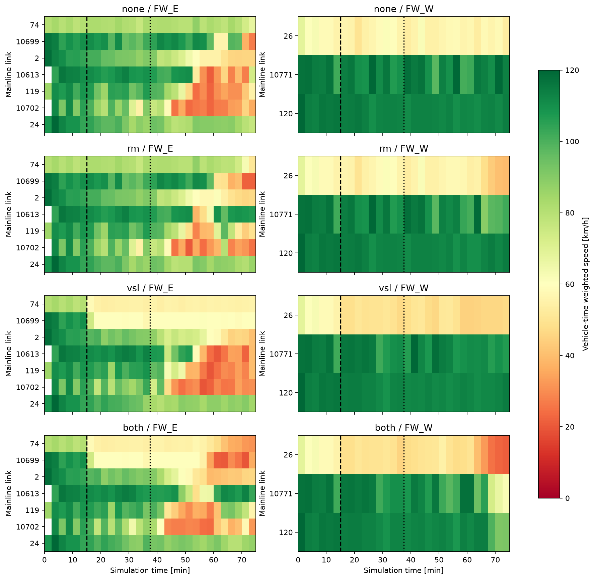

# Plant 보정 및 규칙 제어·MPC 실제 실행 비교

2026-09-16. 완료: seed13 4500초 자료로 보정, 계수 동결 후 seed23에서 규칙 4조건과 작은 중앙집중 MPC 4조건을 각각 4500초 실행했다. 모든 native 실행·LDP/readback·정책 재생 검증을 통과했다.
현재 가장 유망한 관측 결과는 MPC VSL 단독의 Ω TTT 2.07% 감소다. RM과 동시 제어의 전체 개선은 작다. 보정 모델의 제어 응답 크기·순위 검증은 여전히 불충분하므로 정본 성능 검증 완료로 판정하지 않는다.

## 동일 조건과 범위

사용자 수정 가속거리·8램프 DSD120 망, 동측 본선 입력1098만0.8배, seed23. 과거 전역80/도시50 조건이 아니다. 네트워크·도시 신호·수요·경로는 모든 조건에서 같다. 0–900초 native, 150초마다 갱신, SimPeriod9001을 유지하고 SimBreak4500에서 종료했다.
규칙군은 기존 ALINEA와 규칙 VSL을 유지했다. MPC군은 본선42셀+8진입/8진출connector 및 예측한 미진입 대기 비용으로 명령을 선택한다. 450초/3개150초 제어 움직임을 예측하고 첫 명령만 적용한다. 미터10초 RG, 녹색2–10초, 직전 실제 명령 대비±2초. VSL은 기본 분포120에서 한 갱신당20씩 변경한다. 분포 ID는 모든 차량의 고정 주행속도가 아니다.
MPC는 개별 제한·일괄 해제와 일부 결합 후보를 비교하는 진단이다. 전체 결합 공간이나 홀수 녹색을 모두 탐색하지 않는다. 도시 전체 Ω 동역학·green/offset·N_P/N_UF 게임 제약을 포함한 full GNE는 아직 연결하지 않았다. 기존 지원 차단은 유지했다.
## 실제 0–4500초 결과

|조건|Ω TTT[veh·h]|개선[%]|TTD 사건|종료Ω재고|미삽입|Ω 미확인 소실|
|---|---|---|---|---|---|---|
|무제어|3749.99|+0.00|28718|3572|21139|298|
|rules rm|3746.07|+0.10|28677|3589|21154|302|
|rules vsl|3882.22|-3.53|28735|3780|20923|287|
|rules both|3919.66|-4.52|28455|3949|21040|288|
|mpc rm|3740.03|+0.27|28719|3485|21206|316|
|mpc vsl|3672.28|+2.07|28949|3388|21111|290|
|mpc both|3747.06|+0.08|28818|3531|21080|304|

TTT는 Ω=고속도로+도시 protected network 내부 차량시간이다. 살아서 non-control area로 이동한 사건도 TTD에 포함한다. 비정상 소실·종료잔여는 제외하고, 물리적 말단 유출 추정은 별도 정의에 따라 포함한다. 미삽입 차량의 외부 기다림은 실제 Ω TTT 밖이다. 미확인 소실과 native 삭제경고는 겹칠 수 있어 합산하지 않는다.

MPC VSL은 무제어보다 TTD231대 증가, 미삽입28대 감소, 미확인 소실8대 감소다. native 삭제경고는260→267건으로 증가했다. 단일 seed 결과이므로 안정적인2.07% 개선이나 손실 없는 개선으로 단정하지 않는다. MPC RM은 미삽입67대·미확인 소실18대가 늘어0.27%의 작은 감소를 확정적인 제어 이득으로 볼 수 없다.
## 혼잡·램프 반응

|조건|동측 TTT|서측 TTT|8on connector TTT|나머지Ω TTT|
|---|---|---|---|---|
|무제어|845.30|518.05|119.83|2266.82|
|rules rm|830.64|526.32|124.00|2265.11|
|rules vsl|931.26|557.20|122.42|2271.34|
|rules both|967.52|579.33|122.12|2250.69|
|mpc rm|834.79|523.65|121.37|2260.22|
|mpc vsl|774.81|513.47|119.82|2264.18|
|mpc both|845.84|522.24|116.25|2262.73|

무제어는10702에서 시작한 저속 구간이119·10613으로 상류 확대되는 패턴을 보인다. 링크 평균속도40km/h 미만이2개150초 구간 연속인 첫 시각은 각각2700/3150/3300초다. 이는 공간 패턴이며 차량별 병목 원인 확정은 아니다.
ALINEA는10490의2250–4500초 합류를481→371대로 줄였다. 최대connector재고15→40대, 정지 차량시간0.23→6.96veh·h로 늘었다.10613의 지속 저속은 완화됐지만10702의 혼잡은 남았고, 별도 상류10699의 저속은 더 일찍 나타났다. 동측 TTT14.65veh·h 감소 중 서측8.27와on connector4.17veh·h 증가가 상당 부분을 상쇄했다.
MPC VSL의 감소77.71veh·h 중 동측 본선 감소가70.48veh·h다.10613·10699로의 저속 확대가 줄었지만10702는 종료까지 저속이 남는다. 전망450초에서 비용이 낮은 후보를 선택했다는 사실만으로 이 실제 이득을 모델이 정확히 예측했다고 보지 않는다.
MPC VSL은 실제로100 분포까지만 제한했다. 서측seg0은1200–1500/3300–3450초, 동측seg5는2400–2850/3600–3900/4350–4500초, 동측seg0은3750–3900초 제한했다. 규칙 VSL의 동·서 입력부60 분포 장기 유지와 다르다. 특정 구간 하나의 인과효과를 분리한 실험은 아니다.

## 보정한 항목과 독립 seed 예측

seed13에서만 보정했다. 동측 임계밀도 배율1.16→1.0, anticipation ν47.4→35, lane-drop φ6→0; merge δ1 유지. 서측 임계밀도 배율.68→.70, ν12.6→65, merge δ0 유지. 서측 φ는 실제 lane drop이 없어 식별되지 않았다. 제한된 좌표 탐색의 선택값이며 φ0의 보편적 타당성이나 모든 weaving의 부재를 뜻하지 않는다.
램프 서비스의 차로 수 상한을1차로1800/2차로3600veh/h로 구분했다. 이는 관측 포화율 추정이 아니다.10490은 충분한 정지 큐가 있고 정지선 뒤 재고가 작은 seed13 사이클에서g2가45회 모두1대 방출하여, 예측 서비스.71→1대/주기로 보정했다. g3도.99→1로 수정했으며 다른 램프로 전이하지 않았다. 세부 근거는 model_v4/service_calibration.json에 있다.
동일한 큐 조건으로 새 seed23을 검증했을 때도 g2의45개 사이클, g3의30개 사이클 모두 정지선 통과가1대였다. 이 국소 서비스 보정은 새 자료에서도 맞았지만, 그것이 전체 혼잡 동역학의 정확성을 보장하지는 않는다. 근거: controller_response_s23_v1/head_service_validation.json.
아래는 seed23 4조건×2250/3150/4050초의450초 예측, 총12창이다. 관측 이후 경계 수요는 과거150초에서 예측했다. 미래 제어 명령은 기록된 명령을 재생하므로 향후 정책 결정 예측까지 검증한 것은 아니다. 계수를 재적합하지 않았다. RMSE는 창별RMSE의 산술평균이다.

|모델|방향|복합 오차|속도RMSE[km/h]|밀도RMSE[veh/km/lane]|본선TTT MAPE[%]|저속TP/FN|
|---|---|---|---|---|---|---|
|previous|FW_E|4.286|27.37|10.01|4.30|5/232|
|previous|FW_W|2.399|20.09|6.25|4.64|187/62|
|dynamics_only|FW_E|3.434|25.44|9.01|7.82|20/217|
|dynamics_only|FW_W|1.978|16.58|7.60|5.61|62/187|
|calibrated|FW_E|3.437|25.46|9.01|7.85|20/217|
|calibrated|FW_W|1.978|16.58|7.60|5.61|62/187|

previous=이전model_v2; dynamics_only=동역학·차로상한model_v3; calibrated=10490서비스까지 반영한model_v4. 속도·밀도·유량 복합 오차 감소는 실제 교통 개선율과 다르다. 저속 탐지와 TTT 오차를 함께 확인해야 한다.
독립seed의 양방향 평균 복합 오차는 약19% 감소했지만, 본선TTT 오차는 동측4.30→7.85%, 서측4.64→5.61%로 모두 악화됐다. 동측 저속표본237개 중20개만 맞췄고, 서측 저속검출은187/249→62/249로 나빠졌다. 따라서 이 보정을 제어용 모델의 검증 성공으로 채택하지 않는다.

## 같은 초기 상태에서의 제어 반응 재검사

이미 완료된 seed13·1650–2100초 동일 초기 상태 실험을 재사용했다. 늦은 본격 혼잡의 독립 검증은 아니며, 비용은 일치하는 본선+16connector 부분 영역이다. 값은 무제어 대비 비용 증가[veh·h]다.

|후보|실제 ΔTTT|이전 모델 ΔTTT|보정 모델 ΔTTT|
|---|---|---|---|
|rm8|+0.133333|-0.002219|+0.000112|
|rm_ramp|+0.416667|-0.001902|-0.000176|
|vsl|+0.870833|+0.022139|+0.022103|
|both|+1.004167|+0.019834|+0.020372|

강한RM(g8→6→4)은 실제10490합류96→84대, 모델81.63→77.15대다. g8유지에서는 실제103대인데 모델은81.63대로 변하지 않는다. 비용 영향의 크기를 크게 놓치며 강한RM 비용 증가의 부호도 맞추지 못했다. 이 쌍은g2를 쓰지 않아g2서비스 보정의 효과 검증으로 해석하지 않는다.
## 계산과 실행 검증

|MPC 조건|변경 결정 수/24|계산 총[s]|계산 최대[s/결정]|관측 총[s]|초기화 총[s]|
|---|---|---|---|---|---|
|none|0|6.74|0.33|57.53|2.49|
|rm|18|62.31|3.01|57.86|2.70|
|vsl|10|60.46|2.84|57.07|2.61|
|both|18|104.94|4.81|47.82|1.90|

후보 예산 때문에 생략한 단일 후보는0개다. 이는 유한한 후보 목록을 다 봤다는 뜻이며 전체 허용 공간의 전수 탐색은 아니다. VSL 변경 시 모델이 예측한 이득은0.000019–0.00540veh·h에 불과했다. 이 작은 차이로 선택한 정책의 실제2.07% 이득을 정밀한 예측 성공이라고 주장하지 않는다.
매초 차량COM 전수조회는 없고, MPC에 필요한150초 관측마다4개bulk read(런당96회)를 사용했다. 차량 이력은 그때까지의native FZP를 증분 읽었다. 신호 전환 때만 쓰며 VSL은 적용 시readback했다. native LDP·초기readback·기록 정책 재생을 검증했다. 무제어 두 방식은4500초 전체19,638,299개FZP행의SHA256이 정확히 같다.
위 계산·관측·초기화 시간은 실제simulation 속도나 전체 실행시간과 섞지 않았다. 각suite summary.json의wall_seconds는 로딩·시뮬레이션·제어·실행검증을 포함한다.
초기900초시험의 차량ID·COM/FZP 말단 제거 시점 차이 실패 기록을 보존했다. 현재는명시적차량No를 사용하고 동일 차량 좌표가 일치하는지 검사한다. native최종위치 기록 후 사라진 물리말단차량은 pausedCOM과의시점차이로 따로 기록했다. MPC RM의nativeOFF→첫제한 시점에 대한 사후검증기 오판도 원본receipt·코드를 보존하고 수정 후 재검증했다. 교통 자료를 수정하거나 실패한실런을 성공런으로 대체하지 않았다.
## 판단과 다음 우선순위

1. RM이 물리적으로 안 먹는 망은 아니다. 실제 합류와 큐가 변했다. 다만 이 조건에서는 본선 이득이 다른 대기 비용과 상쇄된다. 모델은 그 변화량을 아직 충분히 설명하지 못한다.
2. MPC VSL 단독 정책은 재검증할 가치가 있다. 같은망의 추가seed에서 정책을 고정해 반복하고, 동측seg5의 완만한 제한이 예방한 혼잡 전파를 별도 동일초기상태 실험으로 분리하는 것이 다음이다. 이번 결과를 보고 추가seed를 보정용으로 소급 전환하지 않는다.
3. 추가 계수 전수탐색보다3000초 전후의동일초기상태에서 실제 정지선 서비스·합류량·하류진출배수·본선수용량·대기비용의 차이를 맞추는 것이 우선이다. 과거실현off-ramp분기율과constant배수proxy, 접근도로의혼합목적지 대기는 남은 구조적 한계다.
4. 현재 계수는 명시적실험config에만 유지한다. 전체도시Ω예측과full GNE 연결·정본승격은 아직 완료하지 않았다. 근거 없는capacity drop이나lever보상항은 추가하지 않았다.

근거: 각suite의summary.json·verification.json·analysis, controller_response_s23_v1/frozen_model_validation, controller_response_4500_v1/model_v3/CALIBRATION_AUDIT.md 및model_v4, paired_response_after_calibration.json, mpc_decision_audit_s23.json.
