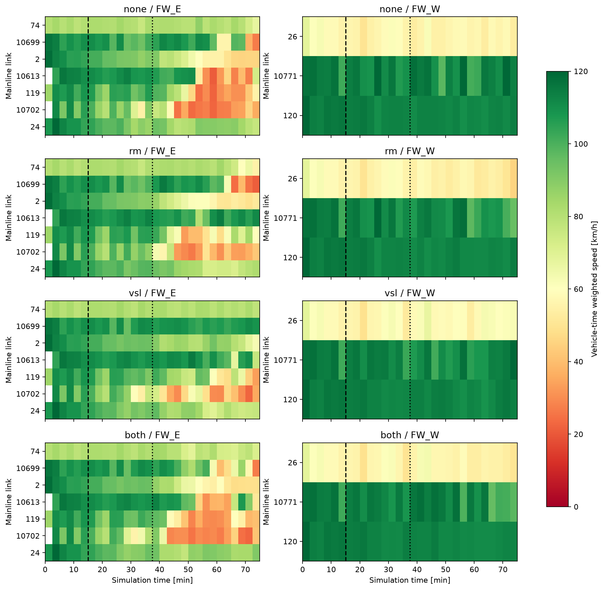
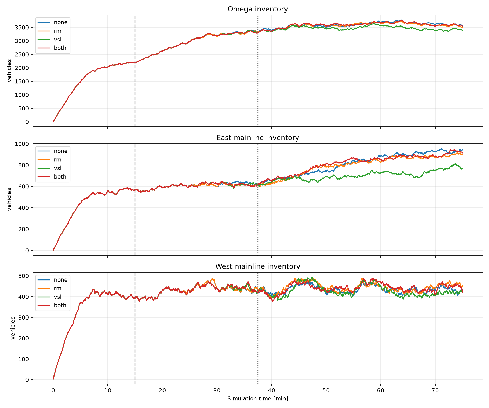

# 4500초 독립 seed 비교

새 사용자 기하·DSD120·동측 본선 입력만0.8, seed23. 0–900초 native,150초 제어 갱신. 물리 망·수요·도시 신호는 조건 사이 동일.

|조건|Ω TTT[veh·h]|개선[%]|TTD|종료Ω재고|미삽입|삭제경고|
|---|---|---|---|---|---|---|
|none|3749.99|0.00|28718|3572|21139|260|
|rm|3740.03|0.27|28719|3485|21206|258|
|vsl|3672.28|2.07|28949|3388|21111|267|
|both|3747.06|0.08|28818|3531|21080|260|

## TTT 공간 분해

|조건|동측|서측|on connectors|나머지Ω|
|---|---|---|---|---|
|none|845.30|518.05|119.83|2266.82|
|rm|834.79|523.65|121.37|2260.22|
|vsl|774.81|513.47|119.82|2264.18|
|both|845.84|522.24|116.25|2262.73|

MPC가 있는 경우: 기존 물리 plant의 작은 중앙집중 후보 비교다. 예측 비용은 본선+16개connector 및 예측한 미진입 대기이며, 도시부 전체 Ω를 예측하는 full GNE가 아니다. 실제 성능 표는 모든 조건에서 같은 Ω로 산정했다.
단일 seed이며 미삽입·삭제 차이를 개선으로 오인하지 않는다. TTD에서 비정상 소실과 종료잔여를 제외했다. 상세 명령과 계산시간은 summary.json에 있다.

