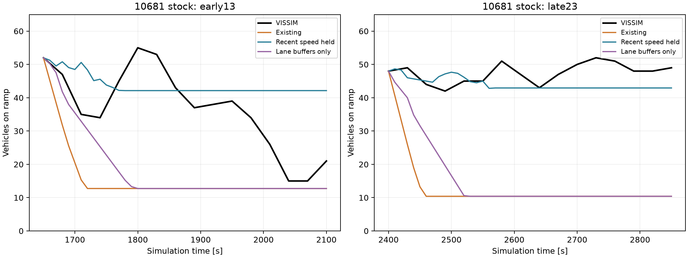

# 후속 검증: 10681 차로별 대기와 VSL 반응

완료: 기존 native FZP 3런의 차로별 재분석, 24개 시작 상태×4조건의 transit 검증96예측, 32개 반응식 ablation, 차로 분리 후보8예측 및8개 재현 검증. 신규 VISSIM 실행은 하지 않았다. **세 가지 단순 수정 모두 제어용 예측 검증을 충분히 통과하지 못하여 정본에 채택하지 않았다.**

## 10681: 실제로 무엇이 빠졌나

seed23 무제어2400초의 램프 재고는48대, 차량 평균속도는약10km/h이다. 기존 모델은 혼잡 전 통행에서 얻은41.45km/h와3600대/h 수용 상한으로 첫30초에30대를 내보냈다. 실제는8대이다. 미래 접근량까지 실측으로 공급한 진단에서도450초 합류가163대/실제126대로 달랐다.

2400–2550초 FZP 차로별 평균:

|위치|1차로|2차로|
|---|---:|---:|
|10681 평균 재고|1.8대|42.9대|
|10681 평균 속도|25.3km/h|8.6km/h|
|합류 직후 본선2번 2300–2400m 평균 재고|0.6대|4.7대|
|같은 본선 위치 평균 속도|70.4km/h|31.7km/h|

총량 모델은 램프 차로별 재고를 저장해도 동역학에서는 합쳐 사용한다. 초기 저속 재고를 고속으로 보내는 문제와, 비어 있는 차로의 공간·서비스를 다른 차로에 사용할 수 있는 문제가 함께 있다. 단, 이것만으로 합류 과대의 전부를 설명했다고 단정하지 않는다.

## 수정 후보를 직접 구현해 비교한 결과

1. **최근150초 관측속도를450초 동안 유지:** seed23 혼잡 지속 상태는 개선되지만 seed13 회복 상태를 놓친다. 미래 도착까지 공급한 원인분리 조건에서는 seed13 합류MAE가7.44→9.53대로 악화된다. 현재 정체를 지평 끝까지 고정하는 것도 잘못이다.
2. **차로별 저장·head 서비스·합류 예산 분리:** 기존 PhysicalRampBoundary를 사용한 실험 코드를 작성하고 보존·적색·차로 간 서비스/저장 공유 금지 등5개 단위검사를 통과했다. seed23 첫30초 과다 방출은30→16대로 줄지만 실제8대보다 크다. 450초 합류는157.6대로 그대로다(history forecast 기준). 저장 공간 분리만으로 하류 수용이 좋아지지 않는다.
3. **VSL desired-speed 분포 평균비로 평형속도 조정:** 분포ID100/120의 평균비0.883을 사용했다. 용량 증가·capacity drop·레버 보상은 추가하지 않았다. 초기 상태에서는 비용 차이가 가까워졌으나 후기 상태에서 비용 부호가 틀렸다. 아래 표 참조.

|10681 합류 MAE [대/450초], 12개 시작 상태씩|seed13 기존→관측속도|seed23 기존→관측속도|
|---|---:|---:|
|과거 이력만 사용하는 예측|20.19→19.27|38.00→18.80|
|미래 접근량을 공급한 사후 진단|7.44→9.53|32.74→10.67|

seed13·23 모두 이미 본 개발자료이다. 독립 holdout으로 표현하지 않는다. 시작점은900,1200,1500,1650,1950,2250,2400,2700,3000,3300,3600,3900초이며 각450초이다. 중첩 예측창은 독립 표본이 아니다.

|VSL−무제어 Δcomponent TTT [veh·h]|실측|기존|분포비 후보|
|---|---:|---:|---:|
|early13|+0.8708|+0.0221|+0.5955|
|late23|-0.7083|+0.0000|+0.1891|

component는 동일42본선셀+16connector의30초 재고 적분이며 Ω 전체와 다르다. early13은1650초 시작·DSD59–62의100→80, late23은2400초 시작·DSD51–58의100이다. 두 bank는 다른 위치·상태의 제어로 단순한 시간차 비교가 아니다.

## VSL의 실제 반응: 유입 억제만으로 설명되지 않음

seed23의 같은 시작 상태, 첫450초, 본선2번0–2000m:

|측정|무제어|VSL|
|---|---:|---:|
|평균 속도 km/h|69.10|73.62|
|시공간 표본을 합친 속도 표준편차 km/h|45.24|37.51|
|차로 변경/1000 차량·초|11.33|9.19|
|큰 감속 표본/1000 차량·초|93.87|84.65|
|2000m 통과 대수|597.00|624.00|

속도 분산은 시간·공간을 합친 설명 지표이며 동일 시점 속도 동질성만을 뜻하지 않는다. 감속은1초간7.2km/h 초과 감소, 차로 변경은 같은 링크 내 lane index 변화이다. 낮은 표지 속도가 더 적은 통과량으로 직결되지 않았다는 관측이며, 단일seed의 이 표만으로 분산 감소가 혼잡 지연의 원인이라고 확정하거나 용량 증가식을 보정하지 않는다.
10681 안에서도1200–4500초에 차로 변경이 seed13 171회·seed23 237회 관측됐다. 따라서 차로를 완전히 독립 FIFO로 묶는 후보 역시 완전한 동역학이 아니다.

## 코드와 채택 상태

- 차로 후보를 기존 canonical component에 연결해 시험한 뒤, 충분한 정확도 개선이 없어 연결과 정본 수정을 제거했다. `physical_ramp_boundary.py`는 작업 전SHA256 `7b6d7feb3252bb8755021f8fce6588f211490332af4004e56c74812d4913296a`와 바이트 단위 일치한다.
- 후보 소스는 `lane_boundary_candidate.py`에 실험 근거로 보존한다. controller가 import하지 않는다. `replay_lane_candidate.py`는 기존 component에 임시 연결하고 finally로 복원하는 오프라인 재현 도구이며,8개 예측의 물리 출력이 원 시험과 정확히 일치한다.
- `lane_candidate_v1/tested_config.json.txt`는 당시 실험 설정의 보존본이다. 실행 가능한 현재 config로 사용하면 안 된다. 후보 상태는 `STATUS.json`에 명시했다.
- 후보 제거 후 기존 late23 무제어 예측 전체가 JSON 정규화 기준 동결 결과와 정확히 일치한다. 최초 비교 실패는 tuple/list 직렬화 차이였고 수치 차이가 아니었다.
- `mechanism_ablation_v1/v2`는 스키마 처리 오류로 결과 생성 전 중단된 준비 시도다. 완성 결과는v3뿐이며 실패를 성공 샘플로 세지 않는다.
- native 신호·DSD·수요·망·기존 결과를 변경하지 않았고 새로운 VISSIM 런도 시작하지 않았다. 통과한 모델 수정이 없어 같은 명령 실험을 반복할 근거가 없었다.

## 다음 모델 수정의 구체적 범위

10681 램프와 본선 합류부에 한정해 **대기 차로와 나머지 차로의 재고, 두 차로군 사이 이동, 본선 대상 차로의 수용·회복**을 보존식으로 연결해야 한다. 전체 망을 차로 단위로 확장하거나 단순히 merge계수를 키우는 것은 우선하지 않는다.

- 램프 각 차로 재고: 다음 재고=현재+접근+차로 유입−head 통과−차로 유출. head 이후는 head 통과+차로 유입−실제 합류−차로 유출. 차로별 대기 비용을 모두 포함한다.
- 실제 합류=min(정지선 이후 도달 가능한 재고, 대상 차로의 수용). 대상 차로에 들어오는 본선 차량과 같은 공간·유량 예산을 사용해야 한다. 지금처럼 전체본선 평균밀도만으로3600대/h 상한을 계속 주면 안 된다.
- 초기 두 차로군의 상태는 관측으로 정하고 이후450초는 자체 보존식으로 전진한다. 미래 관측값으로 중간 상태를 덮어쓰지 않는다. 실측 방출량을 그대로 고정 용량으로 사용하지 않는다.
- VSL은 상류 차량군의 도착 시각·속도/차로 배분 변화가 이 합류·하류 병목 상태로 전달되는지를 먼저 검증한다. 혼잡 지속뿐 아니라 seed13 회복 상태에서 제한을 해제할 근거가 생기는지를 통과 기준으로 삼는다.
- 첫 검증은 저장된 동일 상태의 소수 명령 후보로 한다. RM 방출량·램프 대기·본선 방출·후보 비용 순위가 함께 개선된 모델만 실제 controller/VISSIM 비교로 진행한다.

완료된 것은 원인 분리와 세 후보의 구현·기각이다. 새 최종 plant 또는 controller 성능 개선을 달성했다고 보고하지 않는다.
