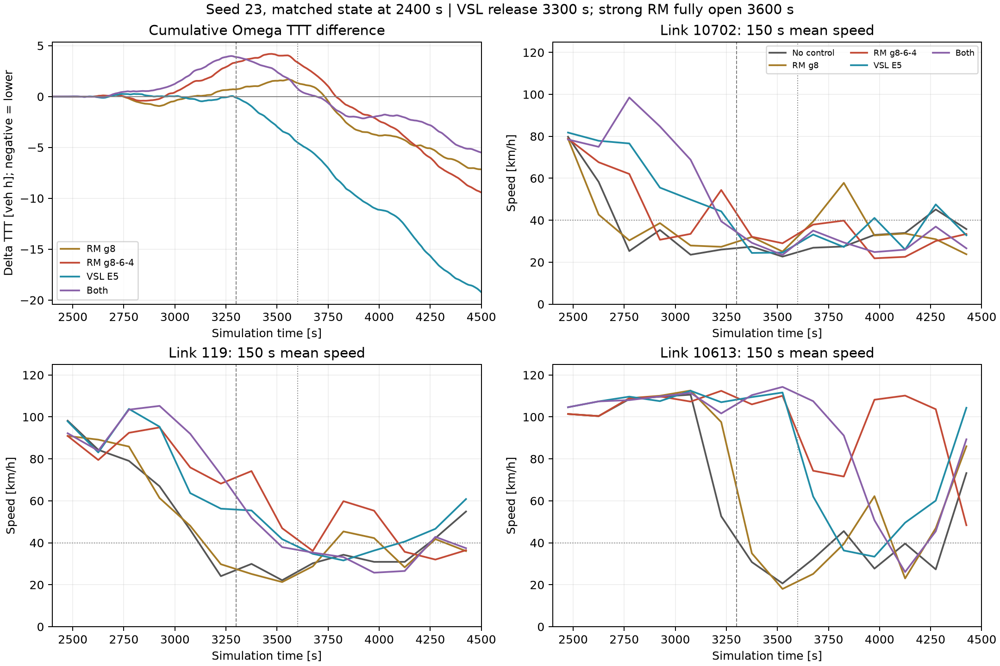
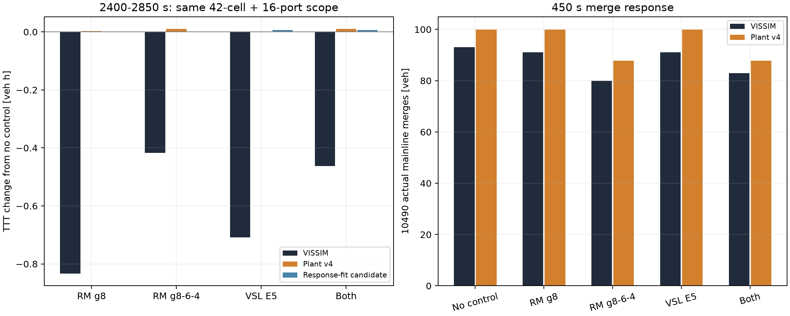

# 동일 초기 상태 RM·VSL 반응 검증 — 2026-09-16

4500초 신규 4런과 사후 검증을 완료했다. 무제어는 이미 완료된 동일 조건 seed23 기록을 재사용했다. **실제 혼잡 지연은 존재하지만 plant의 후보 간 비용 차이는 여전히 부정확하다. 계수 후보를 정본에 채택하지 않았다.**

## 조건과 실행 검증

- 사용자 수정 가속 기하 + ramp DSD120, 동측 본선 input1098만 0.8배. 과거 전역 80/도시50 조건이 아니다.
- seed23, 0–2400초 무제어. 신규 4런 모두 2400초까지 무제어 FZP 데이터 8,646,345행의 payload hash가 일치했다.
- RM은 10490/SC9107 하나, VSL은 동측 E5의 DSD51–58만 변경. 도시 신호·수요·경로는 고정.
- RM8: 2400–3300초 g8/10. 강화 RM: 2400초부터 150초마다 g8→6→4 유지, 3300초 g6→3450초 g8→3600초 g10. 황색 없음.
- VSL: 2400–3300초 DSD120→100, 이후120. 숫자는 desired-speed distribution ID이며 엄격한 속도 상한이 아니다.
- native LDP 전환, 적용 시 readback, 비대상 신호 동일성 검증 모두 PASS. 1초 FZP 유지. 기존 owned-PID/초기 실제 진행300초 watchdog 사용.
- RM 해제 후 COM GREEN(g10)은 초기 native OFF와 상태명이 다르다. 실제 상태를 기록했고 암묵적으로 동일 처리하지 않았다.
- 신규 런은 고정 명령 반응 실험이며 ALINEA/MPC 재실행은 아니다. 이전 ALINEA·소규모 MPC 결과와 구분한다.

## Ω 성능: 같은 시간 구간끼리 비교

Ω는 고속도로+도시 protected network. 1초 궤적을 사다리꼴 적분했다. TTD는 살아서 Ω 밖으로 나간 관측 사건+망 종단 정상 출구 추정이며 내부 이동·미해결 소실·종료 잔여는 제외했다.

|조건|2400–2850 ΔTTT|2400–3300 ΔTTT|2400–4500 ΔTTT|2400–4500 개선|0–4500 개선|
|---|---:|---:|---:|---:|---:|
|RM g8|-0.691|+0.712|-7.147|0.340%|0.191%|
|RM g8-6-4|-0.407|+3.356|-9.424|0.449%|0.251%|
|VSL E5|+0.144|-0.120|-19.227|0.915%|0.513%|
|Both|+0.537|+3.880|-5.503|0.262%|0.147%|

ΔTTT 단위 veh·h, 음수가 개선. 무제어 ΩTTT는 2400–4500초 2100.370, 0–4500초 3749.991 veh·h. VSL 이득 대부분은 3300초 이후에 나타났다. 450초 점수만으로 이후 이득을 판정하기 어렵지만, 이 사실만으로 지평 연장이 해결책이라는 뜻은 아니다.

|조건|2400–4500 TTD|같은 구간 미해결 소실|0–4500 native 삭제|종료 미삽입|
|---|---:|---:|---:|---:|
|No control|14918|195|260|21139|
|RM g8|14869|200|261|21179|
|RM g8-6-4|14959|211|273|21096|
|VSL E5|15062|199|265|21051|
|Both|14971|184|247|21120|

미해결 소실과 native 삭제는 범위·식별 방식이 달라 합산하지 않는다. VSL은 미삽입이 감소하고 TTD가 증가했지만 소실은 4대 증가했다. 작은 단일-seed 차이를 삭제·확률 변동과 무관한 확정 성능으로 판정하지 않는다. 망 전체 오류/미삽입도 상당하여 정본 시나리오 품질 문제는 남는다.

## 혼잡 발생·확산과 대기

- 10702 링크의 첫 150초 평균속도<40km/h 구간 시작: 무제어2700, RM8 2700, 강화RM2850, VSL3300, 동시3150초. 이 정의는 순간 breakdown 시각이나 METANET 셀 평균 판정과 다르다.
- 무제어에서는 119가3150초, 10613이3300초 구간에서 저속화한다. 강화RM의 10613은4200초 구간까지 대체로 높은 속도를 유지하지만4350초에는48.4km/h로 떨어진다. VSL의10613은3750초에36.3km/h로 저하한다. 예방·지연이지 완전 제거가 아니다.
- 첫450초 10490 실제 합류: 무제어93, RM8 91, 강화RM80, VSL91, 동시83대. 강화RM에서 접근 도착94대, 최대connector재고19대, 정지차량시간533초. 동시100대·22대·713초. 다른 설정 수요로 바꾼 결과가 아니라 같은 설정에서 실제 도착·수용이 달라진 것이다.
- 합류 감소와 본선 속도 개선이 보여도 도시·램프 대기를 함께 세면 순이득은 작다. 더 강한 RM이나 두 레버 동시 사용이 자동으로 최적이 되지 않는다.

## 동일 450초 물리 영역에서 plant와 비교

아래는 42개 본선 셀+8개 진입connector+8개 진출connector의 30초 재고 사다리꼴 적분이다. Ω 및 full-controller 목적함수와 다르다. 비교 양쪽에 같은 영역·샘플 간격을 사용했으며, 작은 차이의 정확도를 1초 Ω와 혼동하지 않는다.

|조건|실측 Δcomponent TTT|v4 예측 ΔTTT|seed13 보정 후보 ΔTTT|10490 실측/예측 합류|
|---|---:|---:|---:|---:|
|RM g8|-0.8333|+0.0029|-0.0002|91 / 99.88|
|RM g8-6-4|-0.4167|+0.0104|-0.0002|80 / 87.76|
|VSL E5|-0.7083|+0.0000|+0.0065|91 / 99.97|
|Both|-0.4625|+0.0104|+0.0063|83 / 87.76|

- 강화RM의 합류 감소는 실제13대, 예측12.21대: 이 상태에서 RM 물리 반응 전체가 무효라는 주장은 틀리다. 절대 합류 오차에는 도착 예측102대 vs실제94대가 기여한다.
- 그런데 합류를 줄인 효과의 순비용 부호·크기를 v4가 재현하지 못한다. 실측450초 순위는 RM8→VSL→동시→강화RM→무제어, v4는 무제어/VSL을 선호한다. 작은 실측 순위는 단일seed 관측이며 일반적 최적 순위로 취급하지 않는다.
- v4 VSL 후보는 무제어와 예측이 정확히 같았다. 적용zone225개 cell-time 표본 모두 FD평형속도가 명령100보다 낮아 `min(Veq,(1+alpha)*VSL)`에서 VSL이 결합되지 않았다. 실제 실행 누락 문제가 아니다.
- native DSD100은88–130km/h 분포(평균107.97), DSD120은85–155(평균122.275). 분포·이력·차로별 반응과 단일 평균 평형속도 cap의 차이가 남는다. ID를 평균속도로 치환하는 것만으로 이 포화 문제는 해결되지 않는다.

## 도착 예측과 내부 동역학 분리

미래 실측 경계를 주입한 아래 계산은 원인 분리를 위한 사후 진단이다. 온라인 사용 가능한 예측 성능으로 계산하지 않는다.

1. 실제 source 유입·ramp 접근·진출 배수/분기를 공급해도, 무제어10681 합류는 실측126대 대비163대로37대 과대다. 10490은93대 대비93.70대로 가까워진다. 10681의 head 이후 이동·본선 수용/대기부터 별도로 검증할 근거가 생겼다.
2. 모든 램프의 실제 합류까지 직접 공급하면 경계 source·merge 오차는0이다. 동측 무제어 TTT 예측은94.27→90.34 veh·h로 내려가지만 실측86.38보다 여전히 높다. 속도RMSE도26.70→25.72km/h로만 개선된다.
3. 진출 배수 입력을 줘도 실제 진출량을 완전히 강제하지는 않는다. 실제 합류 주입 조건의 무제어 진출 오차는 서측−19.66, 동측+3.26대이다. 따라서 남은 오차를 순수 METANET 내부항 하나의 탓으로 분리한 것은 아니다.
4. 같은 경계 공급 조건에서도 VSL과 무제어의 미래 실측 도착/분기가 서로 다르다. 이 사후 계산의 비용 차이를 VSL 모델 자체의 인과 효과로 해석하면 안 된다. 진짜 사전 후보 비교는 위 frozen 예측이다.

## 출발지연과 큐 길이

10490의 g4 구간2700–3300초, 선두≤5m·속도<5km/h·head 이후 재고≤6·정지차량≥1인 cycle만 비교했다. 1초 FZP로 GREEN 후 첫 정지선 통과를 측정했다.

|조건|정지 queue1–3|queue4–7|queue8+|
|---|---|---|---|
|RM g8-6-4|3초:8회|3초:6회|2초:3회; 3초:41회|
|Both|3초:6회|3초:6회|2초:2회; 3초:43회; 4초:1회|

이 표본에서는 큐 길이에 비례한 첫 통과 지연 증가가 보이지 않는다. 작은 큐 표본은 적고 차량들이 독립 표본도 아니다. 큐가 길어지면 전체 배출 시간은 늘 수 있지만 첫 출발 지연과 분리해야 한다. 기존 포화 방출률에 포함된 손실을 다시 빼지 않았다. 이전 g2 기록에서 RED 이후 통과가 관측된 시간배치 문제는 남으며 별도 phase 모델 검증 대상으로 유지한다.

## 보정 후보 판단과 다음 수정 범위

seed13의 이전 동일상태 반응만 이용해 동측 free-speed×critical-density의9후보를 계산하고 seed23 결과를 보기 전에 후보 예측을 고정했다. 학습손실은6.752→4.987로 줄었으나 주로 baseline 오차 개선이었다.

- previous: seed23 baseline component 오차 +14.411 veh·h, 후보 ΔTTT MAE 0.6170 veh·h.
- calibrated: seed23 baseline component 오차 +15.504 veh·h, 후보 ΔTTT MAE 0.6111 veh·h.
- response_fit: seed23 baseline component 오차 +9.388 veh·h, 후보 ΔTTT MAE 0.6083 veh·h.

**후보 채택 보류.** 절대 TTT가 가까워졌다는 이유만으로 VSL/RM 선택 모델이 좋아졌다고 판단할 수 없다. merge/weaving 계수를 키워 레버에 인위적인 보상을 주거나 capacity drop을 추가하지 않았다. 이번 변경은 기존 준비·기록추출·사후분석 경로 확장과 진단 artifact이며 정본 plant 동역학은 변경하지 않았다.

후속 우선순위는 (1)10681의 head 이후 재고·속도·실제 합류로 수용과 이동 시간을 분리 보정, (2)VSL 적용을 desired-speed 분포/응답지연과 연결하되 같은 상태의 유량·속도분산·배출 변화로 검증, (3)이 두 가지를 통과한 뒤 후보 ΔTTT와 순위 재검증이다. 무제어 속도 RMSE 전역 재탐색이나 full GNE 확장보다 먼저 해야 한다. 이미 효과를 잘 맞춘10490의 서비스량을 일괄 재보정하지 않는다.

## 재현 파일과 한계

- `protocol.json`, `prepared_*/`, `run_*/fixed_validation.json`: 고정 명령·native 실행·같은 초기 상태 증거.
- `analysis/`, `observations/`: 1초 Ω·30초 물리량·head 통과·선두 거리/속도.
- `frozen_predictions/`, `response_analysis/`: 사전450초 예측과 미래경계 사후 진단 구분.
- `model_mechanism_audit.json`, `response_fit_seed13/`, `summary.json`: 포화·DSD·후보 보정/검증 결과.
- `summarize.py`는 완성된 작은 결과 파일만 읽는다. `evaluate.py --analyze`는 오프라인 진단이다. 새 VISSIM 실행을 시작하지 않는다.
- 추가900초 예측 시도는 canonical450초 guard에 거절되어 미완료. `frozen_900s/FAILED.json` 및 당시 소스/로그 보존. 900초 예측 결과로 가장하지 않았으며 guard도 변경하지 않았다.
- 단일seed·단일개입시점·단일RM/단일VSL 구간. 4500초까지만 평가했으며 끝까지 회복 확인이나10% 개선 달성은 아니다. 새 기하의 full GNE 연결은 여전히 미완료.
- 기존 결과·원본 network·native 궤적은 보존했다. git commit/push는 수행하지 않았다.
