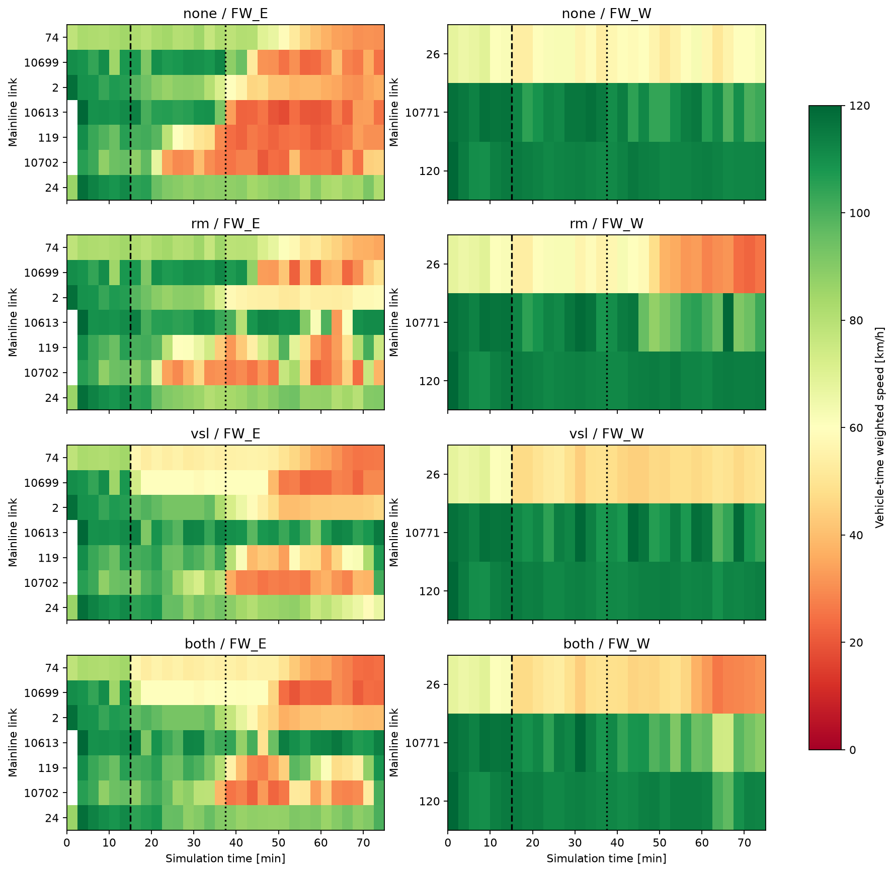
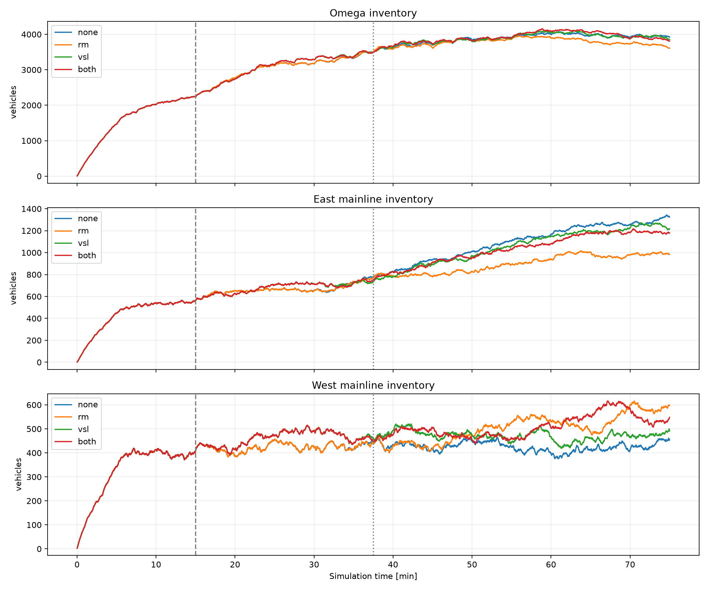

# 동일 룰 제어4조건:4500초 연장 검증

사용자 수정 기하+8램프 DSD120, 동측 본선 입력1098만0.8배. seed13. 수요·경로·기준 신호·검지 위치·정책을 유지하고 SimBreak만4500초로 연장했다. SimPeriod9001 유지.
0–900초 native 무제어, 이후150초마다ALINEA/규칙 VSL을 갱신한다. 고정 명령2250초 실험과 구분한다. 이전3000초 룰 실험과 조건별 전체 FZP 데이터 행이 정확히 일치했다.

## 판단

4500초로 늘려 보니 RM의 Ω TTT 감소율은 전체1.60%, 후반2250–4500초2.62%다. 이전3000초의0.21%보다 커졌다. 10490에서2초 녹색에 처음 도달한 시점도2400초여서2250초 종료는 강한 제한 이후의 반응을 충분히 담지 못했다.
동측 본선 혼잡 완화는 관측됐다. 다만 RM의 서측 체류시간과 램프 대기는 늘고, 미삽입도300대 많았다. Ω 밖 미생성 차량의 기다림은 현재 TTT에 포함되지 않는다. 따라서1.60%를 동일한 서비스 수요 전체의 확정적 개선이라고 단정하지 않는다.
VSL과 동시 제어는 종료 직전 동측 하류119·10702의 속도를 회복시키지만, 전체 Ω TTT는 무제어보다 높다. 병목 국소 효과와 전체 비용을 구분해야 한다. 현재 규칙/검지 배치의 결과이며 VSL 자체가 무효라는 결론은 아니다.

## Ω 체류시간

|조건|0–4500 TTT[veh·h]|개선율|0–2250 개선율|2250–4500 개선율|TTD사건|종료Ω재고|
|---|---|---|---|---|---|---|
|none|3967.55|+0.00%|+0.00%|+0.00%|28354|3924|
|rm|3904.01|+1.60%|+0.00%|+2.62%|28354|3611|
|vsl|3986.13|-0.47%|-0.92%|-0.18%|28387|3856|
|both|4000.09|-0.82%|-0.91%|-0.76%|28264|3812|

TTT는 고속도로+도시 protected network Ω 내부 차량시간. TTD는 살아서Ω 밖으로 이동한 사건 및 물리적 말단 유출 추정이다. 비정상 소실·종료잔여는 TTD에서 제외한다.

## 전체4500초 TTT 분해[veh·h]

|조건|동측 본선|서측 본선|8개on-ramp connector|나머지Ω|
|---|---|---|---|---|
|none|1040.72|505.95|98.74|2322.15|
|rm|917.34|555.08|112.35|2319.24|
|vsl|1022.25|549.39|96.82|2317.67|
|both|1010.23|572.60|108.38|2308.88|

RM의 동측 본선 절감123.38veh·h 중 서측 증가49.13veh·h와 램프 증가13.61veh·h가 상당 부분을 상쇄했다. 접근도로는 혼합 목적지여서 on-ramp connector 항에 무조건 포함하지 않는다.

## 2250초 이후10490 램프

|조건
|실제 도착|실제 합류|최대 재고|정지 차량시간[veh·h]|종료 재고|마지막 녹색[s/10s]|
|---|---|---|---|---|---|---|
|none|497|497|18|0.89|9|native OFF|
|rm|396|399|40|10.94|12|8|
|vsl|505|504|17|0.34|9|native OFF|
|both|437|409|42|8.93|37|4|

도착은 connector에 실제 들어온 차량이다. 설정된 희망 수요가 아니며, 접근도로의 모든 차량을 램프행으로 취급하지 않는다.

## 8개 미터 작동 및 실제 합류

|램프|RM 첫 제한[s]|RM 최소/최종녹색|2250–4500 합류 무제어/RM|RM 종료재고|동시제어 최소/최종녹색|
|---|---|---|---|---|---|
|RM_C10480|None|10/10|206/206|2|10/10|
|RM_C10482|None|10/10|1347/1137|26|10/10|
|RM_C10646|None|10/10|242/235|7|10/10|
|RM_C10644|None|10/10|303/303|10|10/10|
|RM_C10639|None|10/10|329/329|6|10/10|
|RM_C10681|None|10/10|676/664|36|10/10|
|RM_C10490|1800|2/8|497/399|12|2/4|
|RM_C10484|1650|8/8|470/467|12|5/5|

## 종료 직전 본선 속도[4350–4500s 평균km/h]

|조건|동측2|동측10613|동측119|동측10702|서측120|
|---|---|---|---|---|---|
|none|36.2|25.2|30.8|45.1|112.7|
|rm|58.8|111.0|75.1|37.8|114.7|
|vsl|46.3|115.1|107.3|101.6|114.1|
|both|40.0|113.5|108.3|100.7|112.9|

## 손실과 실행 검증

|조건|Ω 미확인 소실|native 삭제경고|종료 미삽입|런 경과[s]|
|---|---|---|---|---|
|none|265|246|21556|278.4|
|rm|288|246|21856|357.9|
|vsl|254|223|21608|282.0|
|both|251|240|21775|349.8|

삭제경고와 미확인 소실은 중복 가능하므로 합산하지 않는다. 미삽입은 Ω TTT 밖이므로 실제 유입 차이와 함께 판단해야 한다. 단일 seed이므로 작은 개선은 확정하지 않는다.
RM의 추가 미삽입은 도시 입력1102(link32) +245대, 서측 본선1099(link26) +81대가 주를 이룬다. 동측 본선1098(link74)은34대 감소했다. 입력별 native 종료 경고를 별도input_pending_comparison.json에 보존했다.

|조건|Ω 경계 실제 진입사건|Ω 안 최초 관측|
|---|---|---|
|none|10284|22259|
|rm|10302|21951|
|vsl|10300|22197|
|both|10294|22033|

모든 대상신호는 native LDP·적용readback, VSL은 적용readback, 정책은 기록된 검지값 재생으로 검증했다. 매초 차량COM 전수조회·MPC/GNE 계산은 없다. 사후분석은4개 런 종료 후 수행했다.
이번 비교는 기존 규칙정책의 시간 연장이다. 입력40m VSL 검지기에 초기 가속과 입구 혼잡이 섞이는 한계는 그대로이며, VSL의 최적 배치나 보정된 MPC 성능을 검증한 결과로 확대하지 않는다.
4500초에 잔여혼잡이 있으면 회복을 입증한 것이 아니다. 수요를 줄이거나 종료시각에 차량을 지우지 않았다.

세부자료:summary.json,verification.json,analysis/*/area_timeseries.csv,stocks_1s.csv,ramp_150s.csv,freeway_links_150s.csv.
