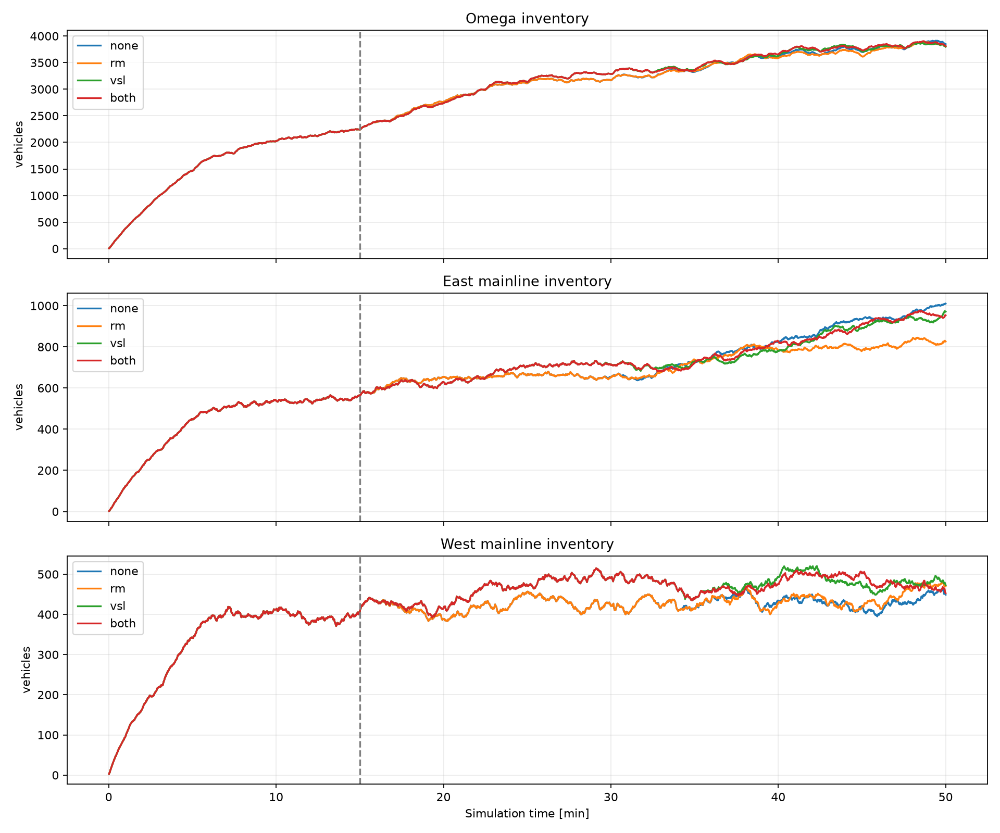
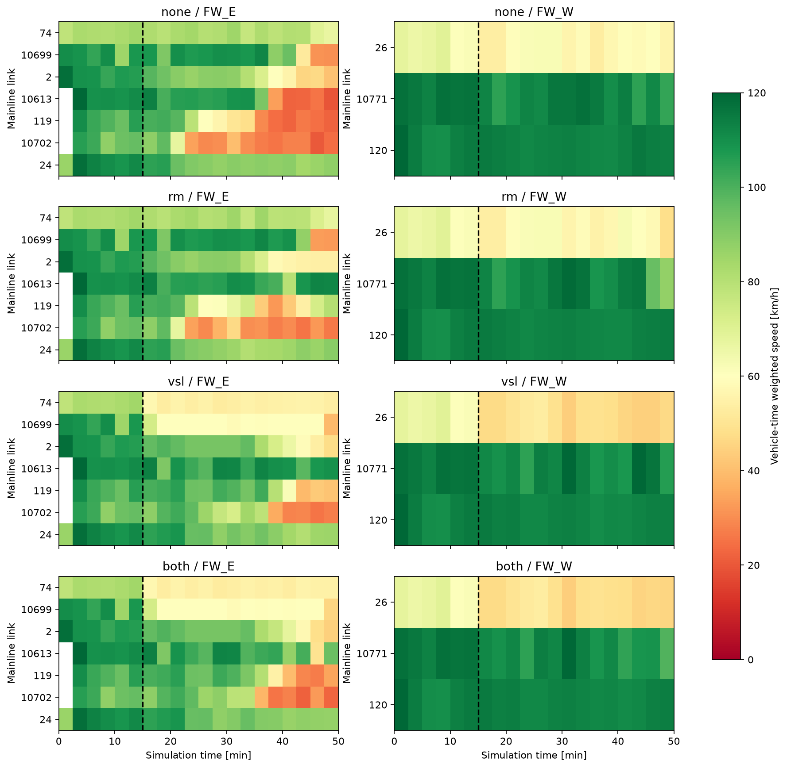

# 새 가속거리·램프 DSD 망: ALINEA / 규칙 VSL 4조건

동일 사용자 수정 망·수요·seed 13. SimPeriod=9001 유지, 3000초에서 정지. 0–900초 native 무제어, 900–3000초 정책 적용.
본선 및 램프 기준 속도분포 ID120 유지. VSL은 기존 결정 트리의 기준 명령만120으로 변경한60/80/120이며, 분포 ID는 모든 차량의 고정 주행속도가 아니다.
ALINEA: 8개 독립 미터, 새 합류점50m 하류 전체 차로 평균 점유율, 목표15%, gain70veh/h/percentage-point/lane. 150초 갱신, 적·녹10초 주기, 최소녹색2초 및 직전 녹색 대비±2초. 서비스 표는 이전 규칙 실험과 동일하며 새 망의 실측 용량으로 재보정한 값은 아니다.
도시 신호·수요·경로·기하·램프 DSD는 네 조건에서 동일하다. 비RM 조건은 native OFF, RM은900초부터 COM으로 제어하므로 OFF와g10의 등가성을 가정하지 않았다.

RM은 실제 본선 혼잡을 줄였다. 다만 동측 이득을 램프·도시부 대기 증가가 대부분 상쇄해 Ω 전체 개선은0.21%다. VSL과 동시 제어는 각각0.76%,0.88% 악화했다. 0.21%는 단일 seed의 작은 차이이고 미확인 소실도 달라, 확실한 순개선으로 판정하지 않는다.

## 결과

| 조건 | Ω TTT 0–3000 [veh·h] | 개선율 | 900–3000 개선율 | TTD [사건] | 종료 Ω 차량 |
|---|---|---|---|---|---|
| 무제어 | 2317.78 | +0.00% | +0.00% | 18122 | 3846 |
| ALINEA RM | 2312.87 | +0.21% | +0.26% | 18132 | 3806 |
| 규칙 VSL | 2335.34 | -0.76% | -0.91% | 18090 | 3798 |
| RM + VSL | 2338.13 | -0.88% | -1.06% | 18071 | 3809 |

TTT는 Ω=고속도로+도시 protected network 안의 차량시간이다. TTD는 살아서 Ω 밖으로 이동한 사건과 물리적 말단 유출 추정이며, 종료 잔여·비정상 소실은 제외했다. 동일 차량의 재진입 후 재유출은 사건으로 다시 센다.

| 조건 | 동측 본선 TTT | 서측 본선 TTT | 8개 진입 connector TTT | 나머지 Ω TTT |
|---|---|---|---|---|
| 무제어 | 435.89 | 248.63 | 52.87 | 1181.74 |
| ALINEA RM | 415.61 | 250.37 | 59.34 | 1188.89 |
| 규칙 VSL | 435.08 | 273.72 | 51.46 | 1176.41 |
| RM + VSL | 437.41 | 273.13 | 53.02 | 1175.93 |
위 분해는900–3000초 [veh·h]. 램프 connector 외 접근도로는 혼합 목적지이므로 모두 램프 대기열로 세지 않았다.

## 혼잡과 방출 반응

무제어 동측은 하류10702에서 저속이 나타난 뒤119·10613·2로 상류 저속 구간이 확대됐다. 2250–2400초 평균속도는119가24.0km/h, 그 상류10613이33.4km/h였다. RM에서는 같은 시간 각각32.1·100.6km/h이며,2700–2850초119는72.9km/h로 회복했다(무제어24.7). 하류10702는RM에서도 낮은 속도가 남았다. 이는 링크 평균에 근거한 전파 패턴이며 차량별 병목 원인 분류는 아니다.
900–3000초10490 실제 합류는445→351대, connector 유입은446→380대로 감소했다. 정지 차량시간(<5km/h)은0.38→5.26veh·h, 최대 connector 재고는16→40대로 증가했다. 설정 수요는 같으며, 관측 도착 감소를 희망 수요 감소로 해석하지 않는다.
RM의 동측 본선 이득은20.28veh·h(4.65%)지만,8개 connector에서6.47, 나머지Ω에서7.15, 서측 본선에서1.74veh·h가 증가해 전체 이득은4.91veh·h만 남았다. 본선만 보면 효과가 있고, Ω 전체 대기 비용까지 보면 현재 정책의 순효과가 작다.
VSL은 동측 하류 저속 발생을 늦췄지만 입력부 저속 구간을 넓혔다. 서측 본선 TTT가248.63→273.72veh·h로 증가해 동측 일부 구간의 개선만으로 전체 이득이 되지 않았다. 동시 제어10490 제한 시작은2400초로RM 단독1800초보다 늦었으며, 단독 효과가 단순 합산되지 않았다.

## 실제 제어 노출

### ALINEA RM

| 램프 | 최소녹색/10초 | 첫 제한 [s] | 제한시간 [s] | 최대 하류 점유율 [%] |
|---|---|---|---|---|
| RM_C10480 | 10 | None | 0 | 5.91 |
| RM_C10482 | 10 | None | 0 | 7.34 |
| RM_C10646 | 10 | None | 0 | 5.51 |
| RM_C10644 | 10 | None | 0 | 4.57 |
| RM_C10639 | 10 | None | 0 | 9.58 |
| RM_C10681 | 10 | None | 0 | 13.20 |
| RM_C10490 | 2 | 1800 | 1200 | 25.71 |
| RM_C10484 | 9 | 1650 | 1350 | 16.27 |

### RM + VSL

| 램프 | 최소녹색/10초 | 첫 제한 [s] | 제한시간 [s] | 최대 하류 점유율 [%] |
|---|---|---|---|---|
| RM_C10480 | 10 | None | 0 | 3.75 |
| RM_C10482 | 10 | None | 0 | 8.51 |
| RM_C10646 | 10 | None | 0 | 5.27 |
| RM_C10644 | 10 | None | 0 | 4.70 |
| RM_C10639 | 10 | None | 0 | 6.12 |
| RM_C10681 | 10 | None | 0 | 12.14 |
| RM_C10490 | 2 | 2400 | 600 | 25.03 |
| RM_C10484 | 8 | 1650 | 1200 | 17.17 |

### 규칙 VSL VSL

| 구간 | 최소 분포 ID | 제한시간 [s] |
|---|---|---|
| FW_E__seg0 | 60.0 | 2100 |
| FW_E__seg5 | 120 | 0 |
| FW_E__seg10 | 120 | 0 |
| FW_E__seg15 | 120 | 0 |
| FW_W__seg0 | 60.0 | 2100 |
| FW_W__seg5 | 120 | 0 |
| FW_W__seg10 | 120 | 0 |
| FW_W__seg15 | 120 | 0 |

### RM + VSL VSL

| 구간 | 최소 분포 ID | 제한시간 [s] |
|---|---|---|
| FW_E__seg0 | 60.0 | 2100 |
| FW_E__seg5 | 120 | 0 |
| FW_E__seg10 | 120 | 0 |
| FW_E__seg15 | 120 | 0 |
| FW_W__seg0 | 60.0 | 2100 |
| FW_W__seg5 | 120 | 0 |
| FW_W__seg10 | 120 | 0 |
| FW_W__seg15 | 120 | 0 |

## VSL 검지 위치에 대한 해석 제한

두 VSL 조건 모두 동·서측seg0만900초부터60 명령을 유지했고, 나머지6개 구간은120을 유지했다. seg0 검지기는 본선 입력 링크74·26의40m 지점이다. 입력1098·1099의 차량 구성1은 승용/기타 분포40, 중차량 분포30이며, 최초 본선 DSD120 통과 후 가속 과정도 이 검지값에 섞인다.
900초 결정의 직전150초 검지값은 동측34.29km/h·27.41%, 서측27.59km/h·36.52%였다. 별도 무제어 FZP 공간 점검(750–900초)에서 동측0–100m 평균26.35km/h가600–700m에서96.59km/h로 높아졌다. 서측은500–600m41.59km/h,1100–1200m72.46km/h로 저속 구간이 더 길었다. 공간 평균은 차량시간 가중이며 검지점 통과차량 평균과 같은 통계량은 아니다.
따라서 이 VSL 결과는 현재 검지기 배치의 규칙 정책 결과다. 합류 병목 예방을 충분히 시험했거나 VSL 자체의 잠재력을 판정한 것으로 볼 수 없다. 초기 가속·입력부 혼잡·하류 병목을 구분해 검지 위치를 재선정하는 것이 다음 검토 대상이며, 이번4조건 중간에는 위치·수요를 바꾸지 않았다. 근거:entry_acceleration_750_900.json 및 각decision_900.json.

## 삭제·미삽입과 검증

| 조건 | native 차로변경 삭제 경고 | Ω 미확인 소실 | 종료 미삽입 | 전체 실행 경과 [s] |
|---|---|---|---|---|
| 무제어 | 132 | 165 | 15638 | 175.8 |
| ALINEA RM | 134 | 175 | 15646 | 235.2 |
| 규칙 VSL | 123 | 147 | 15712 | 180.4 |
| RM + VSL | 131 | 143 | 15715 | 216.8 |

삭제 경고와 미확인 소실은 겹칠 수 있어 합산하지 않는다. 미삽입 차량은 Ω TTT에 포함되지 않으므로 지표만 낮아진 것을 자동으로 개선이라 판단하지 않는다.
4조건의0–900초 전체 FZP 데이터 행 일치, 비대상 신호 LDP 일치, 모든 RM 실행 전환 및 VSL 적용 readback 검증 PASS. 입력 검지값에서 정책 결정을 재계산한 결과와 실행 명령표도 정확히 일치했다.
새 무제어의0–2250초 전체 FZP는 앞선 DSD 무제어 결과와 정확히 일치해, 검지기 추가와 연속 실행 중간 정지가 기준 교통 결과를 바꾸지 않음을 확인했다.
LSA는 보존했으나 COM 전환 누락 문제로 승인된 LDP를 실행 기준으로 사용했다. 초기 상태는 적용 전 readback 및 첫 native LDP 프레임으로 보존했다.
차량 전수 COM 조회·MPC 초기화·예측·GNE 계산은0회. 갱신마다 native 검지 결과만 읽고 명령이 바뀔 때 쓰며, 전환 시점 사이를 RunContinuous로 진행했다. 표의 경과시간은 로딩·시뮬레이션·정책·실행검증을 포함하며 사후 FZP 분석은 제외한다. 순수 시뮬레이션 가속률로 해석하지 않는다.
기존 정책 테스트9개 및 합성4조건의 활성화·녹색 trust region·66개 본선 DSD 주소 검사 PASS.
VSL 단독의 최초 검증은 명령 ID60.0과 readback60의 문자열 비교 때문에 실패했다. 84개 적용값이 모두 수치상 동일함을 확인하고 정수 ID 비교를 수정해 재검증했다. 최초 실패 receipt·검증 출력은run_vsl/initial_failure_*에 보존했고, 교통 결과나 정책을 변경하지 않았다.
단일 seed·3000초 초기 비교다. 장기 회복·다중 seed 유의성·최적 제어 성능·plant 예측 정확도를 입증하지 않는다.

다음 우선순위는 입구 가속 구간과 병목 상태를 구분하는VSL 검지 배치를 확정하는 것이다. RM은10490의 실제 방출·본선 이득·대기 비용을 함께 재현하는지 plant를 점검할 근거가 생겼다. 현재 결과만으로RM이 무효이거나VSL의 물리적 이득이 없다고 결론내리지 않는다.

원자료: `analysis/*/area_timeseries.csv`, `ramp_150s.csv`, `merge_events.csv`, `freeway_links_150s.csv`; 실행검증: `verification.json`, 각 run의`fixed_validation.json`, `decision_*.json`.
