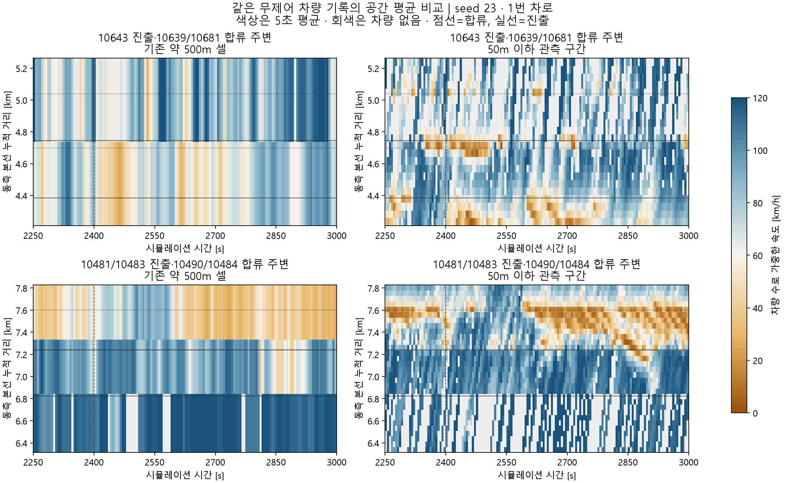

# 램프별 세그먼트 분리와 국소 혼잡의 공간 평균 검증

2026-09-21. **진입 8개·진출 8개를 모두 별도 본선 세그먼트에 배정해 실제 기존 plant에서 450초 예측을 수행했다. 공간 평균에 가려지는 국소 정체는 확인했지만, 분할만으로 제어 이득 예측은 개선되지 않았다.** 보정 완료/운영 정본 승격은 아니다. 새 VISSIM 실행은 없고 완료된 동일 seed23 기록을 재사용했다.

## 1. 적용한 구획

- 동·서측 각각 21→31셀. 기존 셀 경계는 유지하고 램프를 포함한 셀을 주로 약 200m 단위로 나눈다. 램프 접속점이 여러 개이면 그 사이에 먼저 경계를 둔다. 고유 접속점 16개 모두 `한 셀에 최대 하나` 검증 통과.
- 10483 진출점과 10490 합류점은 2.814m 떨어져 있다. 둘의 중간인 누적 거리7241.679m에 경계를 넣었다. 도로 사이2.814m를 별도 셀로 만들지 않았다.
- 다음 램프도 각각 별도 셀이다. 모든 수치/서측 목록은 `ports_branch_guard.csv`에 있다. 인덱스는0부터다.

| 동측 접속점 | 기존 셀 | 분리 셀 |
|---|---:|---:|
|10643 진출 /10639 진입|8 /8|9 /10|
|10682 진출 /10681 진입|9 /9|11 /12|
|10481 진출|12|18|
|10483 진출 /10490 진입|13 /13|20 /21|
|10484 진입|14|23|

물리 INPX, 차로 수, 연결, 램프 위치, 도로 총 길이·lane-km, 수요·경로, 서비스 곡선, 명령과 물리 계수는 바꾸지 않았다. 부모 셀의 차로 그룹과 실측 과거 교환률을 자식 셀에 계승하고 내부 셀 경계는 같은 그룹끼리 연결했다. 기존 물리 경계의 연결 행렬은 유지했다. 초기 차량은 현재 실제 위치로 재배치했고 부모별N과N·v가 정확히 보존되는지 검사했다. 램프 출신은 과거 차량 ID와 기존 출신 재고를 대조했고,10643 목적지 라벨은 현재 경로만 사용했다.

VSL의 기존 공간 적용 근사는 부모→자식으로 그대로 계승했다. 새 DSD 위치나 다른 VSL 구역으로 바꿔 결과를 얻지 않았다. 모든 미터는 기존 독립 실행 명령 그대로다.

최종 진단 구획은 `geometry_200_branch_guard.json`이다. 이 파일은 `run.py`의 검증된 부모→자식 입력 변환으로 기존 harness에 주입된다. **기존21셀 전용 geometry profile/온라인 controller에 파일 경로만 바꿔 직접 넣는 방식은 아직 지원하지 않는다.** GNE/온라인 관측·writer의 구획 전환으로 완료 처리하지 않는다.

## 2. 평균에 가려지는 짧은 정체는 실제로 존재한다

NC/RM/VSL의 기존 native1초 파일3개를 전체 해시로 확인하고, 같은 차량을 기존 셀 및250/100/50m 이하 구간으로 집계했다. 각 구간은 원래 셀을 등분하므로 실제 길이는 명목값 이하이다. 시간은2249–3000초, 비교 통계는2400–2850초다. 모든 공간 해상도에서 초별 총N과N·v가 일치한다. lane3–4가 기존 한 그룹인 곳은 같은 묶음을 유지해 종방향 분할 효과와 차로 분리 효과를 섞지 않았다.

국소 혼잡 선별 기준은 차량3대 이상, 해당 그룹 평균속도30km/h 미만, 밀도는 기존FD의임계 초과, 같은 공간 구간에서5초 이상 지속이다. 이때 부모 셀의 같은 그룹 밀도가 임계 미만이면 공간 평균에 가려진 사례로 센다. 이 기준은 관측 사례 선별이며 새 capacity drop/폐쇄 규칙이 아니다.

무제어 사례:

| 시각/구간 | 같은 차로 그룹의 기존 셀 평균 | 약100m 국소 평균 |
|---|---|---|
|2839초,10483/10490 부근,1번 차로|70.25km/h,26.38대/km/차로|22.72km/h,60.88대/km/차로,정지3대|
|2598초,10484 합류점 하류,2번 차로|40.26km/h,24.35대/km/차로|11.72km/h,50.73대/km/차로,정지4대|
|2491초,10681 부근,3·4번 차로 묶음|65.84km/h,18.05대/km/차로|12.29km/h,28.50대/km/차로,정지3대|

반대로10643 주변2번 차로는451초 중412초에서100m 국소 혼잡 조건을 만족하지만, 이 사례에서 부모 밀도가 임계 아래로 가려진 시간은0초다. **모든 예측 실패를 공간 평균 탓으로 설명할 수는 없다.** 겹친 진출·합류 부근의 관측만으로 어느 램프가 원인인지 독립적으로 식별한 것도 아니다.

그림은 무제어1번 차로의 기존 공간 평균과50m 이하 관측을 같은 속도 축으로 비교한다. 시간 집계는5초 차량 수 가중 평균이며 회색은 차량이 없는 구간이다. 원본 기록은1초이고 신규 기록5초 기본값은 유지했다. 혼잡 발생 지점의 폭과 상류 방향 이동이 작은 구간에서 더 선명하다.

## 3. 첫 구획의 수치 실패와 보완

처음 만든 외부 셀의 최단 길이는92.85m였지만,10643의 기존 내부 pre/post 분할을 고려하면 **pre 길이가9.91m**가 됐다. 동일 계수 예측의 이 내부 상태는2402초에181.22km/h에 도달했고, 이후 셀 평균도1000km/h를 넘었다. 차량 보존만 통과한 이 결과를 유효한 제어 비교로 사용하지 않는다. `refined1_*`와 실패 수치 자료는 보존했다.

기존10643 내부 pre/post 길이도 최소100m가 되도록 주변 외부 경계를 조정했다. 이 길이는 기존100m 공간 검토와120km/h에서1초 이동거리의3배를 사용하는 **수치 검토용 구획 여유**이며 이득에 적합한 계수가 아니다. 최종10643 내부는100.0/156.206m, 해당 외부 셀은256.206m다. 그 앞 셀은76.03m가 된다. 따라서 최종 구획은 `모든 셀200m 이하`가 아니라 `램프 주변 약200m, 내부 분할 길이를 별도 보호`다. 다른 접속점은 계속 서로 다른 셀이다.

보완한 네 예측은 외부 셀과 내부 분할 모두 advective Courant≤1,180km/h의 느슨한 이상값 검사, 비음수·저장·차량 보존을 통과했다. 180은 출력 이상 탐지 기준일 뿐 모델 속도 상한으로 적용하지 않았다. 이것만으로 모든 수치 안정성을 증명했다는 뜻은 아니다. NC 최대 그룹 속도는122.91km/h, 내부 분할 최대는119.39km/h다.

## 4. 같은 시간 간격에서 비교한 제어 반응

seed23·동일2400초 상태→2850초, 고정 명령NC/RM10490/VSL/동시의4조건이다. 전체 물리 계수·수요·명령을 고정했다. 미래 상태 주입이나 비용을 이용한 계수 적합은0이다. 두 구획 모두1초 내부 적분으로 비교해, 공간 변경과 시간 간격 변경을 구분했다. 기록5초/제어150초/지평450초/RG10초의 기본 계약은 변경하지 않았다. 운영에 채택하려면5초 외부 단계와 필요한 국소 내부 단계를 연결하는 검증이 따로 필요하다.

| 제어−NC 체류시간[veh·h] | 실측 | 기존21셀·1초 | 램프별31셀·1초 |
|---|---:|---:|---:|
|RM|−0.553333|+0.004983|+0.017238|
|VSL|−0.981944|+0.046924|+0.055723|
|동시|−0.515000|+0.052045|+0.073176|

비용 범위는 과거와 같은 **동측 본선 링크+진입4개+진출4개**다. Ω 전체 TTT가 아니며 도시부 전체 대기·TTD는 이 표로 평가하지 않았다. 실제 수치는 기존 `response_chain_20260921/README.md`의 완료된 비교를 재사용했다.

NC 동측 속도RMSE는22.82→23.47km/h, 복합 상태 점수는2.4249→2.6470이었다. 서측 상태 점수는2.2806→2.0310으로 줄었다. 한 상태의 결과이며 미사용seed나 전체 controller성능 검증이 아니다. RM의 본선 이득은 두 구획 모두 약−0.2505veh·h로 거의 같다. 램프를 분리해도 실제−0.8797veh·h의 본선 이득을 설명하지 못한다.

**판정:** 요청한 램프별 구획과 초기 상태·보존 연결은 구현·실행 검증했다. 공간 평균이 짧은 정체를 가리는 것도 확인했다. 그러나 현재 속도/회복 법칙의 제어 응답은 세분화만으로 해결되지 않았으므로 운영 정본 전환과 이득 보정 성공 판정은 보류한다. 구획을 전부 더 잘게 만드는 전수 탐색으로 이어가지 않는다. 다음 물리 검토에서는 이 구획의 국소 정체 전후 상태를 사용하되, 실제 지속·방출·회복 반응을 별도로 설명해야 한다.

## 변경과 재현

- 기존 `canonical_harness.py`:21셀 고정 반복·말단 인덱스를 실제 셀 수로 일반화했다. 수식은 변경하지 않았다.
- 기존 `urban_route_transport.py`:분할 후 현재10643 목적지 라벨을 받는 선택형 입력을 추가했다. 기존 호출은 그대로다.
- 기존5초 기준4개 예측JSON 전체가 변경 전과 정확히 같다. 기존 소스 원본과 실행 당시 줄바꿈이 달랐던 소스도 함께 보존했다.
- `prepare.py`:망 구획과 해시 검증된 native 공간 집계. `analyze_space.py`:관측 비교와 그림. `run.py`:기존 runner 호출과 동일 초기 상태의4조건 계산. `validate.py`:구획·소스·수치·보존 확인.
- `validation.json`:최종 판정,88개 소스핀 검사,4개 기본 예측 정확 일치,16개 예측의 개별 수치 검사. 최초 무보호 구획4개는 수치 실패로 분리했다. 새 native0회. 완료된 예측을 다시 돌릴 필요 없이 사후 검증만 재실행 가능하다.

첫 준비 시 INPX 원래 링크 길이와 기존 chain offset의1mm 미만 반올림 차이를 검사가 발견했다. 기존 observer의 연속 `physical_pieces`를 분할하도록 고쳐 부모 길이·lane-km를 정확히 유지했다. 첫 그림 생성은 matplotlib 경로가 없어 중단됐고 이미 설치된 `.review-deps`를 명시해 복구했다. 집계 계산 결과에는 영향이 없다.
