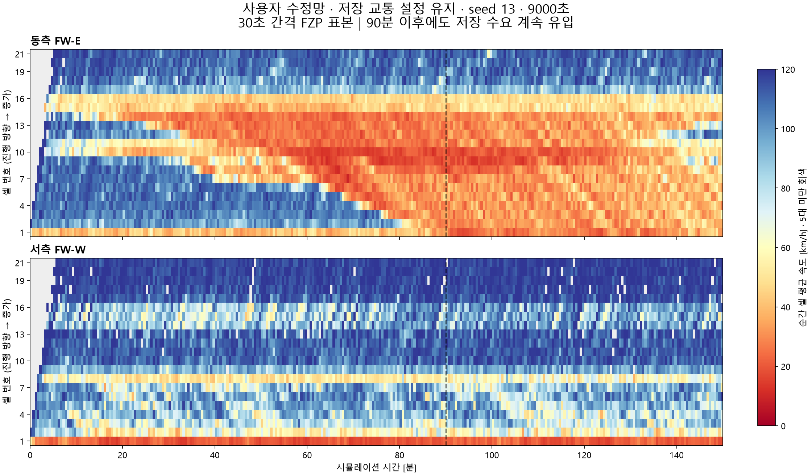
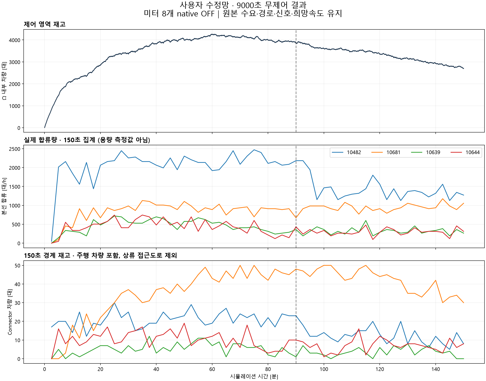

# 사용자 수정망 9000초 실행 결과 — 2026-09-14

저장된 교통 조건을 유지한 9000초 실행과 사후 검증을 완료했다. 램프 합류량은 이전 실험보다 커져 **미터가 실제 합류량을 바꿀 수 있는지 시험할 여지는 늘었다.** 그러나 동측 혼잡은 E14에서 먼저 생겨 상류로 전파됐고, 본선 미삽입과 도시부 차로 접근 실패도 크다. 무제어 한 번으로 metering의 총 TTT 개선 가능성을 입증한 것은 아니다.

## 무엇을 실행했는가

- 사용자 지정 폴더의 실제 파일명은 `baseline.inpx`였다. 원본을 바이트 그대로 별도 폴더에 복사해 실행했다.
- 최종 원본·복사본 SHA256: `10e1fd8f005ffe30646233bd15cef0344ab992036f144fe8e6f91638bb051cb5`.
- seed13, SimRes1, 0–9000초. 수요·route·차로 연결·신호·DSD·미터 설정 쓰기 **0회**. 폴더명에 남아 있는 `u0`나 이전 80/50 배율을 다시 적용하지 않았다.
- 기록만 FZP 0–9000초/1초 간격과 native 신호 기록으로 활성화했다. QuickMode/최대속도 연속 실행을 사용했다. 차량 전수 COM 조회·controller·plant 예측·런 중 대용량 분석은 실행하지 않았다.
- 기존 runner에 `native_preserve` 분기를 추가했다. 새 adapter는 만들지 않았다. 준비/runner 관련 검사 7개, VBS 구문·PowerShell 파서 검사가 통과했다.
- 사용자가 연 PID30304는 건드리지 않았다. 사용자 종료 확인 후 별도 생성한 VISSIM31780은 정상 완료 후 종료됐다. 300초 초기 무진행 watchdog을 유지했으나 발동하지 않았다.
- 실제 진행은 시작 약24초 후 native FZP 122초로 확인했다. 전체 runner 경과 **525.5초(8분45.5초)**. 로딩·기록 설정·simulation·정리를 포함한 시간이며 순수 simulation 시간으로 표시하지 않는다. 세부 단계 로그는 있지만 개별 소요시간은 계측하지 않았다.
- 종료 FZP **41,189,002행**, 약2.20GB, 1–9000초 완전 기록. 사후 집계 한 번에233.3초. 실시간 제어 계산 시간은0이다.

## 저장 조건의 중요한 의미

8개 램프 미터는 native LDP 72,000표본에서 **OFF**였다. LSA도 t=1 OFF와 이후 전환 없음을 확인했다. 저장 프로그램이 없는 SC9101–9108의 native 진단은 보존했다. 과거 COM으로 GREEN을 강제한 g10 조건과 상태가 같지는 않으며 OFF/GREEN의 차량 거동 동등성은 시험하지 않았다.

도시 SC1001·1004의150초 주기·program offset75초는 LDP 상태144,000개, 시계18,000개 및 LSA2,884개 이벤트와 일치했다. 독립적인 최초 관측은 첫 step 후 t=1이고 t=0 readback은 없다.

고속도로 DSD66개는 **희망속도 분포 ID120, 85–155km/h**를 유지했다. 이는 고정100km/h 또는 딱120km/h인 속도 상한이 아니다. 이번에 VSL을 적용하지 않았으므로 동적 VSL readback 검증을 했다고 주장하지 않는다. 설정 보존은 원본·복사본 동일성과 runner의 무덮어쓰기로 확인했다.

4500초부터의 마지막 입력률이9000초까지 계속됐다. **5400초 이후 수요를0으로 끈 cooldown은 아니다.** 이는 원본을 유지한 결과다.

## 혼잡이 어디서 시작했는가

아래 판정은 차량5대 이상인 셀의 순간 평균속도<30km/h가30초 간격으로 연속5표본, 즉 첫–마지막120초에 걸쳐 나타나는 기준이다. 표본 사이 상태까지 연속 관측했다는 뜻은 아니다. 셀 번호는0기반 CSV에1을 더했다.

| 동측 셀 | 최초 지속 저속 시작 [s] |
|---|---:|
|E14|1380|
|E13|1890|
|E12|2400|
|E11|2760|
|E10|3090|
|E9|3420|
|E8|3600|
|E7|3750|
|E6|3930|
|E5|4290|
|E4|4470|
|E3|4800|
|E2|5310|
|E1|5460|

**E14→E1의 상류 전파**가 뚜렷하다. 현재 매핑에서 E14(6.676–7.189km)는 첫3차로 셀이며10490 합류(7.153km)와 도시방향 출구 OR_D_E 집계 위치를 포함한다. 차로 축소·합류·분기가 함께 있는 위치라는 근거이며, 각 요인의 인과 기여까지 분리한 결과는 아니다.

10639 합류는 E9,10681은 E10이다. 따라서 이번 E8/9 저속만 보고 이 두 램프에서 혼잡이 최초 발생했다고 판단하면 안 된다. E14에서 시작한 파가 이미 상류로 전달된 상황도 포함된다.

동측은9000초에986대/정지80대가 남았고 마지막300초 E14의 차량수 가중 표본 평균속도는36.4km/h였다. 재고는 줄지만 완전 회복은 아니다. 서측은 W1만 지속 저속 기준에 해당한다. W1은 최초90초, 마지막 지속 구간6150–9000초이며 종료81대·18.7km/h다. 나머지 서측 셀에 같은 기준의 지속 정체가 없으므로, 서측 램프를 일괄 제한할 이유도 아직 없다.

## 램프 합류와 대기

FZP에서 connector→본선의 실제 차량 전이를 집계했다.8개 램프 모두 모호한 parent-road 점프는0이다. 접근도로의 모든 차량을 램프행으로 분류하지 않았다.

|램프|방향|0–9000초 합류 [대]|900–3000초 합류 [대]|최대150초 합류율 [대/h]|종료 connector 차량 [대]|connector 정지시간 [대·h]|
|---|---|---:|---:|---:|---:|---:|
|10480|W|851|242|576|1|0.04|
|10482|W|4501|1238|2472|8|0.34|
|10646|W|763|189|552|4|0.00|
|10644|W|946|325|744|8|0.01|
|10639|E|997|339|720|0|0.73|
|10681|E|2201|558|1176|30|34.05|
|10490|E|1720|458|960|2|7.01|
|10484|E|1477|420|960|6|0.59|

최대150초율은 관측 count×24이며 saturation capacity가 아니다. Connector 차량 수는 주행 차량도 포함한다. 정지는속도≤1km/h이고 상류 접근도로 비용은 이 표에서 제외했다. 전체 Ω TTT에는 포함되는 접근도로의 비용이 따로 반영된다.

이전 도시50% 무제어의900–3000초 기록과 양만 비교하면10639는66→339대,10681은139→558대,10482는266→1238대로 증가했다. **같은 망·DSD·수요의 대조실험이 아니므로 이를 네트워크 개선률로 해석하지 않는다.**

10681의1초 표본 최대 재고는57대(6202초), 최대 정지33대(7022초), 종료30대 중정지12대다. 이 램프는 실제 대기 비용과 제한 해제 조건까지 시험해야 할 후보다. 반면10482는 합류량이 크지만 connector 정지시간은 작고 서측 본선 대부분이 원활하므로, 유량을 줄일 수 있다는 사실과 줄여서 유리하다는 사실을 분리해야 한다.

원점 수요 감사상1101→10644/10639 생성 기대량은각1027.8대이고1102→10482는4567대다.10681은 복수 원점이 섞여66에서 오는 코호트만으로 전체 희망 수요를 추정할 수 없다. 확률적 생성·미삽입·이동시간 때문에 설정 기대량과 같은 시각 램프 통과량을 등치하지 않는다.

## 회복 판단을 제한하는 문제

- **미삽입32,805대**, 그중 본선1098/1099가32,670대(13,742/18,928). 전체 설정 생성 기대량98,297.348대 중 본선은54,252대다. 실제 삽입량은 기대량에서 미삽입 잔여를 뺀 값으로 단정할 수 없다.
- **차로변경 대기 삭제547대**가 native ERR에 명시됐다. 주요 위치310:215대,71:65대,68:63대,40:62대,281:46대. LCD9999m만으로 차로 접근 문제가 해결되지는 않았다.
- 68에서 삭제된63대는 모두1135:4의10681행이며3194–7910초에 발생했다. 램프 도착량은 희망 수요 전부를 대표하지 않는다.
- 도시40은 종료189대 중정지163대,66은201대 중정지140대다. 마지막900초40의18대 삭제가 있어 재고 감소만으로 정상 회복을 판정하면 안 된다.
- off-ramp10643도 종료30대 중정지19대로 남았다. on-ramp만의 문제로 처리하지 않는다. 반면10682는 종료2대/정지0,121은1대/정지0이었다.
- 무시된 static route372건,desired-speed decision255건,next-link 미발견18건도 보존했다. 이들은 모두 추가 삭제 차량이라고 합산하지 않는다.

이번 파일은 사용자가 확인한 조건 그대로의 **유효한 완료 런**이다. 동시에 미삽입·비정상 삭제가 큰 **성능 비교의 제약을 가진 조건**이다. 런 완료와 깨끗한 제어 평가 시나리오 적합성은 다른 판단이다.

## Ω 성능 지표

|0–9000초 지표|값|
|---|---:|
|TTT|8465.771대·h|
|TTD — Ω 이탈 사건|54,637건|
|그중 살아서 Ω 밖으로 이동을 직접 관측|35,687건|
|검증된 물리 terminal에서 정상 종료로 추정|18,950건|
|종료 Ω 잔여 차량|2,696대|
|분류 미확정 Ω 내부 소실 — TTD 제외|578건|
|재고 보존식 잔차 최대절댓값|0대|

TTT는 고속도로+도시 protected network Ω의1초 표본 사다리꼴 적분이다. TTD는 사람/차량 고유ID 수가 아니라 경계 이탈 사건이어서 정상 재진입 후 재이탈2159건도 포함한다. 비정상 삭제·종료 잔여·내부 이동·미삽입을 TTD에 넣지 않았다. Native 삭제547대는 전 망 기준이며578건과 중첩될 수 있으므로 합산하지 않는다. 망 밖 입력 대기 비용은 이 TTT 밖에 있어, 향후 제어가 진입만 늦춰 얻은 외형적 이득과 구분해야 한다.

## 제어·plant에 대한 판단

**미터의 물리적 반응을 확인할 대상은 생겼지만, 총 TTT 이득은 아직 미확인이다.** 특히 혼잡 시작 직전10490과 그 상류 동측 램프들이 E14 도달 흐름을 얼마나 바꾸는지가 핵심이다.10681은 이미 큐가 큰 구간에서 램프 대기 비용·하류 수용량까지 함께 봐야 한다.10639도 유입은 늘었지만 약한 g10→g8이 실제 합류를 바꾸는지는 별개다. 기존 서비스 계수로 이를 단정하지 않는다.

기존 plant의 물리 링크/Ω 매핑은 동일 link ID·차로수·본선 형상 확인 후 이번 사후 집계에만 재사용했다. 예전 수요/경로·동적 모델을 새 망에서 검증됐다고 취급하지 않았다. **이번에 plant 물리 모델 수정·보정이나 제어 실행을 완료한 것은 아니다.** 다음 변경 범위를 확인된 차이로 좁혔다.

|plant에 반영할 항목|이번 근거와 처리 방향|
|---|---|
|입력·목적지 수요|34입력×6구간과8decision/14relative-flow 변경을 최종10e1 원본에서 읽어야 한다. 과거u0/80–50 배율과4그룹 보정 수요를 덮어씌우지 않는다.|
|10644 geometry|길이730.471→820.690m,69 분기 약90.9m 상류 이동. 저장량·이동시간·head 좌표를 갱신한다. head는 끝점 전5.911m를 유지하므로 실제 stopline이90m 이동했다고 해석하지 않는다.|
|경로 관측/도착|1124 decision은 약1182m 상류 이동.1134 W/E각30%,1135 W20%/E60% 등 실제 저장 비율을 반영하며1:1을 임의 적용하지 않는다.|
|희망속도·액추에이터|분포120의 실제 정의와 native OFF 기준을 분리한다. 새 미터 명령의 실현 방출은 작은 대조실험으로 확인한다.|
|병목·방출|E14→상류 전파와10681 접근 실패를 재현해야 한다. Lane-change distance9999를 곧바로 용량 증가 계수로 바꾸거나 근거 없는 capacity drop을 넣지 않는다.|
|오류·보존|삭제·미삽입·정상 경계 이탈을 분리한다. 이탈 누락을 유효 방출로 보정해 plant를 맞추지 않는다.|

현재 기준망은 보존한 채 **900–1800초 전후 짧은 동일 조건 비교**에서10490 및 동측 관련 미터의 명령→실제 합류 변화→E14 흐름→Ω TTT/램프 대기 변화를 먼저 확인하는 것이 타당하다. 이후10681에 쌓인 큐가 있는 상태에서 제한·해제 반응을 확인한다. 초기 명령이 실제 방출을 못 바꾸면 그 후보로 plant의 metering 효과를 평가하지 않는다. 본선 미삽입도 대조군·제어군에서 함께 보고한다. 새 full run이나 수요 변경은 이번 검토 뒤에 자동으로 이어 실행하지 않았다.

## 근거 파일

- `NETWORK_CHANGE_REVIEW.md/json`: 최종 원본 대비 변경·절대 입력 프로파일.
- `INPUT_AND_ERROR_AUDIT.md/json`: 원점/목적지 기대 수요·미삽입·삭제.
- `NATIVE_SIGNAL_AUDIT.md/json`: 미터 OFF·native clock·DSD 분포.
- `native9000_v1/run.json`, `stdout.txt`, `readback.csv`: 실제 완료·설정 쓰기0 증거.
- `results_v1/summary.json`, `area_metrics.json`, `area_timeseries.csv`: FZP hash·전체 지표·보존식.
- `results_v1/ramps_150s.csv`, `offramps_150s.csv`, `road_recovery.csv`, `fw_cells_30s.csv`: 실제 흐름·잔류·공간 전파.
- `RESULTS_COMPACT.json`, `review_results.py`: 집계표 및 두 그림의 재생성. native FZP 재스캔 없이 파생 CSV만 사용한다.

원본 INPX·기존 plant/config/proof를 덮어쓰지 않았고 git commit/push도 수행하지 않았다.
