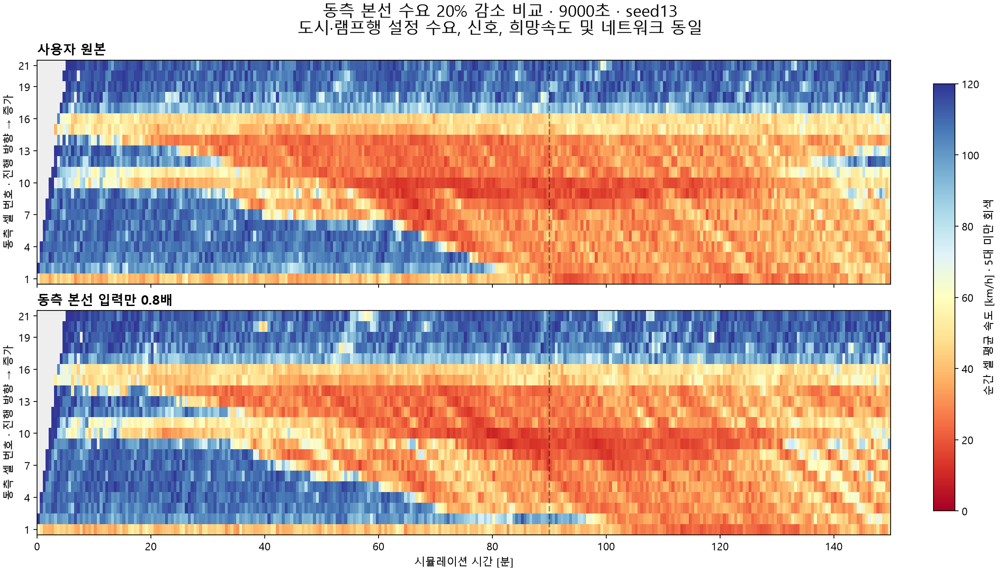

# 동측 본선 입력0.8배 — 9000초 비교 결과

**9000초 실행과 사후 집계를 완료했다. 설정 수요20% 감소에도 실제 동측 본선 진입 대수는 거의 같았으며, 혼잡은 해소되지 않았다.** Ω TTT는0.69% 감소했다. 이번은 무제어 수요 민감도 실험이며 controller 개선률이 아니다.

## 비교 조건과 실행

사용자가 확인한 범위대로 input1098(link74→10699→2)의6구간 volume만 원본의0.8배로 바꿨다. 원본 파일은 보존했다. 나머지 XML 속성·구조·text/tail 및 참조 자산43개(신호42+배경1)는 동일하고 독립 감사도 통과했다.

|시작초|원본대/h|동측0.8대/h|
|---|---:|---:|
|0|11088|8870.4|
|900|15840|12672|
|1800|16632|13305.6|
|2700|14256|11404.8|
|3600|11088|8870.4|
|4500|7920|6336|

서측·도시·램프행 설정 수요, 경로 비율, 신호, 희망속도 분포 및seed13·SimRes1을 유지했다. 마지막 입력률은9000초까지 계속되며 무수요 cooldown이 아니다. 기존 native-preserve runner로 실행해 runtime 교통 설정 쓰기·차량 전수 COM 조회·controller 계산은0이었다.

- 기준망 SHA256: `10e1fd8f005ffe30646233bd15cef0344ab992036f144fe8e6f91638bb051cb5`.
- 후보망 SHA256: `3795b346d7eafbbdf47ede0673050c12a4dcea2e40bca7abc085abf71381d65c`.
- 시작21:20:04, 종료21:28:39, 전체 runner 경과514.95초. exact9000초·exit0·런 소유 VISSIM31436 정상 종료.
- 종료 이후에만1초 FZP를 한 번 집계했고 빠진 시각0, Ω 재고 보존식 잔차0을 확인했다.
- 미터8개 OFF 및 SC1001·1004 상태/신호 시계가 기준과 동일했다.10개 LDP의 데이터90,000행과 전체 native LSA 이벤트51,326행이 일치했다. t=0은 별도 관측되지 않았고 새 VSL readback은 수집하지 않았다.

## 주요 수치

|0–9000초|원본|동측 본선0.8|
|---|---:|---:|
|동측 본선 설정 생성 기대량 [대]|27,126|21,700.8|
|FZP 동측 source74 첫 출현 [대]|13,327|13,326|
|동측1098 미삽입 잔여 [대]|13,742|8,152|
|전 망 미삽입 잔여 [대]|32,805|27,266|
|Ω TTT [대·h]|8,465.771|8,407.327|
|Ω TTD [이탈 사건]|54,637|54,489|
|종료 Ω 재고 [대]|2,696|2,830|
|전 망 명시적 차로변경 삭제 [대]|547|523|
|Ω내 분류 미확정 소실 — TTD 제외 [건]|578|577|

첫 출현은 FZP source link의 entries에서 실제 관측된 incoming-link 전이를 뺀 표본 대수다. 설정 생성 기대량과 구분했다. 입력별 생성은 확률적이며 같은seed라도 입력 변경으로 다른 원점의 실현 차량·이동이 달라질 수 있다. 설정 기대량에서 미삽입을 빼 실제 생성 대수라고 계산하지 않았다.

시간대를 나눠도 동측 source74 진입은 비슷한 범위다.

|900초 구간 시작|원본 첫 출현 [대]|0.8 첫 출현 [대]|
|---|---:|---:|
|0|1396|1354|
|900|1408|1378|
|1800|1386|1347|
|2700|1347|1355|
|3600|1351|1402|
|4500|1418|1360|
|5400|1224|1376|
|6300|1268|1248|
|7200|1214|1169|
|8100|1315|1337|

**0.8배에서도 입력 수요가 진입 처리량보다 높은 상태가 이어져, 주로 망 밖 미삽입 대기가 줄었다는 해석에 부합한다.** 이 비교에서는 본선에 실현된 수요20% 감소를 만들지 못했다. 따라서 혼잡이 크게 줄지 않은 결과를 ‘본선 수요를 실제로20% 낮춰도 효과 없다’고 해석하면 안 된다. 구간별 관측 진입율은 약4,700–5,700대/h이며 이것도 상류·하류 상태에 따른 실현량이지 보편적인 고정 capacity 추정치는 아니다.

## 공간 반응과 램프

30초 간격 순간 표본에서n≥5·속도<30km/h가 연속5개(첫–끝120초)일 때 최초 시각을 집계했다. 표본 사이 연속 상태까지 보장하지 않는다.

|동측 구간|원본 최초 시각[s]|0.8 최초 시각[s]|
|---|---:|---:|
|E14|1380|1710|
|E13|1890|2250|
|E10|3090|3720|
|E9|3420|4560|
|E8|3600|2610|
|E4|4470|5640|
|E1|5460|6300|

E14 및 일부 상류 구간에서는 시작이 늦어졌지만 E8에서는 더 빨리 저속이 나타났다. 종료까지 넓은 저속 영역이 남아, 지점별 시점 변화와 전체 혼잡 해소를 구분해야 한다. 마지막300초 표본 차량수 가중속도는 E14 36.4→37.4km/h, E8 47.1→38.8km/h, E13 70.3→33.6km/h였다. Ω 최종 재고도 오히려134대 증가했다.

|램프|총 실제 합류 원본→0.8 [대]|종료 connector 재고 원본→0.8 [대]|
|---|---:|---:|
|10482(W)|4501→4499|8→9|
|10639(E)|997→997|0→0|
|10681(E)|2201→2269|30→17|
|10490(E)|1720→1655|2→5|

10681 connector 정지시간은34.05→29.71대·h로 줄었고, link68에서10681행 차로변경 삭제도63→39대였다. 반면 off-ramp10643은 종료30→45대, 정지19→41대였다. 도시40의 종료 정지163→179대 등 혼잡 잔류도 남았다. 국소적인 좋아짐과 나빠짐이 섞여 있어 총TTT0.69%만으로 시나리오가 충분히 개선됐다고 판단하지 않는다. Connector 재고는 주행 차량을 포함하며 shared approach 전체를 램프행으로 세지 않았다.

## 판단과 다음 범위

이번 후보는 **설정 수요 변경은 정확히 됐지만, 실제 본선 부담은 거의 유지된 조건**이다. 램프행 희망 수요는 보존했다. 다음에 본선 수요 효과를 구분하려면 단순 배율을 조금씩 낮추는 것보다, 관측 진입량과 입력 대기를 기준으로 실제 진입이 감소하는 후보를 골라야 한다. 그렇다고 원본 수요나 lane/route를 여기서 추가 변경하지는 않았다.

TTT는 고속도로+도시 protected network Ω내 체류시간이고 TTD는 살아서 non-control area로 나간 사건 및 검증된 terminal 정상 종료를 합산했다. 내부 이동·비정상 삭제·종료 잔여·미삽입은 TTD에 넣지 않았다. 망 밖 입력 대기는 Ω TTT 밖에 있으므로 별도로 보고했다. 한seed의 수요 비교로 controller 효과나 통계적 우열을 확정하지 않는다.

근거: `demand_change.json`, `prepared/prepared.json`, `native9000/run.json`, `EXECUTION_AUDIT.md`, `ERROR_AUDIT.md`, `comparison.json`, `results_v1/`의 파생 CSV·JSON. 후보 생성은 `../prepare_east080.py`, 비교 표·그림은 `../compare_east080.py`로 재현할 수 있다. 원본망·기존 plant/config는 변경하지 않았다.
