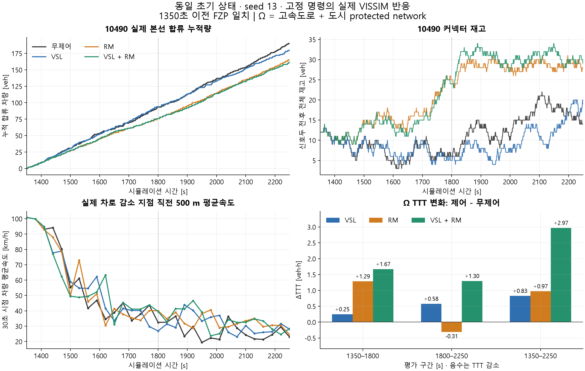

# 고정 명령 네 조건의 실제 VISSIM 반응

네 런 모두 완료됐으며, 1350초까지 모든 FZP 데이터 행이 같다. 무제어는 기존 9000초 런의 2250초 prefix와도 정확히 일치한다. 실제 신호는 LDP, VSL은 명령 적용 readback으로 검증했다. 각 FZP를 한 번만 읽어 분석했다. **RM의 물리 효과는 생겼지만, 이번 처방된 명령은 Ω TTT를 개선하지 못했다.**

그림의 1800초 점선은 제한 강화 구간과 단계적 해제 구간을 나눈다. RM은 1350/1500/1650초에 g8/g6/g4, 1800/1950/2100초에 g6/g8/g10이다. VSL은 DSD59–62의 분포 ID를 1350/1500초 100/80, 1800/1950초 100/120으로 바꿨다. 이 숫자는 목표속도 분포 ID이며, 모든 차량에 같은 km/h를 강제한 값이 아니다. 무제어 미터 상태는 native OFF다. OFF와 g10 GREEN의 동등성은 이 결과에서 가정하지 않는다.

## 1350–2250초 관측 비교

| 조건 | Ω TTT [veh·h] | 무제어 대비 변화 | Ω TTD [사건] | 10490 실제 합류 [veh] | 10490 체류시간 [veh·h] | 10490 끝 재고 |
|---|---:|---:|---:|---:|---:|---:|
| 무제어 | 842.7581 | 0 | 6432 | 190 | 2.7475 | 14 |
| VSL | 843.5871 | +0.8290 (+0.0984%) | 6444 | 180 | 2.2767 | 20 |
| RM | 843.7321 | +0.9740 (+0.1156%) | 6436 | 165 | 5.4264 | 28 |
| VSL+RM | 845.7294 | +2.9714 (+0.3526%) | 6438 | 162 | 5.5782 | 29 |

Ω는 고속도로+도시 protected network다. TTD는 살아서 경계를 벗어난 사건과 검증 가능한 말단 유출 추정이며, 미확인 소실·마지막 잔여는 제외한다. 다른 곳의 차량이 줄어드는 효과와 램프 대기 비용이 모두 포함된 Ω 결과다. 동일 seed 한 쌍의 짧은 개입 결과여서 작은 차이를 통계적으로 확정된 성능 차이로 해석하지 않는다.

- RM의 최초 450초 실제 합류는 93→76대, 전체 900초는 190→165대다. 서비스 상한만 바뀌고 교통은 그대로인 실험이 아니다.
- 동측 본선 TTT는 RM에서 197.2308→193.3385 veh·h로 3.8924 줄었지만, 10490 대기 비용은 2.6789 증가했다. 고속도로+8개 진출 커넥터+10490의 모델 구성요소 TTT는 339.7881→338.8292로 0.9589 감소했다. Ω 전체는 0.9740 증가했다. 작은 구성요소의 이득을 전체망 이득으로 바꾸어 말하면 안 된다.
- 실제 차로 감소 지점 직전 500 m의 1800–2250초 30초 시점 속도평균은 무제어/VSL/RM/둘 다 26.29/31.17/32.45/33.23 km/h다. 그보다 500–1000 m 상류는 51.94/54.86/81.48/70.81 km/h다. 특히 RM은 상류로 전파되는 저속 영역을 줄이는 반응을 보인다.
- 그러나 네 조건 모두 차로 감소 접근부 속도가 초기 약100에서 약30–40 km/h로 떨어졌다. 무제어에서 관측된 30 km/h 미만 연속5표본 에피소드가 다른 조건에서 없다는 것은 혼잡 자체를 예방했다는 뜻이 아니다.
- RM+VSL의 효과는 두 단독 효과의 단순 합이 아니다. 단독/결합의 방향 및 비용 오차를 별도로 모델과 비교해야 한다.

## 삭제·미삽입·보존 한계

| 조건 | 전체망 삭제 경고 0–2250 | 전체망 삭제 경고 1350–2250 | Ω 삭제 경고 1350–2250 | Ω 미확인 내부 소실 1350–2250 | 종료 native 미삽입 잔량 |
|---|---:|---:|---:|---:|---:|
| 무제어 | 69 | 47 | 12 | 72 | 11151 |
| VSL | 71 | 49 | 18 | 65 | 11121 |
| RM | 69 | 47 | 12 | 62 | 11138 |
| VSL+RM | 60 | 38 | 6 | 52 | 11157 |

삭제 경고와 미확인 내부 소실은 겹칠 수 있어 더하지 않는다. 종료 미삽입은 ERR가 보고한 전체망 입력 잔량이며, 1350–2250초 동안의 대기 차량 궤적이나 Ω TTT가 아니다. 입력별 수치는 `NATIVE_FINDINGS.json`에 남겼다. 이미 생성된 차량을 제외하는 방식으로 결과를 개선한 것은 아니지만, 원래 VISSIM 경로·차로 변경 삭제가 여전히 존재하므로 이 망을 오류 없는 기준 시나리오로 승격하지 않는다.

Ω 프레임 회계 잔차는 모든 런에서0이다. 이 식은 미확인 내부 소실을 별도 손실 항으로 넣어 닫는 장부식이며, 숨은 손실이0이라는 증명이 아니다. 말단 유출 추정과 알려진 삭제의 충돌은0건이다. 16개 커넥터의 미확인 소실은 해당900초에 모두0이며, 고속도로 셀 추출의 미해명 전이 증거도0건이다. Ω 범위는 기존1,236개 물리링크 목록과 새 망의 연결 구조를 재검증했고, 새 망의 길이로 말단 판정을 갱신했다. 기존 SHA를 바꾸어 통과시키지 않았다.

## 미터 실행에서 관측한 추가 단서

신호두 통과와 실제 본선 합류는 별개다. RM에서는900초 중 신호두 통과166대와 합류165대, 둘 다에서는162대와162대다. LDP상 RED인 프레임에 걸친 신호두 통과도 각각31대와22대 있었다. 전부 RED 시작 후 첫2개1초 프레임에서 발생했다(RM: 첫 프레임21, 둘째10; 둘 다:16,6). 이미 통과를 결정한 차량의 진행과1초 관측 bracket이 있으므로 이것만으로 신호 실행 실패나 적색 위반이라고 부르지 않는다. 실제 녹색 시간×포화율의 엄격한 이진 통과문만으로 방출량을 맞출 수 있는지 검증해야 할 근거다.

모델과 동일 범위를 비교할 때는 `model_component`를 사용한다. 이는 고속도로+8개 진출 커넥터+10490이며, 나머지7개 진입 램프와 도시부는 외부다. 셀 자료는 음수 본선 위치를 제외하고 물리 링크 TTT는 포함하므로, 모델 평가에서 같은30초 셀·커넥터 표본을 별도로 맞춘다. 1초 물리 TTT와30초 모델 비교를 섞지 않는다.

이 실험은 물리 반응과 예측 방향을 검증하기 위한 처방된 진단 명령이다. N_UF 허용오차 안의 follower 후보, 최적 MPC, 장기 개선 성능을 검증한 결과가 아니다.
