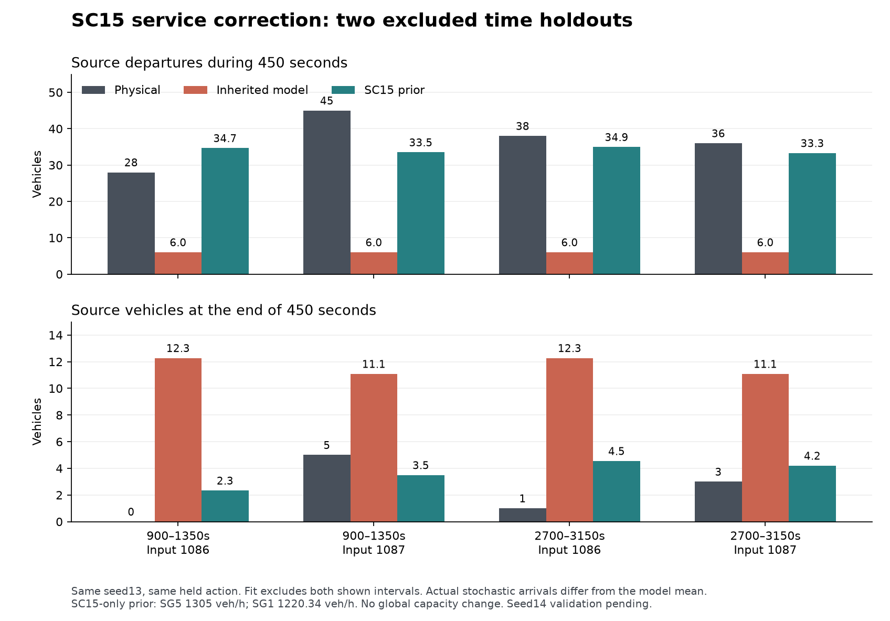

# SC15 입력의 가짜 지속 포화: 관측, 전용 보정과 시간 holdout

**실제 source343/341은 매 녹색마다 정지 대기를 해소하지만, 기존 206.53veh/h/차로를 사용한 모델은 두 source를 지속 포화시켰다.** 실제 정지 대기가 있는 출발 headway로 SC15만 보정한 결과, 보정에서 제외한 두 450초 구간 모두 방출량과 끝 재고 오차가 줄고 인위적인 미주입 backlog가 사라졌다. 전체 네트워크 성능 개선이나 독립 seed 검증을 뜻하지 않는다.

## 실제 관측의 범위

완료된 `codex_area_observed_nc_s13_20260910`의 1초 FZP 26,693,633행을 읽었다. source343은 입력1086/SC15SG5, source341은1087/SC15SG1이다. 두 도로는 들어오는 connector가 없는 독립 입력원이며, 관측353/344개 차량 모두 처음 나타난 도로가 해당 source였다. 초기 관측보다 앞선 경로를 추측하지 않았다.

Head position을 같은 도로의 두 위치가 감싼 경우와, 바로 뒤의 고유 connector/target으로 넘어간 경우를 분리했다. 후자는 검증된 branch 거리로 crossing 구간을 정한다. source343의 head 통과349건은 같은 도로134/connector215, source341의342건은 같은 도로98/connector230/고유 target14건이다. 종료 시 source에 남은4/2대는 검열로 유지했다. 통과시각은 `(t,t+1]` 구간이며, 보간값은 표시용 추정이다.

SC15는 선택된 MPC 신호가 아닌 native FIXEDTIME이다. SIG prog1/프로그램 offset61초/controller offset0/주기160초/녹색35초가 실제 LSA SG1·SG5 각각102전이와 일치한다. 23..5399초의 모든 정수초 상태·GREEN overlap 불일치0이다. LSA가 첫 상태를 주지 않는0..22초는 직접 관측 검증에서 제외했다. 이 검증을 COM으로 덮어쓴 다른 신호에 일반화하지 않는다.

| 항목 | 1086 / source343 / SG5 | 1087 / source341 / SG1 |
|---|---:|---:|
| Source 관측 admission |353|344|
| 5400초 nominal stochastic expectation |339.5|339.5|
| Head 통과 |349|342|
| 1초 crossing 구간 전체가 GREEN |338|335|
| GREEN 시작에 정지 대기가 있는 창 |34/34|33/34|
| GREEN 끝에 정지 대기가 남은 창 |0/34|0/34|
| 차량별 source 정지 표본시간 중앙값 |50초|43초|
| Source 관측 최대 재고 |11대|10대|

Nominal expectation은 실현된 stochastic 요청 수가 아니다. 따라서 admission/expectation이1을 넘을 수 있고, 그 비율을 실제 수용 확률이나 거절률로 해석하지 않는다. 녹색 말미에는 수요가 소진되므로 전체 녹색 평균유량을 포화교통량으로 사용하지 않았다. GREEN 이외 통과를 보간으로 분류한 소수 사례도 총 통과량에는 남기되, 보정 표본에는 넣지 않았다. 이 자료로 신호 위반을 판정하지 않는다.

## 206.53의 출처와 녹색 중복 여부

`vissim_stackelberg_adapter.py:3800`의 설치 함수는 기존 `equivalent_uniform_veh_h=330`에 internal movement184개를 곱하고, 물리 차로/미해소 turn 중앙값 합294로 나누어 **206.530612=330×184/294**를 만든다. 이 계산에 green/cycle 인자는 없다. 도시 서비스는 `urban_flow_accounting.py:379` 이후 별도로 capacity×green_fraction을 사용한다. 코드상 녹색 비율이 두 번 곱해지는 오류는 확인되지 않았다.

다만 함수 설명은 네트워크 전체 방출량 3시점 적합을 유지하는 재분배라고 명시한다. `scripts/derive_measured_saturation.py:4` 및 `docs/HANDOFF_20260907_lcd1000_ramp_spillback.md:72`도 기존 낮은 척도를 실제 포화 방출률과 구분한다. 전역330의 원래 적합자료를 이 감사에서 재현한 것은 아니므로, 그 수치를 개별 SC15 정지선 포화율로 식별했다고 볼 근거는 없다. 206.53×35/160=45.18veh/h는 실제 source 방출을 크게 밑돈다.

## 보정 표본과 1초 시간 불확실성

두 검증 구간 `[900,1350]`, `[2700,3150]`과 닿는 모든 표본을 fit에서 제외했다. 사용한 표본은 같은 GREEN의 연속 출발 두 건이 모두 완전 GREEN으로 확인되고, 두 번째 출발이4번째 이상이며, 사이의 모든 정수초에 source head 앞 정지 대기(speed≤5km/h)가1대 이상 있는 gap이다. 연속 gap을 블록으로 묶어 첫 통과의 하한부터 마지막 통과의 상한까지를 총 duration 상한으로 썼다. 각 gap마다1초 오차를 더해 과도하게 누적하지 않았다.

선택값은 `3600 × gap 수 합 / 블록 duration 상한 합`이다. 중앙값이나 임의1800 하한을 쓰지 않았다.

| SC15 source | Fit gap / 연속 블록 | 블록 duration 상한 합 | 선택한 보수적 하한 | 보간 기반 비율 | 시간구간 기반 상한 |
|---|---:|---:|---:|---:|---:|
|343 / SG5|58 /20|160초|1305veh/h|1453.91veh/h|1740veh/h|
|341 / SG1|20 /15|59초|1220.34veh/h|1651.28veh/h|2482.76veh/h|

전체 적격 gap68/31개 중10/11개를 시간 holdout 때문에 제외했다. 위 범위는 **관측 crossing 시각의1초 불확실성**을 전달한 값이며, 모집단 포화유율의 통계적 신뢰구간이 아니다. 잔여 하류 간섭이 있는지 완전히 식별한 것도 아니다. 보정은 seed13의 다른 시간 구간이며, seed14는 아직 검증하지 않았다.

## 같은 명령을 고정한 450초 비교

기존 actual shared runtime을 사용하고 source별 service 설정만 바꿨다. 원본 관측·명령·수요·다른 용량과 전역 per-lane 값은 같으며 optimizer와 VISSIM을 실행하지 않았다. 아래 실제 방출은 physical source를 나간 고유 ID 수다. 모델의 source→receiver accepted count와 같은 source 경계를 비교한다. 네 행 모두 물리 source 재고 보존 잔차0이다.

| 시작 / input | 실제 방출 | 모델 기존→보정 방출 | 실제 끝 재고 | 모델 기존→보정 끝 재고 | 모델 기존→보정 미주입 backlog |
|---|---:|---:|---:|---:|---:|
|900 /1086|28|6.02→34.67|0|12.28→2.33|18.70→0|
|900 /1087|45|6.02→33.51|5|11.09→3.49|19.89→0|
|2700 /1086|38|6.02→34.95|1|12.28→4.55|21.20→0|
|2700 /1087|36|6.02→33.30|3|11.09→4.20|20.39→0|

900→1350초 실제 admission은26/48대이고 예측은 명목평균35/35대다. 2700→3150초는 실제31/33대 대 예측31.5/31.5대다. 이 수요 실현 차이가 남은 방출·끝 재고 차이에 함께 작용한다. 새 service가 실제 교통 전체를 정확히 재현했다는 주장은 하지 않는다.

Ω TTT/TD는900 시작308.391veh·h/1482.086대→309.709/1490.293, 2700 시작630.459/1743.914→631.779/1758.948이다. 이전에 source 밖 backlog로 남았던 수요를 실제 모델 재고로 받아들이므로 Ω TTT가 소폭 증가한다. 이것은 제어 성능 비교가 아니다.

## 설치와 검증

기존1099/1100 evidence 경로 대신 아래 opt-in 자료를 지정한다. 원래 두 파일은 그대로 유지한다.

- `diagnostics/route_choice_corridor_1099_sc15_calibrated.json`
- `diagnostics/route_choice_corridor_1100_sc15_calibrated.json`

각 `native_fixed_service.calibrated_discharge`가 `native_sc15_service_calibration.json`을 SHA로 고정한다. Runtime은 이 작은 보정 JSON과 실제 source/SC/SG/head/network/SIG 정합을 검증하고 블록 상하한에서 선택값을 재계산한다. FZP/LSA/원래 미래 궤적을 runtime에서 읽지 않는다. SC15의 source head와 직렬 branch에 동일한 하나의 예산을 적용하므로 뒤에206.53 cap이 다시 남지 않는다. 다른 movement와1128/1129는 그대로다. 기존 canonical/native generation hook 추가 변경은 없다.

세 보정 JSON의 실제 bytes는 CRLF다. Git checkout에서 embedded SHA가 바뀌지 않도록 해당 파일들의 EOL을 CRLF로 고정해야 한다. 설정 승격과 `.gitattributes`는 root 소유다.

41개 집중 검사가 통과했다(보정7 + crossing6 + source11 + 기존 corridor17). 보정값/다른 SG/holdout 오염 거부, 연속 블록 endpoint 상한, 새 직렬 예산, red/receiver-full holding, accepted-once 보존, 원본 후보 불변,450초 반복·fresh worker·Ω OFF 물리 동치를 포함한다. `native_sc15_service_holdout.json`의 source 전후 변경0 및150초마다 모든 ledger/model 재고 일치도 확인했다.

재현: `python -X utf8 -m diagnostics.audit_sc15_source_discharge`, `...prepare_sc15_service_calibration`, `...probe_sc15_calibrated_service`, `...render_sc15_service_review`. Runtime 검증은 고정 보정 JSON만 필요하고, 대용량 FZP는 보정 재생성에만 사용한다.
