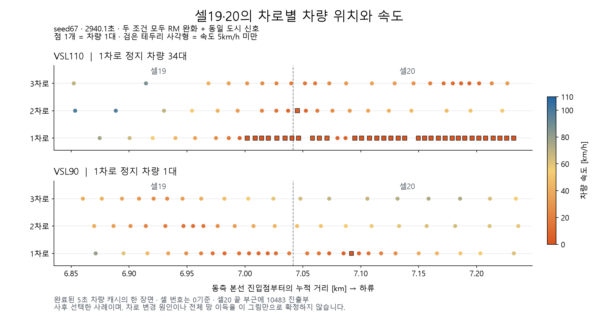

# 차로별 정지 대기열과 실제 방출 — REVIEW106

2026-10-03. **PROGRESS / NOT_GAIN_QUALIFIED.** 완료된 seed29·43·67의 6조건 캐시를 재사용했다. 새 VISSIM·FZP 스캔·plant 예측·계수 적합은 없다. 생산 모델과 실행 중인 REVIEW96 동결본은 변경하지 않았다.

직전 목표 턴은 기존 결과에 대한 가설 설명으로, 새로운 진전은 없었다. 이번에는 현 상태와 Claude 기록을 다시 확인하고, 정지 대수에 따라 차로 수를 줄이는 가설을 새 방출 장부로 검사했다. Claude의 REVIEW_CHECK 및 K1K6_IMPLEMENT에는 망·계수 계약 차이가 있어 다른 망의 수치를 이식하지 않았다. 기존 REVIEW91 이동거리 후보, REVIEW92 상태 회귀, 차로19–25 및 회복 후보의 실패도 재사용했다.

## 확인한 차로 막힘

seed67, RM 완화+native 도시 신호, VSL110/90의 2940.1초를 비교했다. 같은2670.1초 초기 상태에서 출발한 두 실행이지만, 표시 시각의 차량 구성은 다르다. 아래 장면은 방출 검사를 마친 뒤 설명용으로 선택한 사례다.

| 1차로 | VSL110 정지 차량 | VSL90 정지 차량 |
|---|---:|---:|
| 셀19 |7|0|
| 셀20 |27|1|
| 합계 |34|1|

정지는 속도5km/h 미만으로 정의했다. VSL110의 셀20 1차로 평균속도는1.21km/h이고, VSL90은26.54km/h였다. VSL110의34대에는 진출10483행21대와 통과행13대가 포함된다. 목적지는 기존 차량별 진출·통과 기록으로 사후 판별했으며 예측 입력으로 쓰지 않았다. 차로별·위치별 큐가 통과 차량에도 관계한다는 근거다. 정지점 사이에 간격과 움직이는 차량이 있으므로 모든34대를 하나의 연속 정지 행렬이라고 부르지는 않는다.

## 정지 차량이 있다고 방출을0으로 두면 안 됨

셀19의 3차로×30초 창390개 중, 시작 시 정지 차량이3대 이상인 차로 창은36개였다. 이후30초 방출은 모두 양수였고3–21대, 평균15.61대였다. 36개 중 종료 시에도 같은 기준의 큐가 남은 것은8개였다. 해당 창의 방출562대 중4대는5초 사이 차로 변경과 경계 통과의 순서가 불명확하다. 기록 시작 차로에 귀속하고 이 불확실성을 별도로 저장했다.

현재 관측의 `rho*v`를30초 동안 유지하는 단순 기준은 이36창에서 평균4.80대를 과소예측했다. MAE6.35대가 정지 차로를 완전 폐쇄하면15.61대로 악화한다. **이 기준은 실제 plant의30초 rollout이 아니다.** 유입과 회복을 갱신하지 않는 상태 유지 진단이다. 부분 차로 손실이나 순간적인 blocking 자체를 기각하는 결과도 아니다.

실제로 seed67 VSL110의2940.1초 셀19 1차로에는 하류 경계1.12m 전까지 정지7대가 있었고, 이후30초 방출이3대에 그쳤다. 같은 규칙으로 잡힌 다른 창은 빠르게 회복했다. 따라서 필요한 것은 정지 대수의 정적인 용량 배수가 아니라, **어느 차로의 대기열이 어느 경계에 도달했고 배수·회복이 지속되는지**의 동역학이다.

## 셀 내부 움직임과 하류 경계 방출도 다름

셀19에는 중간 진출·합류가 없다. 각 차량의 셀 안 위치를 길이로 나눈 합을 `M=sum((x-start)/L)`로 두면, 다음 보존식이 성립한다.

`하류 방출 대수 = 구간 내 이동거리 합 / 셀 길이 - (M_end - M_start)`

이동거리는 인접5초 위치 사이에서 셀 내부 부분만 취한다. 출입 질량 수지와 위치 수지를780개 구간에서 검사했다. 누락된 셀 내부 차량과 미관측 생성은0건, 위치 수지 최대 오차3.56e-15대다. 이는 미래 위치를 정답으로 사용한 보존 장부이며 자율 예측식의 검증이 아니다.

seed67의2820.1–2970.1초에서는:

| 물리량 [대] | VSL110 | VSL90 | 차이90−110 |
|---|---:|---:|---:|
| 실제 셀19 하류 방출 |257|269|+12|
| 셀 내부 이동거리/셀 길이 |281.31|278.37|−2.94|
| 하류 쪽 위치 재고의 변화 ΔM |24.31|9.37|−14.94|

따라서 `−2.94 − (−14.94) = +12`로 닫힌다. 같은 창의 실측 속도·재고를 적분한 셀 평균 `rho*v`는280.78→276.63으로 줄었지만, 경계 방출은 늘었다. **평균속도×평균밀도에 용량 배수 하나만 붙여서는 이 비정상 상태의 차이를 설명하기 어렵다.** 이 분해를 VSL 이득의 인과 기여율이나 차로 변경 효과라고 해석하지 않는다.

## 보정 방향과 남은 검증

1. 현재 관측으로 출구 접근 차로의 정지·이동 재고와 대기열 위치를 초기화하고, 이후에는 예측 도착·배수·차로 접근으로 갱신해야 한다. 전체 셀을 폐쇄하지 않으며 통과행도 해당 차로에 묶일 수 있다.
2. 기존 동적 off-ramp 저장·spillback과 같은 차단을 두 번 적용하지 않는다. 기존 속도 감소에 추가 감속/용량 손실을 곧바로 더하지 않는다.
3. 현재 평균속도로 남은 거리만 이동시킨 REVIEW91은 이미 실패했다. 이를 다시 실행하거나 단순 거리 배율을 탐색하지 않는다. 큐의 형성·지속·회복과 하류 수용 반응을 같이 표현해야 한다.
4. 위 관측만으로 새 차로 모델을 채택하지 않는다. 현재 정보만 사용하는 후보가 나오면 seed67의 큐 형성과 회복을 함께 검사하고, 기존 독립seed71의 RM/both 순위 실패와 seed47의 큰 RM 손익 방향도 유지하는지 확인해야 한다. 이후 SDMPC 선택 검증이 필요하다.

VSL이 차로 변경 가능 시간을 늘려 큐를 줄였는지, 유입 시각·하류 상태 변화가 주된 원인인지는 아직 구분하지 못했다. 추가 예측이나 성능 개선을 완료했다고 보고하지 않는다.

## 재현 및 보존

기존 `entry10682/audit.py --stopped-lane106`를 확장했다. `protocol.json`, `assessment.json`, `rows.json`, `steps.json`, `blocks.json`, `posthoc_witness.json`에 범위·입력 해시·수지·차로 불확실성을 남겼다. 기존9개 helper 함수 AST 및 생산9파일·STOP 해시는 동일하다.

첫 계산 후 차로 귀속 불확실성과30초 뒤 큐 유지 여부 필드만 추가했다. 첫 산출물은 `initial_without_lane_uncertainty/`에 보존했으며 기존 모든 수치가 정확히 같은지 확인했다. 두 계산 모두 EXIT0, 저우선순위다. fitting·새 물리 후보 반복이 아니다.

`plot.py`는 완료 캐시155개 차량점을 사용했다. 첫 시도는 Matplotlib 경로 누락으로 실패했고, 기존 `.review-deps/plots`를 지정해 성공했다. 패키지는 설치하지 않았다. PNG를 직접 열어 축·범례·정지표시·34/1대 주석과 잘림 여부를 확인했다.

별도 데이터9000은 시작 시 소유 PID48436과 생성시각을 확인했고3750초 관측까지 기록돼 있었다. 실행본을 건드리지 않았다. 이 상태를9000초 완료나 이득 검증의 통과로 보지 않는다.
