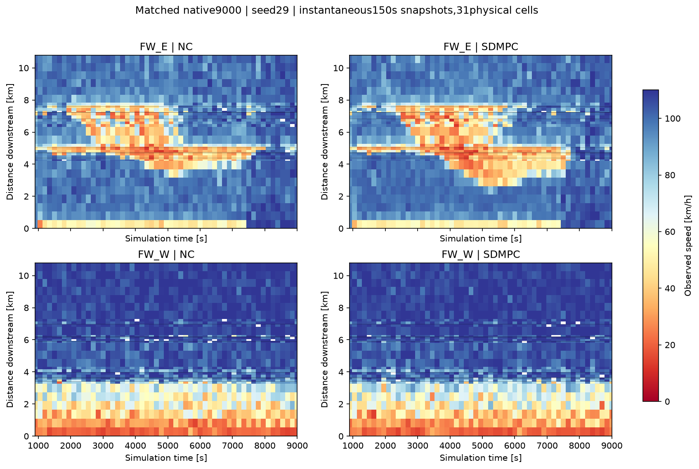

# 선택망 SDMPC 9000초 실제 비교 — 2026-09-27

두 런은 정상 종료했지만 **현재 SDMPC의 순이득은 확인되지 않았다.** Ω TTT는 3.65%, 전체 도로 체류와 미삽입 대기의 합은 1.85% 증가했다. 이 결과를 모델 보정 완료 또는 제어 성공으로 표시하지 않는다. 새 계수 보정은 하지 않았다.

## 같은 조건의 실제 비교

- 선택한 80–90 DSD110 망, seed29, SimRes10, FZP5초, 0–9000초. 제어 시작900초, 갱신150초, 예측450초.
- 원본: `D:/VISSIM_runs/20260927_sd31_closedloop9000/{nc,sdmpc}`. 기존 실행 session9778은 exit0으로 종료했다.
- 제어 전431,233 FZP행(895.1초까지)이 두 런 및 기존 초기 이력과 정확히 일치한다.
- 실제 신호·미터 LDP와 적용 시 readback 검증은 두 런 모두 PASS. COM 전환의 LSA 누락은 별도 FAIL로 유지한다. LDP 대체는 사용자 승인 사항이다.
- 실행한54개 제어 주기900–8850초를 평가한다. 종료9000초에도 runner가 추가 계산했으나 이후 교통을 진행하지 않았으므로 성능 기간에는 포함하지 않는다.

| 지표 | 무제어 | SDMPC | 차이(SDMPC−무제어) |
|---|---:|---:|---:|
| Ω TTT [대·시간] | 7,263.267 | 7,528.621 | +265.354 (+3.65%) |
| Ω 밖 도로 체류 [대·시간, FZP] | 2,391.475 | 2,686.742 | +295.267 |
| 전체 도로 체류 [대·시간, native] | 9,654.761 | 10,215.515 | +560.754 |
| 미삽입 누적 대기 [대·시간, native] | 19,290.009 | 19,265.275 | −24.733 |
| 전체 도로 체류+미삽입 대기 [대·시간, native] | 28,944.770 | 29,480.790 | +536.020 (+1.85%) |
| Ω 유출 사건 TTD [건] | 58,364 | 58,076 | −288 |
| 최종 관측 Ω 재고 [대] | 1,998 | 2,181 | +183 |
| native 비정상 차로변경 대기 삭제 [대] | 243 | 386 | +143 |
| 종료 미삽입 [대, native] | 10,857 | 10,793 | −64 |

Ω는 고속도로+도시 protected network다. TTD는 살아서 non-control 영역으로 나간 사건과 정상 망 종료 추정을 포함하고, 내부 이동·비정상 삭제·종료 재고는 포함하지 않는다. 5초 기록으로 확인할 수 없는 Ω 내 차량 소실은 별도 미확인751/834건으로 남아 있다. TTD를 완전한 차량별 경계 전수 기록으로 해석하지 않는다. native `VehArr`65068/64838은 전체 망 도착 수로, Ω TTD와 다르다.

FZP 체류는8995.1초의 마지막 재고를9000초까지 유지해 계산했다. native 전체 체류는1236개 모든 링크를 포함하며, `DelayLatent`를 한 번만 더했다. SDMPC 오류 로그의 종료 미삽입 합10792와 native10793의1대 차이는 보존하며, 시간 비용에는 native 값을 사용한다. 비정상 삭제가 더 늘었으므로 삭제로 보이지 않게 된 대기를 개선으로 해석하지 않는다.

## 이득이 언제 손해로 바뀌었는가

동일9000초 런의 누적 Ω ΔTTT다. 이전 별도3000초 런과 숫자를 섞지 않았다.

| 종료 시점 [초] | 누적 ΔTTT [대·시간] | 직전 구간 ΔTTT [대·시간] |
|---|---:|---:|
| 3000.1 | −53.231 | −53.231 |
| 4500.1 | −36.167 | +17.063 |
| 6000.1 | +60.751 | +96.919 |
| 7500.1 | +161.333 | +100.581 |
| 9000.0 | +265.354 | +104.021 |

초기 이득이 후반 비용 증가로 뒤집혔다. 4500–9000초의 선택과 회복을 우선 점검해야 한다. 이 시간 분해만으로 특정 VSL 명령의 인과 효과를 분리한 것은 아니다.

공간별 체류 증가: 동측 본선+114.613, 서측 본선+1.437, 나머지 Ω 내부(도시부·램프 등)+149.304, Ω 밖 도로+295.267대·시간. 큰 링크별 증가는40(+226.989),174(+117.912),2(+102.117),1220044500(+100.242, Ω 밖),66(+93.000, Ω 밖)이다. 다른 링크의 감소도 있으므로 이 링크들의 합을 전체 증가와 혼동하지 않는다. 40번 링크의 삭제는12→103대로 증가했다.

이 그림은 **150초마다 저장한 순간 관측**을31개 물리 셀로 집계한 것이다. FZP5초 또는150초 시간평균 히트맵은 아니다. 동측 SDMPC에서 중후반 저속 영역이 약3km 부근까지 더 상류로 확장된다. 서측 차이는 상대적으로 작다. 정확한 혼잡 전파 속도나 명령별 인과성을 이 그림만으로 주장하지 않는다.

## 실제 선택과 남은 핵심 문제

- 54개 주기 모두8미터 녹색10초: RM 제한은 한 번도 선택되지 않았다.
- 47개 주기에 VSL 제한이 있고 실제 선택 속도는90/100/110km/h다. 허용 집합50–110 중 낮은 속도를 선택하지 않았다는 이유만으로 오류라고 판단하지 않는다.
- 저장된 동측 미터의 국소 비용·자원 미분1248행이 모두0이다. 유한한 합법 명령 변경이 무효라는 증거는 아니다. 이 런에서 유한 이웃 후보 검사는 수행되지 않았다.
- 도시 신호와 VSL을 함께 바꾼 런이다. 손해를 VSL 단독 효과로 돌리거나 RM을 실제 시험했다고 표현하면 안 된다.
- 제한된 최적화 반복으로 실행했다. 실행 완료와 GNE/최적해 수렴은 다른 주장이다.

## 다음 작업을 좁히는 기준

METANET의 절대 속도를 더 정밀하게 맞추는 보정은 재개하지 않는다. 먼저4500초 이후 저장 상태에서 (a) 선택한 도시 신호가40/174 등 대기를 과소평가하는지, (b) VSL 선택의 비용 방향이 잘못됐는지, (c) 국소 미분0인 RM에도 실제 합류량을 바꾸는 유한 후보가 있는지를 분리한다. 기존 공통 초기 상태 반응 자료와 비용 정의가 같은 범위에서만 비교한다.

기존2700초의 합법 RM 후보는 모델의 합류량 변화와 비용 이득이 작았다. 그 결과를 혼잡 후반 모든 상태에 일반화하지 않는다. 유량이 실제로 달라지는 후보부터 확인하고, 선택을 잘못하게 만드는 큰 오차만 수정한다. 작은 비용 차이나 개별 차량 궤적의 정밀 일치는 통과 조건이 아니다. 새9000초 런, 추가 계수 전수 탐색 또는 성공 판정은 이번 보고서에 포함하지 않는다.

근거: `summary.json`, `sdmpc_decisions.json`, `spatial_decision_audit.json`, `decision_cost_breakdown.json`, 두 arm의 `execution.json`, `area_metrics.json`, `native_errors.json`. native 입력 대기 원본은 각 런의 `native_network_performance.json`이다.

재현: 기존 `native_pair1200/analyze_pair.py --closed-loop-9000 --runs-root D:/VISSIM_runs/20260927_sd31_closedloop9000`, 이어 `--cached-diagnostics`. 완료된 요약을 덮어쓰지 않는 검사 때문에 무작정 재실행하지 않는다. 그림에는 저장된 `.review-deps/plots` 패키지 읽기 권한이 필요했다. 현재 모든 분석이 종료됐고 새 시뮬레이션이나 보정은 실행 중이지 않다.

## 후속: 후반 두 상태의 선택 재생과40번 도로 서비스

추가 보정 없이4500초와6000초의 실제 관측·직전 실제 명령·저장된 선택 명령을 사용했다. 기존 `probe_selected_arrival_path.py`에 두 시점 재생만 추가했다. 네 번의450초 실행 모델 예측(각 약20초)이 완료됐고 모든3개 제어 블록의 적용과8램프 보존을 확인했다. 새 최적화 반복·VISSIM 런·미래 실측 예측 입력은 없다. 네이티브 결정에 기록된 동결본 출처 중 현재 작업트리로 옮긴453개 파일은 SHA가 일치했다(FREEZE.json은 동결 원본에서 확인).

| 초기 상태 | 선택에 쓰인 근사 모델 ΔΩ TTT | 실행 모델 ΔΩ TTT | 실행 모델 Δ(Ω+추적 가능한 외부 체류) |
|---|---:|---:|---:|
| 4500초 | −1.2765 | −1.2289 | +0.1956 |
| 6000초 | −1.6130 | −1.5647 | −0.4901 |

단위는 대·시간이며 각 행의 기준은 그 상태에서 직전 실제 명령을450초 유지한 예측이다. 근사→실행 모델 교체로 Ω 이득 부호가 뒤집히지 않았다. 따라서 이 두 상태에서 근사 모델 차이가 주원인이라는 가설은 지지되지 않는다. 4500초에서는 추적하는 외부 재고까지 포함하면 이득이 사라진다. 6000초에서는 작은 예측 이득이 남으므로 비용 범위만으로 모든 손해를 설명했다고 주장하지 않는다. 이 외부 체류는 모델에 표현된 재고에 한하며 native 전체 미삽입 대기와 동일하지 않다. 실제 런은150초마다 명령을 다시 선택했으므로 이450초 고정 시퀀스를 VISSIM에서 검증한 결과도 아니다.

`sc1001_service_audit.json`은 실제 LDP 두 파일과 저장 관측을 사용한다. 40번 도로2·3차로는SC1001 SG8,4차로는SG3이다. 원본 계획에서SG8은p1,SG3은p2다.

| 기간 [초] | 무제어 SG8 녹색/150초 | SDMPC SG8 녹색/150초 | 무제어 SG3 | SDMPC SG3 |
|---|---:|---:|---:|---:|
| 900–3000 | 46.0 | 26.29 | 23.0 | 20.14 |
| 3000–4500 | 46.0 | 20.8 | 23.0 | 20.0 |
| 4500–6000 | 46.0 | 20.5 | 23.0 | 20.0 |
| 6000–7500 | 46.0 | 21.4 | 23.0 | 20.3 |
| 7500–9000 | 46.0 | 20.8 | 23.0 | 20.0 |

6000초40번 도로 재고는 무제어130대/SDMPC257대, 정지 차량은112/220대다. 단,4500초 SDMPC의5km/h 미만 차량205대 중166대는SG3이 제어하는4차로,39대는3차로에 있었다. 따라서 SG8 녹색 절반 감소만으로 전체 정체를 설명하면 안 된다. SG3 서비스 감소, 목적지별 수요, 공유 차로 막힘과 하류 수용의 영향을 함께 확인해야 한다.

저장된4500초 국소 미분에서SC1001 p1좌표의 own 비용은음수, external 비용은양수이고 합은양수였다. p2좌표도 합이양수다. 이 좌표는 다른 현시와의 녹색 교환을 포함하므로 독립SG의 초당 편미분으로 읽지 않는다. 다음은 이 도시 신호의 유한한 합법 녹색 교환이 실제로 어떤 목적지의 방출·대기 비용을 바꾸는지 확인한다. RM/VSL의 물리계수를 더 늘리기 전에, 이미 관측된 큰 도시 대기를 반영하는 선택 구조부터 점검한다.

근거 폴더: `../closedloop9000_selected4500_response/`, `../closedloop9000_selected6000_response/`의 원본 해시·실행 블록·보존 검증·예측 결과. 실행 세션75712와61182는 모두exit0. 현재 실행 중인 추가 작업은 없다.

## 후속: 초기 큐 배정 후보와 중요한 방출 차이

4500초에 기존 연속 정지선 큐는40번 도로3차로8대/4차로66대, 합74대다. 기존 투영은 이를 세 movement에24.667대씩 배분했다. 실제 head/현시가 유일한 차로에 한해 해당 현시 movement로 배정하는 `urban.queue.attribution=head_phase` 후보를 정본 adapter에 opt-in으로 추가했다. 이 후보는p1 두 movement에4대씩,p2 좌회전에66대를 배정하며, 같은 현시 안의 목적지는 기존 비율을 유지한다. 링크 총재고236대 및 별도 이동/저장 재고162대는 보존한다. 목적지를 관측한 것처럼 꾸미거나 전체 저속 차량을 정지선 큐로 바꾸지 않는다.

기존 모델과 후보에서 각각 held+4개의SC1001 녹색 교환을450초 예측했다. 녹색±6초, 주기합, 다른 신호/offset/RM/VSL 유지 및3개 예측 블록을 확인했다. N_P/N_UF 공유 제약은 이 진단에서 판정하지 않았으므로 follower game 실행 가능성까지 통과했다고 해석하지 않는다. 후보의 ΔΩ TTT는 +0.2254,+0.2836,+0.2617,+0.2686대·시간으로 기존 순위를 바꾸지 않았다. 초기 큐 배정 문제는 확인했지만 **이득 개선 수정으로 채택하지 않았다**. 관련7개 신규 단위검사와 기존 관측 투영4개 검사는 통과했다. 기본 설정과 동결 native 코드에는 적용하지 않았다.

별도 native detector 누적값 차분에서4500–4950초의40번 도로4차로/SG3 통과는33대,3차로/SG8은2대,2차로/SG8은10대다. held 모델의 좌회전 방출은3.442대뿐이다. 실제 실행은150초마다offset과다른 제어를 갱신한 반면 이 예측은4350초 명령을450초 유지했으므로 엄밀한 동일 명령 오차가 아니다. 향후 비교를 좁힐 단서로만 사용한다.

코드에서 해당 좌회전은`boundary_out`이고 일반 head 서비스 배분의 기본 대상은`internal`이라 이 관측 갱신에서 제외된다. 또한 head 관측은최소녹색30초를 요구하지만 해당SG3 명령은20초다. 즉, METANET 계수 정밀도가 아니라 **실제 서비스 정보가 선택 모델에 전달되는가**부터 확인할 이유가 있다. 단순히 전체종류 필터를 넓히거나 관측 통과량을 포화 용량으로 단정하지 않는다. 유일한 물리 연결과 기존 짧은 녹색 누적 기능으로 필요한 범위만 검토한다.

근거: `sc1001_head_response_audit.json`, `../closedloop9000_SC1001_4500_response/`, `../closedloop9000_SC1001_4500_response_head_phase/`. 세션32305와58961은exit0. 초기 진단 출력 오류(None 외부source)는`*_failed_external_source`에 보존했다. 추가 계수 보정·VISSIM·최적화는 없으며, 절대 예측 정확도나 이 미세한 후보 차이를 맞추려고 탐색을 확대하지 않는다.

## 채택: 누락된 단일 head 서비스 연결

기존`head_service_resources`와`signal_head_observation`을 수정해40번 도로4차로/SG3→10698→31에만 관측 방출 지원값을 연결했다. 원본INPX의 head·connector 차로·경로1119:1 및 기존 physical projection 증거를 재사용한다. 다른 head 뒤의 분기, 중복 model consumer, 잘못된 현시/수신 링크는 거부한다. 기존`boundary_out` 필터 전체를 넓히지 않았다. 해당head에만 기존4창 녹색 누적을 적용하며, 다른 신호의 최소 관측 기준은 유지한다. 신규 adapter나 물리항은 없다.

| 시작 상태 | 기존450초 방출 예측 | 수정후held 예측 | 이후 실제head 통과 |
|---|---:|---:|---:|
|4500초|3.442|32.195|33|
|6000초|3.442|32.195|29|

단위는대. 기존 값은206.530612대/h×누적녹색60초/3600, 수정값은 과거관측에서 지원되는1931.707317대/h×60초/3600다. 후속 실측을 계수보정 입력으로 사용하지 않았다. 실제는150초마다offset과다른 명령을 갱신하므로 이 표는 동일 명령 반사실 실험이 아니며, 포화용량이나제어이득이 정확히 검증됐다는 주장도 아니다.

4500초의held+4개 녹색 교환은 여전히Ω비용 기준held가 우세하다. p2에6초를 추가한 후보의ΔΩ는+0.17861/+0.15867대·시간(p4/p3에서각각차감), 추적외부체류까지합하면−0.11214/−0.08299다. 6000초의4후보ΔΩ도+0.12713~+0.15235로held보다크다. 이 미세한 차이를 뒤집으려고 보정하지 않는다. N_P/N_UF 공유 제약·게임 수렴·native 순이득은 이 작은고정예측으로 검증하지 않았다.

수정 전후효과를분리했다. 같은4500초 옵션OFF 재생은 이전 TTT/비용내역/램프유량·재고/명령이 정확히 일치한다. 모든 movement 용량을 비교해 바뀐 것은10698의한movement뿐이다(`../closedloop9000_SC1001_4500_response_service10698/parity.json`). 관련47검사+19subtest PASS,선택config의`verify_parameters.py` PASS. 초기재고74대를현시별로재배정한 이전 후보는 적용하지 않았다.

**다음 실행에 쓰는선택config에는 이 서비스연결만반영했다.** 수정 전설정은`../executed_sources/config_n31_v2_before_head10698_dc24299938e7.json`에 바이트 그대로보존했다. SHA256 `dc24299938e7086f27c4a4bd10f7e2f5a8d726dc573f4ba5f76aa830d1c87952`. 기존9000초 native 동결본·원본관측·명령은변경하지않았다. 따라서기존결과에수정이적용됐다고읽으면안된다. `head10698_connection_validation.json`에채택범위와근거를정리했다. 실행70121/67355/67187은모두exit0,새native는0회다.

## 다음 범위: RM 후보와 실제 도착량의 큰 차이

`late_ramp_arrival_audit.json`은 이미완료된상태의native누적detector를차분한자료다.10681의450초진입(1m검지점)은4500초상태125대,6000초상태101대인데,held모델은각28.263/17.239대다. 각양끝0–1m구간재고는0대다. 미터head통과는137/99대이며, 이값을본선합류량으로대체하지않는다.10698수정은10681의도착량에영향을주지않았다.

실제재계획과held예측의차이를분리해야하지만, 이큰도착량차이는RM0미분을해석하기전에확인할근거다. 다음은동일첫150초실행명령에서의도착·방출또는실제로서비스가달라지는유한RM후보다. 절대속도RMSE,사소한비용순위,모든링크의오차를추가보정하는방향으로돌아가지않는다. 전체제어순이득은계속미검증이다.
