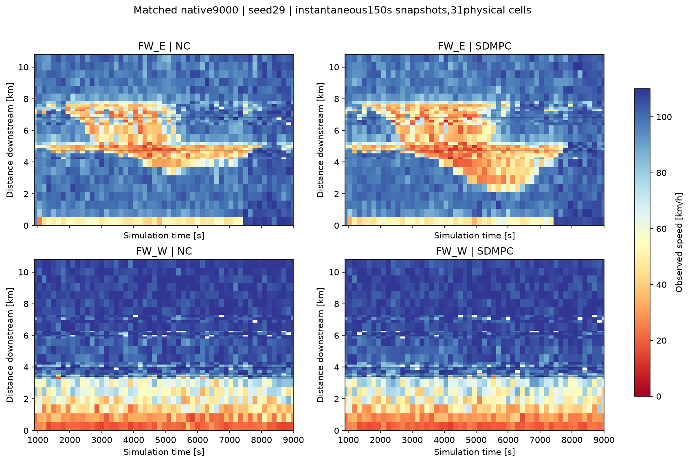

# 수정 SDMPC9000 실제 비교 — 2026-09-28

**9000초 실행·사후 분석 완료. 순이득은 미달성.** Ω TTT는 무제어보다 98.45 차량·시간(+1.36%), native 전체 도로 체류시간과 미삽입 대기의 합은 340.58 차량·시간(+1.18%) 증가했다. 실행 완료를 플랜트 이득 보정 완료로 간주하지 않는다.

## 조건과 실행 확인

- 사용자 선택 80–90 DSD110망, seed29, SimRes10, FZP5초. 망 SHA: `64cf5f55fe9990f3e25bc4fedebf4ab1e4634c8138dbcf5697a136c48cb559dc`.
- SDMPC: `D:/VISSIM_runs/20260927_sd31_detached9000/sdmpc`. 9월28일 01:01:32 종료, watchdog 전체 경과 28672초. `STAGE=SIM_DONE`, `SIM_SEC=9000`, launch `OK` 확인.
- 무제어는 `D:/VISSIM_runs/20260927_sd31_wiring9000/nc`에서 재사용했다. 제어 전 900초 FZP의 431233개 데이터 행과 SHA가 정확히 같다.
- native LDP, 신호 적용/readback, VSL 적용/readback, 명령 전환 검증 PASS. LSA의 COM 전환 기록 누락은 여전히 FAIL이며, 사용자가 허용한 LDP 대체 기준으로 판정했다. `execution.json`의 종합 `passed=false`를 삭제하거나 바꾸지 않았다.
- 기존 verifier가 확인하지 않는 process/completion 항목은 `runtime_closure.json`에 별도로 기록했다. 실제 소유 PID·생성시각의 부재와 일회성 Windows task 등록 해제를 확인했다. 후속 분석 exec41624도 exit0, 01:04:17 분석 종료.
- 기존 3150초 환경 중단·3600초 큐 목적지 오류 결과는 보존했다. 이번 런은 두 시점을 통과했다. 동결 모델·계수·망·수요를 런 도중 바꾸지 않았다.

## 실제 성능

Δ는 SDMPC−무제어이며 시간 단위는 차량·시간이다. 양의 Δ시간은 악화다.

|지표|무제어|SDMPC|Δ|
|---|---:|---:|---:|
|Ω TTT|7263.27|7361.72|+98.45 (+1.36%)|
|Ω 밖 실제 체류시간, FZP|2391.48|2662.71|+271.24|
|native 전체 도로 체류시간|9654.76|10024.34|+369.58|
|native 미삽입 대기 시간|19290.01|19261.01|−29.00|
|native 전체 도로+미삽입 대기|28944.77|29285.35|+340.58 (+1.18%)|
|Ω TTD 사건, 관측+말단추정|58364|58201|−163|
|native 망 완료 차량|65068|64959|−109|
|Ω 종료 잔여 차량|1998|2073|+75|
|차로 변경 실패 삭제|243|371|+128|

Ω는 고속도로+protected 도시부이다. TTD에 내부 이동·비정상 삭제·종료 잔여를 포함하지 않는다. 표의 Ω TTD는 5초 기록에서 직접 관측한 외부 이동과 정상 말단유출 추정을 합친 값이며 native 망 완료수와 다르다. 미해결 Ω 소실은 751/782건으로 별도 보존했다. 마지막 8995.1초 뒤 4.9초는 마지막 재고를 유지해 비용만 계산한다(2.7195/2.8216 차량·시간). 삭제가 늘었는데도 TTT가 증가했으므로 삭제로 좋아 보인 성공 결과가 아니다.

종료 미삽입 native 집계는 10857/10855대다. SDMPC 오류로그 합계는 10854대로 native와 1대 차이가 남아 있어 정합 완료로 간주하지 않는다. native 지표와 FZP 지표는 집계·표본 범위가 달라 서로 치환하지 않는다.

## 손해가 생긴 곳과 시간

|공간별 FZP 체류시간|Δ|
|---|---:|
|동측 본선|+204.72|
|서측 본선|−0.72|
|Ω 내부의 나머지 도시·램프 등|−105.55|
|Ω 밖|+271.24|

Ω 누적 차이는 3000.1초 −22.48, 4500.1초 −19.50, 6000.1초 +42.72, 7500.1초 +75.72, 9000초 +98.45다. 초반의 작은 개선이 4500초 이후 손해로 뒤집혔다. 동측 2번 링크가 +168.74, 도시 40번 링크가 +136.07 차량·시간으로 증가했다. Ω 밖 66번 +93.04, 1220044500번 +80.92도 크다. 도시·램프를 합친 감소를 모든 도시 링크의 개선이라고 해석하지 않는다.

그림은 31개 물리 셀의 150초 간격 순간 관측이다. 5초 FZP 평균 히트맵이 아니다. 동측의 저속 영역이 제어 시 더 상류로 확장되는 모습이 보인다. 도시 신호·offset·VSL이 함께 달라졌으므로 이 차이를 VSL 단독의 인과 효과라고 하지 않는다.

## 실제 선택과 남은 문제

- 900–8850초의 54개 제어 결정 모두 8개 RM 녹색이 10초, 즉 완전 개방이었다.
- VSL은 52개 결정에서 제한됐다. 동측 S13은 50개 결정에서 80–100km/h, S5/S7은 36개에서 90–100, S10은 21개에서 100, S2는 10개에서 100이었다. 입구는 110으로 유지됐다.
- SDMPC의 finite-neighbor audit는 수행되지 않았다. 국소미분 0으로 실행 가능한 유한 RM 변경의 효과가 0이라고 판정할 수 없다.
- 보고서의 `converged=false`는 구현이 수렴을 주장하지 않는 표식이며 54회 계산 실패라는 뜻이 아니다. 실제 명령과 제약 검증은 완료했다.
- 2700/3750/8400초에서는 유지 명령보다 예측 비용이 큰 선택도 있었다. 제약과 후보 선택 근거를 구분해 검토해야 한다. 여러 주기의 예측 절감량을 합쳐 실현 이득이라고 하지 않는다.
- 종전 수정 전 완료 런의 Ω 격차 +265.35보다 이번 +98.45는 작지만, 이번에도 무제어보다 나쁘다. 여러 연결 수정과 선택이 함께 달라져 개별 수정의 인과 기여를 분리한 결과는 아니다.

## 동일한 6000초 상태의 작은 비교

같은 관측·직전 실제 명령·450초 지평을 사용했다. 다른 신호·offset·RM·VSL은 직전 실제 값으로 유지했다. 예측 입력에 미래 실측을 넣지 않았고 계수 보정이나 새 VISSIM 실행도 하지 않았다.

|변경한 레버|명령, 각 150초 블록|ΔΩ 예측비용|Δ추적 가능한 Ω밖 재고까지 포함한 비용|
|---|---|---:|---:|
|10681 RM|8/8/8초|−0.000032|−0.000031|
|10681 RM|8/6/4초|−0.000093|−0.000087|
|동측 S13 VSL|70/70/70km/h|+1.703080|+1.710483|
|동측 S13 VSL|110/110/110km/h|+0.296958|+0.301122|

기준은 RM10초·S13 VSL90km/h이며 Ω 예측비용은 382.033402 차량·시간이다. 모델 밖 미삽입 대기의 완전한 native 비용은 이 표에 들어 있지 않다.

10681의 세 RM 조건은 모두 도착 55.4144대, 합류 65.9076대, 말단 램프 재고 9.5068대로 같다. 따라서 미세한 비용 차이는 동률로 취급한다. 이 상태의 이 램프에서 신호 변경이 총 합류량을 바꾸지 못했다는 결과이며, 다른 램프·다른 시점의 RM 무효를 입증하지 않는다.

S13에서는 모델이 무조건 낮은 VSL을 선호하지 않는다. 70으로 더 낮추거나 110으로 풀기보다 현재 90을 유지하는 순위다. 그러나 세 후보의 실제 VISSIM 인과 비교는 아직 없으므로 이 순위를 검증 완료로 부르지 않는다. 전체 런 악화만으로 6000초의 VSL 해제가 실제로 더 낫다고 단정하지 않는다.

모든 후보는 기존 writer·블록 간 변경 한도·8개 램프 보존 검사를 통과했다. N_P/N_UF 예산에 대한 최종 선택 가능성은 이 진단에서 아직 평가하지 않았다. 선택적 VSL 강화/해제 비교만 기존 helper에 추가했고, 물리식·계수·제어기 선택 코드는 바꾸지 않았다. 추가 전후 유지 후보의 비용·재고·유량·명령은 JSON 값이 정확히 같다(`default_reference_regression.json`).

- RM: `../closedloop_recorded6000_lever450_RM_C10681_detached/summary.json`
- VSL: `../closedloop_recorded6000_lever450_VSL_FW_E__seg13_detached/summary.json`

## 다음 작업

후속 선택 진단 완료(9월28일): 위 2700/3750/8400초 모두 원래 유지 명령이 최종 N_P/N_UF cap을 만족했고 비용도 더 낮았다. PFO 이후 후보 누락을 좁게 수정하고, 3750초 실제 SDMPC 한 주기 및 writer까지 통과했다. 계수·목적함수·완료된 native 결과는 그대로다. [재현 근거와 수정 검증](../HELD_CANDIDATE_20260928.md). 이는 새 native 순이득 검증이 아니다.

1. 현재 결과와 실행 증거를 보존한다. 목표는 ACTIVE이며 이득 보정·독립 seed·실제 순이득 검증은 미완료다.
2. 이 작은 후보들의 비용·유량 변화와 실제 SDMPC의 제약/선택을 연결해 본다. 한 시점의 RM 동률을 일반화하거나 작은 수치 차이에 맞춰 계수를 다시 맞추지 않는다.
3. 기존 명령 재생 경로를 활용해 공통 초기 상태에서 짧은 VSL 유지/해제의 실제 반응을 비교한다. 전체 런의 혼합 효과와 단일 레버 효과를 구분한 뒤 필요한 부분만 수정한다. 새로운 9000초 런을 곧바로 반복하지 않는다.

주요 근거: `summary.json`, `runtime_closure.json`, 각 arm의 `execution.json`·`area_metrics.json`·`area_timeseries.csv`, `sdmpc_decisions.json`, `spatial_decision_audit.json`. 원자료와 실패 자료는 보존했고 push는 하지 않았다.
