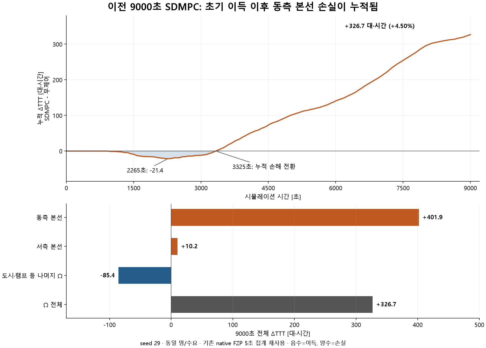
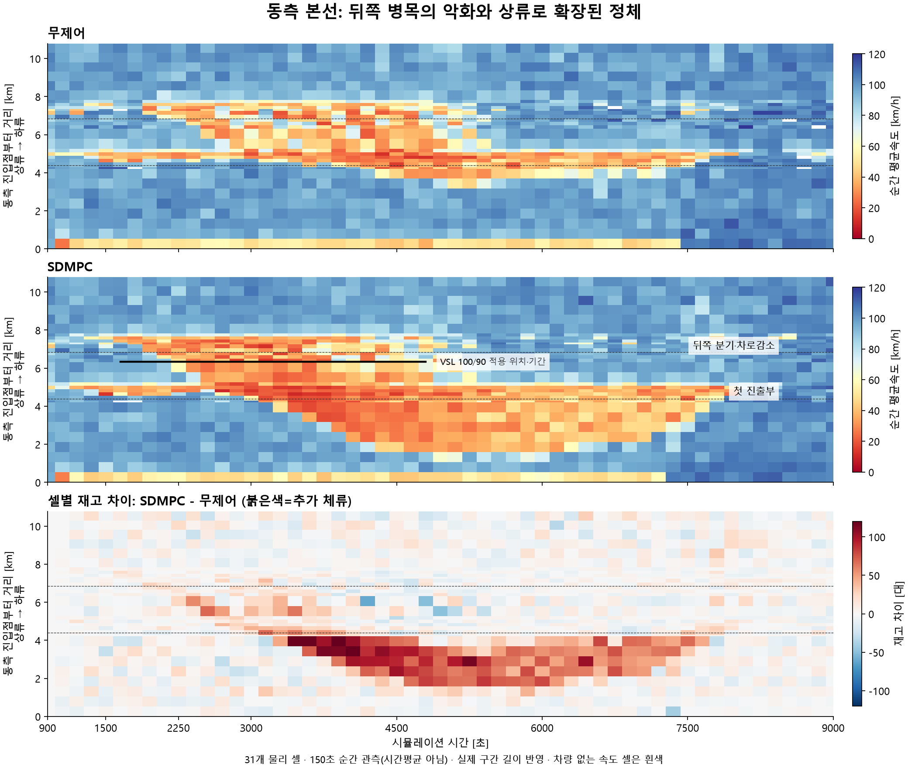
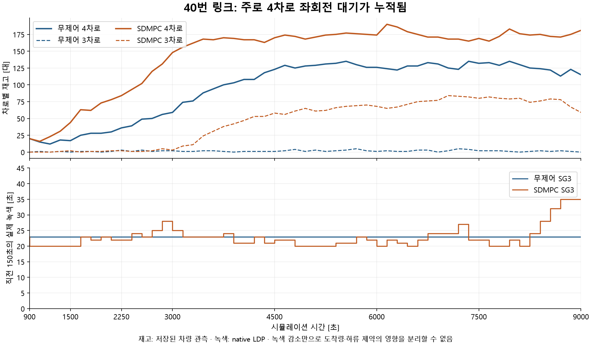

최신 후속(2026-10-01): [10484 체류 비용의 시점 분해](../loss_early1500/ramp_cost47/README.md). 독립 seed47의 RM 완화에 따른 신호등 뒤 체류 증가는 실측0.554/기존0.146대·시간이었다. 실제 사건 시각과5초 합류 구간으로 계산한 가능 범위0.441–0.639보다 모델이 작아 기록 간격만의 문제가 아니다. 실제 접속 차로 속도·유량을 쓴 조건부 재생은0.497로 범위 안이었지만 미래 실측을 쓰므로 정본에 채택하지 않았다. 합류 대수 합계뿐 아니라 신호등을 지난 뒤 본선에 합류하는 시점이 중요하다. 이 독립 상태의 오차를 아래9000 손실의 인과 기여로 환산하지 않는다. 새 native/예측/FZP 재스캔/현재 런 조회 없음.

추가 국소 차량·독립 RM 검증(2026-10-01): [합류 차로 관측과6회 예측](../loss_early1500/lane84/README.md). 초기10484 이동 오차는 일부 줄었지만 독립seed47의 Ω 이득 오차는 커져 새 후보를 채택하지 않았다. 큰 RM 유지 이득은 실제2.054/기존1.843/후보1.497대·시간으로 두 모델 모두 방향을 맞췄다. 실제 유지 상태의 신호등 앞 대기는 입구1.314m까지 닿았는데 현행 전체 저장공간 계산에는 여유33.318대가 남는다. 도착72→83대의 제어 반응과 이 공간·시간 관계를 다음 진단으로 남겼다. 새 VISSIM/현재 런 조회 없음.

추가 합류부 수용 진단(2026-10-01): [10484 공유 처리율 후보](../loss_early1500/shared84/README.md)는 초기1500초 오차를 줄였지만, 후속3600초 상태에서 실제23대 합류를0대로 막아 **기각**했다. 공유 수용량을 본선에 우선 배정하는 가정이 원인이었다. 실제 본선은 이 후속 창에서도 혼잡하므로 코드의 `recovery` 이름과 달리 본선 회복 검증으로 해석하지 않는다. 정본 미채택·독립seed 후속 미실행, 새 VISSIM/현재 런 조회 없음.

추가 발생 시점 정밀화(2026-10-01): [첫 VSL 이전 경계 원장](early_onset/README.md). 1650초 첫VSL 직전 이미동측+21대,셀21–23+41대/셀23속도33.0vs88.8. 1500–1650 재고차이증가46대=진입+9+합류+2+진출감소21+종단감소14. 두런18창보존잔차0. 초기악화전체를VSL탓으로해석하지않으며, 다음반응검사시점은1500초로앞당긴다.

후속2250초 실제 개입 분석 완료(2026-10-01): [네 조건 결과](../../native_onset2250_20261001/RESULTS.md). 같은 새 이력에서10484 합류100→98대로 RM 반응은 작았고, VSL 해제의 Ω ΔTTT는−1.2507대·시간이었다. 원래9000 raw-prefix 완전 재현 실패는 그대로 보존한다. 이후 [과거 입력 검증](../../native_onset2250_20261001/HISTORY_AND_PATH_UPDATE.md)에서2250초 예측이 실제 소비하는 head/VSL 이력은15개 창 모두 동등함을 확인했다. 새 네 조건의 비교와 원래9000 전체 궤적의 완전 재현은 구분한다. 아래9000 손실 분해 수치는 바뀌지 않았다.

# 이전 expanded036 seed29 9000초 런의 손실 발생·전파 진단

현재 판단(2026-10-01): 손실의 중심은 동측 본선+401.89대·시간이며, 첫 VSL 직전1650초에 이미 뒤쪽 합류부가 악화했다. 도시·램프 이득이 초반 이를 가려 Ω 누적 손해 전환은3325.1초였다. RM은54회 모두 완전 개방이었다. 따라서 RM 과제한이나 VSL 하나만을 전체 손실 원인으로 확정하지 않는다. 원래1500초10484 모델은 head43.61/실측45대를 비슷하게 보면서 합류45.76/실측34대로 너무 빨리 비웠다. 이와 함께 이후 상류 재고 전파를 놓친 것이 확인된 예측 오류다. 정확한 lever별9000초 인과 기여는 아직 미분리다.

속도만 대입한 독립 검사에서 새 gap 후보는 실제97대 합류를76.18–76.27대로 과소평가했다. 후속 [충돌 유량 분리](../loss_early1500/clearance84/README.md#후속-원인-분리-충돌-유량이-접속-차로를-대표하는가)에서는 같은 실제 속도·head에 실제 접속1차로 유량을 넣으면97.96–98.32대,본선3차로 평균 유량을 넣으면75.66대였다. 원래1500초도접속1차로유량35.08–35.92대/실측34대였다. 따라서 gap 보정식 단독 실패로 확정하지 않고 평균 충돌 유량과 접속 차로 상태를 섞는 입력 문제를 구분한다. 미래 실측을 쓰는 조건부 진단이며 자율 예측·이득 검증이 아니다. 초기 차로 비율 고정으로 제어 이후 변화를 표현할 수 있다는 근거도 아직 없어 후보는 미채택이다. 현재 런은 조회하지 않았다.

후속 저속 합류 시험(2026-10-01): [공간 해소 시간 보정](../loss_early1500/clearance84/README.md). 실제 head 속도는 두 상태 약42km/h로 비슷하고, 초기10484의 감속은 head 이후 중간·말단에서 발생했다. 기존 간격/속도만으로 gap 시간 증가를 반영한 후보는 초기 합류45.759→32.219(실제34),posthead0.855→14.394(실제14)로 개선됐다. 그러나 독립47 Ω ΔTTT1.843→1.256(실제2.054)로 악화해 미채택이다. 실제 미래 head를 준 조건부 검사에서도 과소 합류가 남아 도시 도착 오차만의 문제로 돌리지 않는다.4회450초 예측, 추가native/현재런조회 없음.

2026-10-01 후속 도착 시점 진단: [저장공간·150초 반응 분해](../loss_early1500/lane84/README.md#후속-저장공간-상한만-바꾸면-이번-도착-오차가-해결되는가). 기존4개 예측1,800초를 재구성하니 prehead 상한도 전부 비구속이었다(강한 RM 유지 최소여유6.178대, 원래1500초45.851대). 단순 저장상한 수정은 채택하지 않았다. 독립47의 RM 완화 합류는450초 합계97/95.001대로 가까웠지만, 중간150초 모델+7.512대/마지막−11.813대가 상쇄됐다. 실제 도착 차이 대부분은 입구 대기가 커진 마지막150초에서 발생했다. 원래9000 초반의 posthead 이동·합류 오차와 강한 RM 후반 도착 피드백을 구분한다. 새 rollout/native/FZP스캔/현재런조회 없이 기존 기록만 분석했다.

추가10484 이동 후보(2026-10-01): [현재 예측 본선 속도로 posthead 이동 제한](../loss_early1500/posthead84/README.md)을 생산 기준에 한 키만 켜1회 시험했다. 합류45.759→45.024(실측34),종료posthead0.855→1.589(실측14)로20% 개선 기준에 실패했다. 회복/독립47 후속은실행하지 않았고후보를채택하지 않았다. 단순평균속도제한을더반복하지않고기존gap기회와공유수용을구분한다.

추가 실제 수용 경로 확인(2026-10-01): [10484의 공간 상태와 gap 식](../loss_early1500/receiving_context1500/README.md). 변경 없는450초 예측1회가 기존 결과와 정확히 일치했다. 현재31셀 v2는10484 접속1차로 대신 상류22 전체평균rho×v를 사용하며 canonical1800대/h보다 gap공급이450초 내내 낮았다. native 저속 정체에서rho×v 감소는 gap기회를 오히려 늘릴 수 있어, 단순 계수 증대/차로 주소 치환만으로 점유·잔여 수용을 표현하지 못한다. 실제 용량이나 전체손실의 단독 원인 식별로 해석하지 않는다.

추가10484 초기 진단(2026-10-01): [1500–1650초 실제 head 시각 대입](../loss_early1500/posthead10484_timing/README.md). 원래 예측 합류45.759대/실제34대; 실제 head 시각을 주어도43.899대이고 신호등 뒤 잔여는4.101대/실제14대다. head 입력 오류만으로는 과대 합류가 사라지지 않으며, posthead 이동·수용 계산의 과소 대기가 남는다. 미래 입력·고정 수용 예산 조건부 진단이므로 자율 예측 또는9000초 손실의 인과 기여로 해석하지 않는다. 신규 native/전체 rollout/보정/런 조회 없음.

후속10490 posthead 진단(2026-10-01): [실제 head와 점유 기록](../loss_onset2250/posthead10490_receiving/README.md)을 대조했다. 혼잡2250–2400초에서 실제 head 입력을 주어도 저장 수용 예산은 합류44.70/잔여2.30대로 실측37/10대를 놓친다. 회복3600–3750초는32/1로 일치한다. 낮은 통과량이 짧은 점유를 뜻하지 않으며 합류점 직전 검지기는 램프 차체 점유를 누락한 사례도 확인했다. 미래 head를 쓰는 조건부 회계 진단이며 자율 예측/보정 성공이 아니다. 새 native/plant rollout/현재 런 조회 없음.

후속10490 수용식 검사(2026-10-01): [제한된5회 비교](../loss_onset2250/origin_supply10490/README.md)에서 혼잡 상태의 과대합류59.1→50.7대(실측37), head 이후 잔여0.8→9.2대(실측10)로 일부 개선했다. 회복 상태에서는 추가 대기를 만들지 않았고 독립seed47의 RM 손익 순위는 유지했다. 도착·head 통과 오류는 남아 정본에 채택하지 않았다. 이것을10490이9000 손실의 주원인이라는 결론으로 해석하지 않는다.

후속(2026-10-01): 아래 이전9000의 손실 분해는 유지한다. 이후2250초의 도시→램프 도착/방출 예측을 추적해 관측속도 집계·실제 거리와 유효속도 혼용 등을 수정 후보로 검증했다. [물리속도 후보와 독립 명령 비교](../loss_onset2250/physical_speed/README.md)의 마지막 절에 seed47 유지/완화4회와 seed43 네 조건8회 결과를 추가했다. RM 이득 크기 및 RM+VSL 조합 오차가 남아 기본 설정에는 채택하지 않았다. 현재 CTG 런과는 분리된 완료 자료/오프라인 검증이다.

검토 대상은 완료된 `20260930_expanded036_s29_9000_r2/sdmpc`와 `20260927_sd31_wiring9000/nc`다. 현재 진행 중인 cost-to-go 런을 평가한 문서가 아니다. Δ는 SDMPC−무제어이며 양수 TTT는 손실이다.

**확인된 핵심은 초기의 도시·램프 측 체류 감소가 동측 본선의 추가 혼잡에 의해 상쇄됐다는 것이다.** 2265초까지 Ω 누적 TTT는 이득이지만 동측 본선의 재고 차이는 그보다 먼저 양수가 된다. 이후 뒤쪽 병목에서 악화한 저속 구간과 앞쪽 램프군 주변 정체가 이어지고, 긴 상류 구간에 추가 재고가 남는다. 최종적으로 동측 본선에서 발생한 +401.89대·시간이 Ω 전체 +326.71대·시간 손실의 중심이다.

## 1. 시간 분해: 초기 이득과 후반 손실은 실제로 섞여 있다

| 시점/구간 | Ω 누적 또는 구간 ΔTTT [대·시간] | 해석 |
|---|---:|---|
| 0–900.1초 | 0 | 제어 전 동일 궤적 |
| 2265.1초 | 누적 -21.3694 | 최대 누적 이득 |
| 3325.1초 | 누적 +0.0868 | 최대 이득 이후 처음 누적 손해로 전환한 5초 표본 |
| 3300.1–4500.1초 | 구간 +74.6167 | 본선 정체 확장 |
| 4500.1–6000.1초 | 구간 +67.5090 | 추가 재고의 지속 |
| 6000.1–7500.1초 | 구간 +113.7049 | 큰 손실이 계속 누적됨 |
| 7500.1–9000초 | 구간 +72.3963 | 본선 회복 후에도 도시 대기 등이 남음 |
| 9000초 | 누적 +326.7060 (+4.498%) | NC 7263.2672 → SDMPC 7589.9732 |

출처: `omega_delta_5s.csv`, `period_contributions.csv`. 3325.1초는 연속 시간의 정확한 교차점을 추정한 값이 아니라 첫 양수 관측 시점이다. 기존 FZP 집계의 끝부분 4.9초 재고 유지 처리도 그대로 보존했다.

## 2. 공간 분해: 도시 전체가 나빠진 것이 아니다

아래 세 영역은 중복 없는 물리 링크 분해이며 합이 Ω 전체 차이와 1e-7대·시간 이내에서 일치한다.

| 영역 | NC TTT | SDMPC TTT | ΔTTT [대·시간] |
|---|---:|---:|---:|
| 동측 본선 | 2249.6927 | 2651.5804 | **+401.8878** |
| 서측 본선 | 1536.8900 | 1547.0837 | +10.1937 |
| 도시·램프 등 나머지 Ω | 3476.6845 | 3391.3091 | -85.3754 |
| 합계 | 7263.2672 | 7589.9732 | **+326.7060** |

주요 물리 링크는 동측 본선 **2(+279.39)**, **74(+107.54)**, 도시 **40(+211.08)**이다. 반대로 도시 링크 1220012001(-129.47), 127(-84.59), 1210018302(-49.36) 등은 좋아졌다. 40번의 손실은 이미 ‘나머지 Ω’ 안에 포함되어 있으므로 다시 더하면 안 된다. 상세: `link_contributions_exact5s.csv`.

동측 재고 차이는 1800초 +53대, 2100초 +85대, 2250초 +80대, 3300초 +293대, 3900초 +408대다. 2250초에는 나머지 Ω가 -107대여서 동측 악화가 전체 누적 TTT에 가려져 있었다. 9000초 동측 재고 차이는 -6대로 거의 회복하지만 나머지 Ω는 +137대다. 종료 재고가 회복되어도 이전에 쌓인 체류시간 손실이 없어지지는 않는다.

이 그림은 **각 런의 저장된 150초 순간 차량 관측을 31개 물리 셀에 다시 배치한 것**이다. 5초 FZP 시간평균 히트맵으로 해석하면 안 된다. 실제 물리 셀 길이를 사용했고 차량 없는 셀의 속도는 결측으로 남겼다. TTT 표는 더 촘촘한 기존 5초 FZP 집계를 사용했다.

2100초 셀18은 NC 87.6 / SDMPC 24.5km/h, 2250초 셀16은 95.9 / 48.7km/h다. 3300초에는 앞쪽 셀9가 98.1 / 25.6km/h, 3900초 상류 셀6이 102.4 / 18.7km/h가 된다. 4500초에는 더 상류 셀4도 103.8 / 26.5km/h다. 서로 다른 병목의 혼잡이 합쳐질 수 있으므로 이 자료만으로 단일 충격파가 모든 구간을 만들었다고 단정하지 않는다. 셀 번호는 모두 31개 물리 셀의 **0기준**이다.

## 3. 당시 제어와 실제 유량

- RM은 **54개 결정 모두 8개 램프의 g=10초**, 즉 10초 주기에서 완전 개방이었다. 이 런의 악화는 ‘활성 RM이 과도하게 제한한 결과’가 아니다. RM을 사용했다면 얼마나 좋아졌을지는 이 런만으로 알 수 없다.
- VSL은 `RW_FW_E_S13`만 1650초 100, 1800초부터 주로 90, 후반 100/90을 거쳐 4800초 110으로 복귀했다. 제한 결정은 21개다.
- 이 명령의 **실제 DSD63–66은 링크2의 3607.216m, 동측 누적 6.341743km**에 있다. 8.090751km의 DSD67–69가 110으로 복귀시킨다. CSV의 오래된 링크119 메타데이터로 위치를 판단하면 안 된다. native INPX의 실제 DSD 주소를 사용했다.
- 기존 완료 검증에서 LDP 실행 시각·상태와 VSL 적용 readback이 통과했다. CSV 명령표만 보고 적용됐다고 판단하지 않았다. LSA 누락 실패는 기존 기록에 그대로 있으며, 사용자가 허용한 LDP 기준으로 실행을 확인했다.

특히 **2250–3300초**의 실제 검지 기록에서:

| 관측/재구성 물리량 | NC | SDMPC | 차이 [대] |
|---|---:|---:|---:|
| 동측 입구 40m 검지 통과 | 2189 | 2118 | -71 |
| 10484 램프 입구 검지 통과 | 150 | 230 | +80 |
| 10484 미터 신호등 검지 통과 | 155 | 236 | +81 |
| 10484 본선 합류 재구성값 | 161 | 236 | **+75** |
| 10490 본선 합류 재구성값 | 233 | 229 | -4 |
| 10639 본선 합류 재구성값 | 139 | 137 | -2 |
| 10681 본선 합류 재구성값 | 340 | 310 | -30 |
| 뒤쪽 10481 분기 이후 본선 통과 | 1907 | 1630 | **-277** |
| 동측 본선 끝 검지 통과 | 2011 | 1863 | -148 |

합류 재구성값 = 미터 신호등 검지 통과 + 시작 시 신호등 이후 커넥터 재고 − 종료 시 재고. 네 램프 커넥터에 native 삭제 기록은 없다. 직접 합류 단면 검지나 차량별 FZP 재추적을 수행한 값은 아니므로 이러한 보존식 기반 추정임을 유지한다. 검지기 150초 계수와 누적 계수의 차이는 **34,692개 비교에서 모두 일치**했다.

이것은 뒤쪽 램프 유입·도시 신호를 함께 볼 근거다. 전체 입력 수요는 같지만 도시 신호로 램프에 도달하는 시각과 실제 도착량은 달라진다. VSL도 동시에 바뀌었고 이력도 이미 달라졌으므로, **+75대가 -277대 방출의 원인이라고 수치적으로 분리해 입증한 것은 아니다.** 전체 9000초 동측 입구 검지 누적은 두 런 모두 17,321대다. 따라서 최종 동측 손실을 단순한 추가 본선 투입 대수만으로 설명할 수는 없지만, 시간대별 입구 통과 차이까지 없어지는 것은 아니다.

## 4. 모델도 혼잡 위치·전파를 잘못 예측했다

이미 저장된, 실행 명령을 적용한 **150초 one-step 예측**을 실제 다음 관측과 맞췄다. 새 rollout이나 계수 보정은 하지 않았다. 오래된 보정 배율이 적용된 audit 요약 대신 원시 `prediction.state_summary`의 물리 셀 재고를 사용했다.

| 실제 관측 시점 | 동측 셀 | 예측 재고 | 실제 재고 [대] |
|---|---:|---:|---:|
| 3300초 (3150초 출발 예측) | 9 | 41.7 | **72** |
| 3300초 | 10 | 35.7 | **61** |
| 3900초 (3750초 출발 예측) | 6 | 106.2 | **156** |
| 3900초 | 7 | 103.5 | **164** |

반면 3300초 셀23은 37.2 / 30대, 셀25는 37.6 / 31대로 과대 예측했다. 혼잡을 전혀 예측하지 못한 것이 아니라 **상류에 쌓이는 차량과 하류 재고의 배치를 틀렸다.** 이것은 장기 말단 비용만 추가하면 해결된다고 볼 수 없는 150초 내 물리 예측 오차다. 단, 절대 오차만으로 다른 명령의 비용 순위 오류까지 증명한 것은 아니다. 전체 3348개(54시점×2방향×31셀) 비교를 `saved_one_step_count_errors.csv`에 보존했다.

기존 의사결정은 모델상 보유 명령 대비 이득을 보고했지만 54회 모두 SDMPC 수렴에는 도달하지 않았다(PFO/SDMPC 각 최대 2회). 따라서 최적화를 더 오래 하면 해결된다는 주장도, 물리 모델만의 문제라는 주장도 아직 입증되지 않았다. 서로 다른 초기 상태의 rolling 예측 이득을 더해 실제 이득처럼 해석하지 않는다.

## 5. 도시부 40번은 별도의 차로·서비스 문제

40번 링크의 +211.08대·시간은 주로 **4차로 좌회전(SC1001 SG3)** 재고에 해당하는 공간 패턴을 보인다. 2250초 4차로 재고는 36→84대, 3300초 76→162대다. 이후 3차로에도 대기가 늘어난다. SG8 직진 녹색이 46초에서 약21–28초로 줄어든 사실만으로 이 현상을 설명하면 안 된다.

SG3의 실제 녹색은 NC 23초/150초, SDMPC는 주로20–28초이며 후반에야 증가한다. 4500초 직전 150초의 4차로 방출은 13→9대였다. 도시 상류 유입, 차로 접근, 연결되는 링크31의 수용, SG3 서비스가 함께 원인 후보다. 이 스냅샷만으로 각각의 인과 기여를 나누지는 않았다.

특히 40번의 native 차로 변경 실패 삭제는 **12→98대**다. 최종 남은 링크40 재고도 117→241대다. 삭제 덕분에 좋아진 것으로 판정해서는 안 되며, 삭제가 없었다면 얼마의 TTT였을지 임의로 복원하지 않았다.

## 6. 다음 확인 순서

1. **1500–3300초를 첫 비교 창으로 삼는다.** 후속 경계 원장에서 첫 VSL 이전1500–1650초에 이미 악화했음을 확인했으므로1800초보다 앞에서 시작한다. 이미 손해가 크게 누적된6000초 이후부터만 보지 않는다.
2. 기존 도시 명령표를 고정한 상태에서 10484를 중심으로 한 RM 개입이 실제 합류량과 뒤쪽 방출·상류 재고를 바꾸는지 작은 비교를 한다. 램프·도시 대기까지 Ω TTT에 포함한다.
3. VSL의 기여는 도시 명령을 고정하고 VSL만 제거/유지하는 비교로 분리한다. 현재 두 전체 정책의 차이로 VSL 단독이 해로웠다고 결론 내리지 않는다.
4. 그 동일 초기 상태·명령에 대해 plant가 합류, 분기 이후 방출, 셀6–10의 추가 재고를 맞추는지 먼저 본다. 터미널 보상/거리 보상을 늘려 해당 물리 오류를 덮지 않는다. 이후 SDMPC가 실행 가능한 이득 후보를 선택하는지를 본다.
5. 40번은 SG3와 유입/차로 접근을 별도로 진단한다. SG8 녹색만 복원하는 처방은 아직 근거가 부족하다.

이번 작업은 **완료 자료 진단만** 수행했다. 진행 중인 CTG의 상태를 다시 폴링하거나, 실행을 중단하거나, 새 VISSIM/예측/보정/후보 탐색을 시작하지 않았다. 모델·목적함수·제약·실행 설정·기존 STOP은 수정하지 않았고 push도 하지 않았다.

## 추가 대조: 손실 누적과 명령 선택

`verify_loss_readout.py`로 완료 캐시만 다시 대조했다. 실행 중인 런 조회·새 예측·계수 변경은 없으며, 결과와 읽은 파일 해시는 `verified_loss_readout.json`에 있다.

- 1650초의 동측 추가 재고 +21대 중 셀21–23은 +41대다. 2250초에는 셀10–20에 +80대, 3900초에는 셀0–9에 +377대가 쌓인다. 이는 150초 순간 표본의 공간 이동 패턴이며, 같은 차량군이나 하나의 충격파를 추적했다는 뜻은 아니다.
- VSL을110으로 복원한4800초에도 동측 추가 재고는 +246대,6000초에는 +305대다. 6000초 이후 Ω 추가 TTT는186.10대·시간으로 최종 순손실의56.96%다. 이를 VSL의 직접 손실로 귀속하지 않는다. 제한 해제 이후에도 이미 생긴 대기와 도시 신호 등 정책 차이가 남아 있다.
- 54개 결정 중46개는 유지 명령보다 낮은 예측 목적값을 선택했고8개는 수치상 같았다. RM 제한은0회, SDMPC 수렴은0회다. 1500초에는 유지 명령을 그대로 선택했다. 따라서 매번 새 명령을 바꾼 직후 손해가 시작된 것은 아니다.
- 기존 셀6·7의 재고 과소예측은 다른 상류 셀의 과대예측과 상쇄된다. 3900초 셀0–9 전체 예측 오차는 오히려 +18.76대다. 본선 총량을 일괄적으로 늘리는 보정보다, 재고가 쌓인 위치와 단면별 방출을 확인해야 한다.
- 모든 명령의 기록상 binding/변경 한도 검사는 통과했다. 원래 native 실행 검증과 별개로, 이번에는 저장된 목적값 차이 산술·링크 TTT 합계·초기18개 경계 장부의 잔차0을 재확인했다. 저장된 다른 시점의 예측 이득을 합산하거나, 이를 실제 대안 정책의 이득으로 해석하지 않았다.

핵심 진단은 **초기 도시·램프 체류 감소 → 뒤쪽 합류부 추가 재고 → 더 상류의 추가 대기와 장기 잔류**다. 초기 악화는 첫 VSL보다 앞선다. 특정 도시 현시·VSL·합류의 인과 기여와 더 나은 대안 명령은 전체 정책 한 쌍만으로 확정할 수 없다. 기존1500초 유한 RM 시험에서도 작은 예측 이득만 나왔으므로, 새 말단 보상만으로 해결됐다고 간주할 근거는 아직 없다.

## 자료·재현 및 검증

- `summary.json`: 5초 시간/영역/링크 분해, 제어 시점, 실제 DSD 위치.
- `mechanism_evidence.json`: 검지 누적 검증, 기간별 유량, 램프 합류 보존 재구성, 삭제와 예측 사례.
- `source_pins.json`: 이번에 읽은 완료 파일 및 기하의 SHA256.
- `../diagnose_loss9000.py`: 완료 캐시·122개 차량 관측·native LDP·명령/예측 JSON만 읽는 추출기. 새 FZP 스캔 없음.
- `../render_loss9000.py`: 추출 CSV를 검증하고 위 PNG 3개 작성. 로컬 matplotlib는 `VISSIM/.review-deps/plots`를 PYTHONPATH로 사용했다. 패키지를 새로 설치하지 않았다.
- 그림 3개를 실제로 열어 축, 범례, 결측, 구간 길이와 한글을 확인하고 마이너스 글자 깨짐을 수정했다.
- 차량 관측은 122개 모두 complete/누락0/동일 정지 시각, 본선 차량의 31셀 배치는 보존, native LDP는 대상 SC별 9000개 프레임을 읽었다.
- Ω 정상 유출 사건은 58,364→57,944(-420), 종료 Ω 재고는1998→2157(+159), native 삭제243→367(+124). 미해결 Ω 소실751→843은 정상 유출 사건에 포함하지 않았다. 기존 분석의 정의를 보존했다.
- 외부 Ω 체류도 +180.92대·시간 증가했다. Ω 내부 TTT만 보고 외부 대기를 숨겨서 얻은 이득으로 해석하지 않는다.
- 단일 seed 정책 비교이며, 모든 차량의 난수/경로를 고정한 독립 lever 인과 실험은 아니다. 새로운 계수 채택이나 전체 목표 달성 판정의 근거로 사용하지 않는다.
