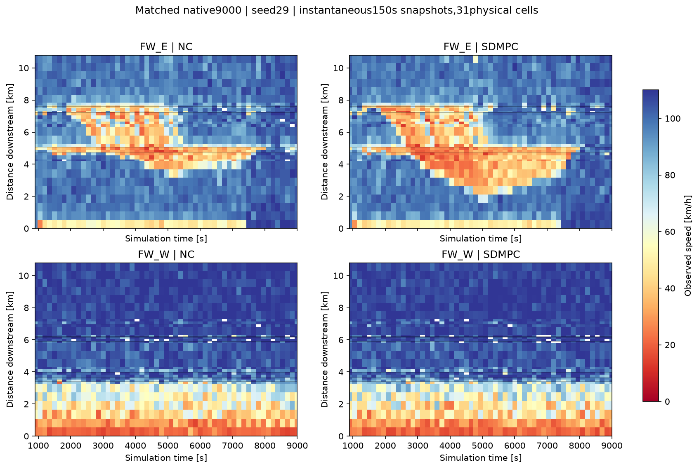

# 실제 SDMPC9000 비교: 실행 완료, 성능 악화

2026-09-29. 선택망64cf5f55…·seed29·9000초·동일 수요/초기조건. Ω 목적함수와 동결 모델을 유지했다. **전체 목표는 미완료이며 이 결과로 이득 보정 완료를 선언하지 않는다.**

| 지표 | 무제어 | SDMPC | 변화(SDMPC−NC) |
|---|---:|---:|---:|
| Ω TTT [대·시간] | 7263.267 | 7618.724 | **+355.457 / +4.894%** |
| Ω 밖 도로 체류 [대·시간] | 2391.475 | 2621.844 | +230.368 |
| native 미삽입 대기 [대·시간] | 19290.009 | 19244.941 | −45.068 |
| native 전체 도로+미삽입 [대·시간] | 28944.770 | 29485.462 | **+540.692 / +1.868%** |
| 관측+말단 추정 Ω 유출 사건 | 58364 | 57984 | −380 |
| native 망 종료 차량 | 65068 | 64863 | −205 |
| 명시적 차로변경 실패 삭제 | 243 | 376 | +133 |
| 종료 시 미삽입 차량 | 10857 | 10860 | +3 |
| 마지막 FZP Ω 재고(8995.1초) | 1998 | 2163 | +165 |

TTD는 Ω 경계 밖으로 살아서 이동한 사건을 포함하고 내부 이동·삭제·마지막 재고는 제외한다. 다만5초 기록 사이의 미분류 Ω 소실이751/847건이어서 위 유출 사건 수를 정확한 전체 TTD 또는 native 망 종료 차량 수와 동일시하지 않는다. 관측 유출35134/34773건, 말단 추정23230/23211건이다. 미분류 소실을 임의로 정상 유출에 넣지 않았다.

TTT는5초 FZP 체류 적분이며 마지막4.9초는8995.1초 재고를 유지했다(2.7195/2.9441대·시간). native 전체 도로 시간은 별도 측정 범위이므로 Ω TTT와 바꿔 쓰지 않는다. 미삽입 대기를 포함해도 성능은 악화한다.

## 어디서 악화했나

- 동측 본선:2249.693→2527.836, **+278.143대·시간**. Ω 악화분의 약78%다.
- 서측 본선:1536.890→1538.878, +1.988대·시간.
- 나머지 Ω(도시/램프 등):3476.685→3552.010, +75.326대·시간.
- 도시의 개선·악화가 상쇄됐다. 링크40은+231.839,420은+41.588인 반면1220012001은−128.840,127은−87.518대·시간이다. 링크별 차이는 유입·재배치 영향도 포함하며 인과 분해가 아니다.
- 900.1–1950.1초에는 Ω 비용이11.653대·시간 줄었다. 이후1950.1–4200.1:+93.708,4200.1–6300.1:+121.285,6300.1–8995.1:+151.893으로 악화가 누적됐다. 뒤 구간의 손해에는 앞선 제어로 형성된 상태가 이어지는 효과도 포함된다.

그림은900–9000초의150초 간격 순간 관측이며150초 평균 FZP 히트맵이 아니다. 동측의 첫 램프군 상류로 저속 구간이 더 넓어지는 양상이 보인다. 도시 신호와 VSL이 함께 바뀌므로 이를 VSL 단독 효과로 단정하지 않는다.

## 실제 명령·검증

- 제어 전900초까지 FZP431233행과 해시가 정확히 일치했다.5초 기록 누락0. 샘플 장부 잔차0은 미분류 소실을 포함한 장부 닫힘이지 모든 물리 경계 사건을 식별했다는 뜻은 아니다.
- LDP의 전체 대상 SG·시각·상태, 신호 적용 확인, VSL 적용 시 readback 검증은 두 런 모두 통과했다. LSA의 COM 기록 누락은 별도 실패로 유지하며 사용자 승인된 LDP 기준을 사용했다.
- 900–8850초의54개 실제 적용 결정 중 RM 제한0회:8램프 모두g10 유지. 동측 RM 비용/제약 미분은 모든 결정에서0이었다. 유한 RM 이웃 검사는 수행하지 않았다.
- VSL은29개 구간에서100km/h를 선택했고 나머지는110이다. 동측S13은1950초부터, S5/S7은4200초부터 제한했다. 진입부110은 유지했다.
- PFO 상한2회, 실제1–2회/수락0–2회, 수렴 판정0/54. SDMPC 역시 수렴 판정0/54다. PFO 이후 계산만60.57–219.51초이고, 초기화·PFO·최종쓰기까지 포함한 전체 지연과 다르다. 실시간150초 요건을 충족했다고 할 수 없다.
- 9000초에도 추가 결정을 계산했으나 그 뒤 교통은 실행하지 않았다. 이를55번째 적용 구간이나 실제 이득으로 세지 않았다.

## 실행 종료와 자료 보존

관리 task는0xC000013A로 실패했지만 원래 native는 계속 진행했다. 회복 후처리는 cscript17892/VISSIM8036의 생성시각과 유지한 process handle을 검사했고 둘의 exit0, SIM_DONE/9000, 필수 오류 계수0을 확인했다. `recovered_native_status.json`에 증거를 남겼으며 원래 `status.json`, `postprocess_status.json` 실패는 보존했다. 관리 task 종료 원인은 확인되지 않았다.

기존 `native_pair1200/analyze_pair.py --closed-loop-9000`으로 E:/VISSIM_runs/20260929_sd31_head10119_9000와 D:/VISSIM_runs/20260927_sd31_wiring9000/nc를 비교했고, 동일 출력에 `--cached-diagnostics`를1회 실행했다. 이후 `review_completed.py`는 저장 집계만 읽어 `analysis/completed_review.json`을 만들었다. 추가 FZP 스캔·새 예측·native 재시작·계수 변경·push는 없다.

## 다음 진단의 우선순위

1. 기존 RM g9/g10의 평탄 상한은 옛 g10 외삽값 보존에서 왔다. 현재 망의 실제 head 통과·신호 이후 재고·본선 합류를 분리해 식별하며, 상한을 임의로 높여 기울기를 만들지 않는다. 상세 근거는 ../rm_nonselection_live_20260929/HEAD_SERVICE_PROVENANCE.md.
2. 전체 결과가 악화했으므로 다음9000초를 반복하기 전에 손해가 커지기 시작한 동일 초기 상태에서 VSL·도시 신호 효과를 분리한다. 실제 실행된 첫150초와31셀 SDMPC의 같은 명령 예측을 비교한다. 기존 action.json의 별도 prediction_error는31셀 선택 모델과 동일하다고 확인하기 전에는 사용하지 않는다.
3. RM은 허용된g8 후보를 비용·제약까지 평가하는 짧은 탐색 보완이 필요하다. 앞서g8/6/4 직접 비교의 최대 이득이약0.002%였다는 결과도 유지한다. 탐색 보완만으로 물리적 이득이 생긴다고 기대하거나 RM을 강제로 켜지 않는다.
4. 실제 합류/방출 반응과 큰 손익 순위의 독립 상태 검증을 통과한 뒤 모델/선택을 반영한다. Ω 목적함수는 유지하고 외부 대기는 진단으로 보고한다.
