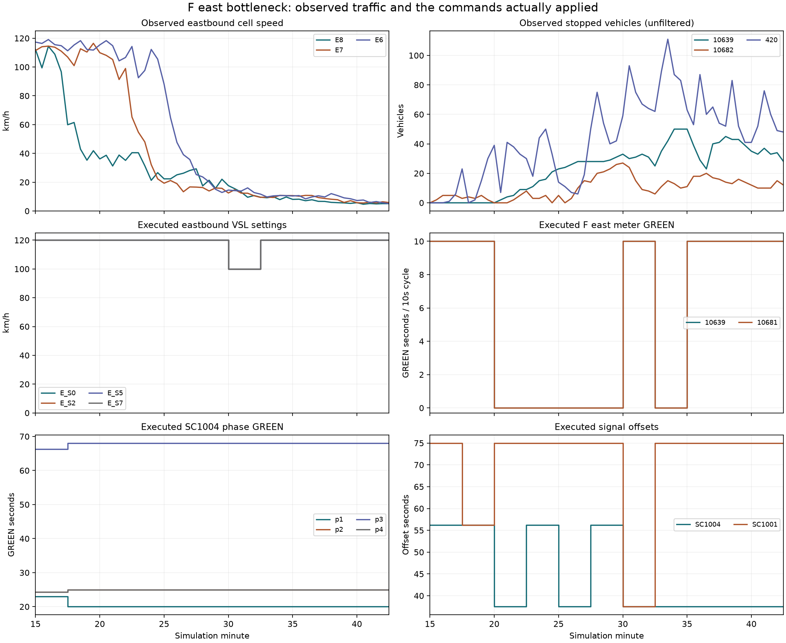

# 900–2550초 중간 관측: E8의 시작 지연이 전파 방지로 이어지지 않았다

같은 Ver2·seed13의 무제어와 현재 β0 제어를 완료된 공통 구간만 비교했다.
11개 제어 구간의 실제 SG/ramp/VSL 적용 검사가 통과했다. 전체5400초 실행과
Ω 성능 측정은 아직 진행 중이므로 아래 수치를 최종 성능으로 사용하지 않는다.

| 동측 본선 셀 | 무제어 지속 저속 시작, 초 | 현재 제어, 초 | 제어−무제어, 초 |
|---|---:|---:|---:|
| E8 | 1350 | 1440 | +90 |
| E7 | 1470 | 1470 | 0 |
| E6 | 1650 | 1650 | 0 |
| E5 | 1830 | 1830 | 0 |
| E4 | 1980 | 2010 | +30 |
| E3 | 2160 | 2190 | +30 |
| E2 | 2340 | 2310 | −30 |

저속 시작은 차량5대 이상·평균30km/h 미만인30초 표본4개가90초 이상 이어진
첫 시각이다. 두 팔 모두 E1/E0는 이 구간 끝까지 그 지속조건이 확인되지 않았다.
이는 아직 정체가 없다는 뜻이 아니며 마지막90초는 시작 판정이 검열된다.
시간 순서만으로 원인이나 충격파 속도를 확정하지 않는다.

| 물리 도로 | 무제어 정지 체류, veh·h | 제어 정지 체류, veh·h | 무제어/제어 최대 정지 차량 |
|---|---:|---:|---:|
| 램프10639 | 1.2042 | 10.8583 | 14 / 50 |
| 진출10682 | 1.8792 | 4.6250 | 9 / 27 |
| 도시부420 | 1.7417 | 20.2500 | 24 / 111 |
| 도시부40 | 9.5417 | 14.1542 | 39 / 62 |

정지 체류는 같은30초 격자의 사다리꼴 적분이다. 차량 단위 지체시간이나
연속적인 실제 대기열 길이와 같다고 주장하지 않는다.

1,200초에 F동측 두 미터가10초 주기 중 GREEN0으로 닫혔고,1,800초에 열렸다가
1,950초에 다시 닫힌 후2,100초부터 열렸다. E8/E7/E6의 관측 속도는 이미
크게 떨어져 있었다. VSL은1,800–1,950초에 표시한 동측 네 zone 모두100km/h,
나머지 이 구간에는120km/h였다. 네 곡선이 같아 겹쳐 보이며, 두 미터의 명령도
동일해서 곡선이 겹친다. SC1004는1,050초부터 p1=20초, p3=68초에 머문 반면
offset은 반복해서 바뀌었다. 다른16개 신호의 명령은 comparison.json에 있다.
이 그림은 각 레버의 독립 효과를 식별한 실험이 아니다.

다음 진단에는 다음 세 결과를 함께 사용한다. 밀도 벌점이 잘못된 램프 폐쇄를
유도하는지 목적함수부터 바로잡아야 한다. SC1004의 녹색 선택은 실제 head별
서비스 추정과 local/global 공유 회전 예산을 일치시켜야 해석할 수 있다.
본선은 E8의 과도한 예측 회복과 출구·합류 순서 오류를 별도로 수선해야 한다.
VSL 수치만 더 낮추는 방식으로 이 세 문제를 대체하지 않는다.

입력·결과 해시, 전체42셀·13도로 지표, 실제 명령은 comparison.json 및 인접 CSV에
보존했다. 그림의480개 수치는 lever_timeline.csv에 있다. 마지막2,550초 명령은
이 비교 구간에서 실행시간0이므로 그림에 넣지 않았고, 끝점은 직전 명령의 유지값이다.
