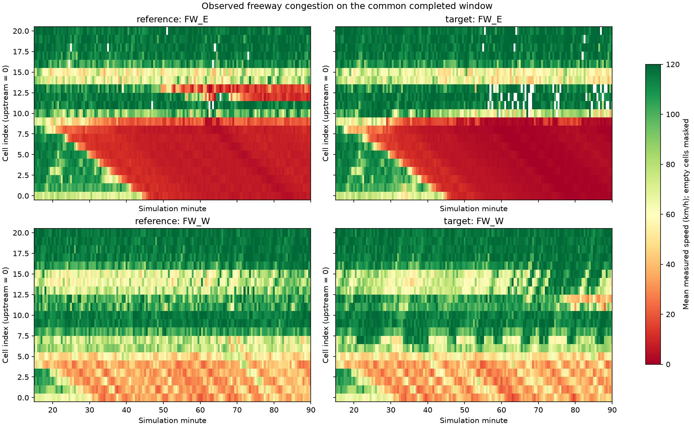
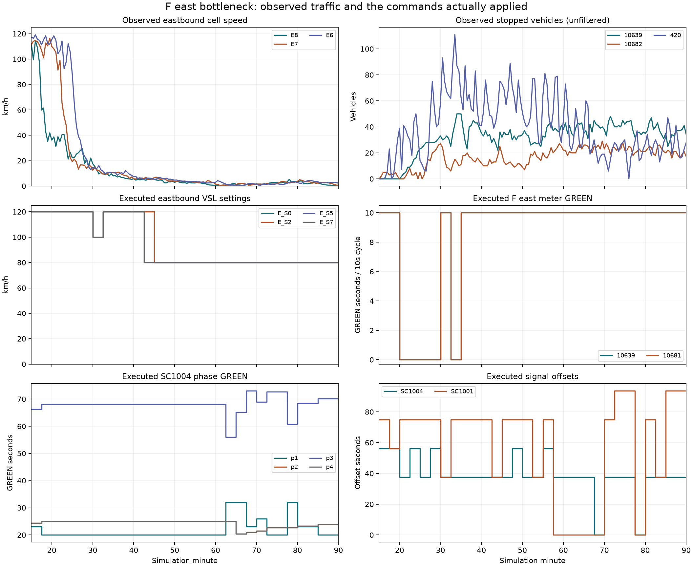

# 기존 β0 실행의 완료 평가

**현재 제어는 무제어보다 나쁘며 최종 정본 후보로 통과하지 못했다.** 같은 seed13·같은 INPX에서 5400초까지 종료했고, 적용된 30개 제어 구간의 신호·미터·VSL readback 검증은 모두 통과했다. 명령 전달 성공을 성능 개선으로 해석하지 않는다. 분석 중 소스 변경은 없었다.

| 지표 | 무제어 | 기존 β0 제어 | 제어 − 무제어 |
|---|---:|---:|---:|
| 0–5400 ΩTTT [veh·h] | 5,578.610 | 5,959.880 | +381.270 |
| 900–5400 ΩTTT [veh·h] | 5,282.963 | 5,664.233 | +381.270 |
| 900–5400 TTD [경계 유출 사건] | 23,512.000 | 22,134.000 | -1,378.000 |
| 5400 Ω재고 [veh] | 4,670.000 | 5,295.000 | +625.000 |
| 900–5400 미확정 내부 소실 [사건] | 393.000 | 326.000 | -67.000 |

전체 ΩTTT는 6.834%, 제어 시작 후 ΩTTT는 7.217% 증가했다. 전체 TTD는 26,203→24,825사건이다. 반복 경계 유출을 세며 unique ID와 구분한다.

## 정체 발생과 전파

| 본선 셀 | 무제어 지속 저속 시작 [s] | 제어 [s] | 차이 [s] |
|---|---:|---:|---:|
| FW_E:8 | 1350 | 1440 | +90 |
| FW_E:7 | 1470 | 1470 | +0 |
| FW_E:6 | 1650 | 1650 | +0 |
| FW_E:5 | 1830 | 1830 | +0 |
| FW_E:4 | 1980 | 2010 | +30 |
| FW_E:3 | 2160 | 2190 | +30 |
| FW_E:2 | 2340 | 2310 | -30 |
| FW_E:1 | 2490 | 2490 | +0 |
| FW_E:0 | 2730 | 2730 | +0 |
| FW_E:9 | 2280 | 1890 | -390 |
| FW_W:0 | 3570 | 2340 | -1230 |

E8의 지속 저속 시작을 90초 늦췄지만 E7·E6에서는 지연이 사라졌고, E0 도달은 두 실행 모두2730초였다. E9는390초, W0는1230초 더 일찍 지속 저속에 들어갔다. E8에서 상류로 전파하는 파동과 E9·W의 변화는 구분한다. 셀별 지속 저속 판정은 comparison.json의 고정 contract를 따른다.

## 도시부와 램프의 공간적 교환

다음 값은 900–5400초의 30초 표본 정지차량 적분이며, 1초 차량궤적으로 계산한 ΩTTT와 별도 진단량이다.

| 물리 링크 | 무제어 정지시간 [veh·h] | 제어 | 제어 최대 정지차량 [veh] |
|---|---:|---:|---:|
| 10481 | 96.017 | 0.000 | 0 |
| 127 | 191.833 | 22.233 | 70 |
| 10639 | 1.975 | 39.758 | 50 |
| 10682 | 4.683 | 20.446 | 29 |
| 420 | 3.883 | 50.417 | 111 |
| 40 | 40.433 | 79.287 | 105 |
| 68 | 0.438 | 15.796 | 40 |

10481·127의 정체 완화만 보면 성공처럼 보이나, F 동쪽 램프·도시 접근로와 본선 병목의 악화가 함께 발생했다. 커넥터 통과량 표의 공통 창은 의도적으로900–5250초까지만 집계되어 있으며 Ω·정체 도표의900–5400초와 혼용하지 않는다.

## 다음 수정에 쓰는 해석

- **Metering:** FE가1200초부터 폐쇄된 동안 상류 램프·도시부 저장이 늘었다. 동일 상태·동일 나머지 명령의 모형 개입 비교에서 DW/FE 재개방은 ΩTTT·TTD를 모두 개선했지만 기존 본선 밀도 벌점이 선택 순위를 뒤집었다. 이는 점수 계산 오류의 직접 증거이며 VISSIM 효과를 단독으로 입증한 것은 아니다.
- **Green:** SC1004 p1=20초가 선택된 결정은1050…3600초이고 실제 유지창은[1050,3750)초다. 별도로10634(71/SG2/p3)의 세 유입은 하나의 물리 서비스 예산을 공유해야 한다. p1 접근로와 이 p3 자원은 구분한다. 기존 국소 모형의 중복 예산과 미도착 차량 조기 방출을 고치고, 학습창만으로 식별한 실제 통과율 하한을 사용해 현시 간 배분을 다시 검증한다. p1을 늘리는 정책의 최종 효과는 다음 실제 실행에서 확인한다.
- **VSL:** 80km/h는E_S5/S7에서2550초, E_S0/S2에서2700초부터 끝까지 유지되어 E8/E7/E6 붕괴보다 늦었다. 이미 차량 속도가 매우 낮은 병목에서 제한속도만 낮추는 것으로 회복을 기대할 근거가 없다. 상류 도착 흐름을 더 일찍 조절하는 후보는 실제 유출·램프 수용·차로 변경 상태를 함께 예측해야 한다. VSL 용량 보너스를 임의로 넣지 않는다.
- **Offset:** SC1004·SC1001 offset은 실제로 바뀌었지만 현재 다중 제어 실행의 동시 변화만으로 원인 효과를 분리하지 않는다. 앞선 offset 단독 실험의 개선과 이번 장기 실패를 함께 보존하고, 도착시각과 실제 GREEN 창의 일치를 검사한다.

핵심 남은 오차는 E8의 차로별 대기·합류와 분류 순서다. 목적함수와 서비스 계약 수정만으로 이 물리 오차까지 해결했다고 주장하지 않는다.

## 차량 유실과 영역 밖 수요

완료 native ERR는386건의 명시적 차로 변경 삭제를 담고 있다(Ω 내부181, 외부205). terminal24/120 삭제는0건이다. TTD는 내부 미확정 소실에 보상을 주지 않으며, 나중에 삭제되는 차량의 앞선 정상 경계 유출을 취소하지 않는다. native 삭제와 1초 궤적 소실의 전체 ID 일치는 아직 전수 검증하지 않았으므로 두 집계의 단순 차이를 다른 유실 원인으로 해석하지 않는다.

종료 미삽입 잔여는 FW입력1098(link74)1932대, FW입력1099(link26)574대, Ω 밖 도시입력1105(link99)71대다. 이는 이미 들어온 차량의 삭제와 다르다. 앞선 NC ERR는 덮어써졌으므로 native 미삽입 잔여의 NC 차이는 추정하지 않는다. 관측 경계유입+영역내 출현 사건은900–5400초 기준26810→25990으로820건 적다. 영역 밖 대기를 줄인 결과인지 악화시킨 결과인지 TTT 하나로 판단하지 않는다.

[최종 ERR 보존과 원자료](../native_runtime_error_capture/codex_area_sources_beta0_s13_20260910_complete_20260910T011658154086Z/final_summary.md)

## 재현 근거

- `comparison.json`: 동일 seed/network, 전체 관측·actuation 검증, Ω 장부 보존 잔차0.
- `reference/area_metrics.json`, `target/area_metrics.json`: full1s 궤적 측정, 각각26,693,633/28,587,555행.
- `cell_curves.csv`, `road_curves.csv`, `lever_timeline.csv`: 도표의 원수치.
- 현재 실행 뒤 적용하는 수정안의 성능은 이 결과에 섞지 않는다.
