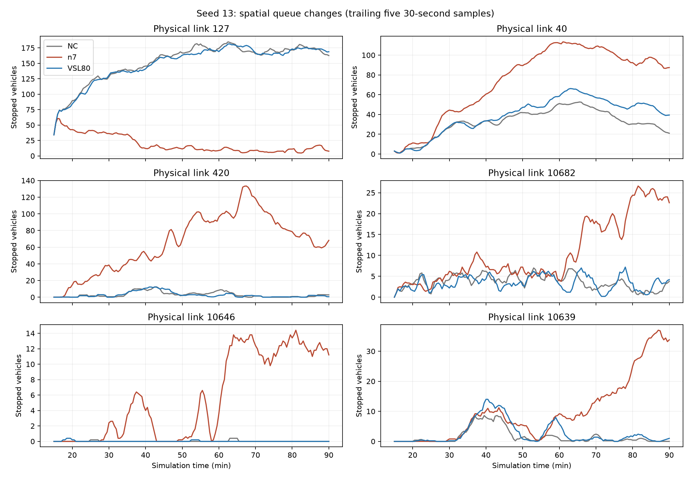

# NC / pure n7 / upstream VSL80 공간 진단 — 2026-09-10

**n7은 D 진출부(10481→127)를 실제로 비웠지만, F 부근과 도시 링크 40·420에서 그 이익을 상당 부분 잃었다.** 초기 F 본선 정체는 미터 폐쇄보다 먼저 나타났다. 반면 후기 `10646→121→10682` 대기 확대는 F_W 미터를 4초로 유지한 시점 뒤에 나타나므로, 초기 병목 발생과 후기 역류를 구분해야 한다. VSL80을 900초부터 적용한 팔은 F 본선의 초기 붕괴를 늦췄지만 D의 신호 대기를 해소하지 않았다. 따라서 아직 검증된 최적 조합은 없으며, 선행 VSL·F_W 통로 유지·도시 신호 배분을 분리해서 검증할 이유가 명확하다.

비교한 완료 런은 다음 세 개이며, 예전 추가 audit-anchor 계측이 제어 관측창을 초기화했던 n7 런은 제외했다.

| 팔 | 완료 런 | 실제 개입 |
|---|---|---|
| NC | `codex_nc_s13_6056c94_20260909_retry` | VSL120, native 도시 SG, 모든 물리 미터 GREEN |
| n7 | `codex_n7_pure_s13_20260910` | 900초부터 도시 신호·미터 최적화, VSL80 첫 적용 2100초, 쓰인 offset 전부 0 |
| VSL80 | `codex_vsl80_upstream_s13_20260910` | 900초부터 FW_E zone0·5=80, 나머지120, native 도시 SG·모든 미터 GREEN |

VSL80과 NC의 native SG 녹색초는 동일하다. VSL 팔의 얇은 extends config를 watchdog이 풀지 않아 queue-window 계측 설정은 달랐지만, 고정 팔은 관측값으로 명령을 바꾸지 않는다. 두 런의 사전 warmup 상태 일치는 별도 VSL 보고서에 있다. 각 팔은 시드13 한 번이므로 아래는 이 궤적의 효과이며 일반적인 성능 우위를 뜻하지 않는다.

## 어디서 이익을 얻고 잃었나

아래는 기존 `analysis/physical_link_residence.csv`의 링크별 차량 체류 적분(veh·h)이다. 속도가 낮아진 시간만이 아니라 **모든 차량의 해당 링크 체류시간**이다. 분석은 0~5400초로 구성되어 있고 기본 FZP는5초 표본이다. NC의 마지막4초는 마지막 재고 유지, n7/VSL의 마지막4초는 final state 보완이므로 작은 차이를 확정적인 성과로 해석하지 않는다. 큰 공간적 차이들은 이 끝단 차이보다 훨씬 크다.

| 물리 링크 | NC | pure n7 | VSL80 | n7−NC |
|---|---:|---:|---:|---:|
| 10481: FW_E→D 신호 접근127 |118.91|3.30|121.69|−115.61|
| 127: SC1001 접근 |263.46|58.70|261.31|−204.76|
| 10682: FW_E→F 직행 접근121 |24.88|31.62|24.65|+6.74|
| 10646: 121→FW_W 물리 미터 |7.85|26.69|7.86|+18.85|
| 10639: 70→FW_E 물리 미터 |5.41|18.12|7.44|+12.71|
| 420: SC105 상류 |31.66|149.02|30.83|+117.36|
| 40: SC1001 접근 |56.69|115.76|66.46|+59.07|

10481+127에서 약320veh·h를 줄였지만 위에 표시한 다섯 악화 링크에서 약215veh·h가 늘었다. 이 링크 선택만으로 전체 네트워크 원인을 합산한 것은 아니다. `slow_veh_h`(<5km/h) 역시127은211.18→31.62,420은3.94→90.47,40은41.44→96.28로 같은 방향이다. 따라서 단순 주행속도나 관측 위치 변경만으로 설명되는 현상은 아니다.

그림은900~5400초의 원시30초 `stopped_count`(<1km/h)를 최근5개 표본으로 평균한 것이다. 그림의 평활값으로 최초시각을 판정하지 않았다. 신호주기와 표본 위상에 따른 편향이 있으므로 정량 체류 비교는 위 FZP 분석을 우선한다.

## 최초 발생과 전파

본선 사건은 기존 `congestion_events.csv`의 **차량≥5, 평균속도<30km/h가90초 이상 지속**된 원시30초 표본을 사용했다. 최초시각은 이 표본 해상도 및 임계값에 따른 사건 시작이며 정확한 충격파 도달시각은 아니다.

| FW_E cell | NC 첫 사건 | pure n7 첫 사건 | VSL80 첫 사건 |
|---|---:|---:|---:|
|8: F10639 합류 부근|1350|1290(1470까지),1530부터 재발|1620|
|7: 그 상류|1470|1440|1530|
|6|1650|1590|1740|
|5|1830|1800|1860|
|4|1980|1950|2010|
|3|2160|2160|2130|
|2|2340|2310|2280|
|1|2490|2460|2460|
|0: 상류 진입|2730|2640|2670|

실제 Ver2 좌표에서 10639는 link2 pos1876.29→체인4610.82m로 cell8 끝부분에 합류한다. 10682는 체인4746.88m, 10681 합류는4899.96m로 cell9에 있다. D의10481 분기는 체인6826.84m로 cell13이다. 따라서 D를 비운 것과 가장 먼저 무너지는 F cell8을 비운 것은 다른 문제다.

VSL80은 첫 본선 사건을 NC1350→1530으로180초 늦추지만, 상류cell0 도달은2730→2670으로60초 빨랐다. 초기 붕괴 지연을 장기 대기열 전파 차단으로 확대해서 해석하면 안 된다. n7의 VSL80 첫 쓰기는2100초(cell5·7 DSD), zone0까지 포함한 적용은2700초부터다. 이미1290초에 시작한 혼잡에 뒤늦게 반응한 제어와900초의 예방적 팔을 같은 VSL 시험으로 취급할 수 없다.

도시·램프의 추가 강한 대기 사건은 **정지차≥10대가300초 이상 연속 유지**된 원시30초 표본으로 구분했다. 링크127은900초에 이미 조건을 만족하므로 시작 이전부터 있던 대기로 검열된다. n7의 링크40은1470초(NC1620),420은2250초(NC·VSL은해당 사건없음)부터다.

F의 후기 순서는 다음과 같다.

1. n7은 RM_C10646을1650초에 처음5초로 내렸다가 열고 닫으며,3450초부터4초로 계속 유지했다. RM_C10644는 같은 시점부터9초다.
2. 강한 대기 사건은10646에서3840초, 그 상류10682에서3870초, 중간121에서3930초에 잡힌다. 임계값과 서로 다른 링크 길이 때문에 이30초 순서를 차량 경로의 정확한 역순 도달로 보지는 않는다. 다만 장기 폐쇄 이후 통로 전체의 대기가 커지는 패턴은 명확하다.
3. 10639의 강한 대기는4020초부터다. 그 시점 명령은 GREEN10초이며4650~4800초에만0초로 닫힌다. 따라서10639의 후기 대기 전부를 자체 미터의 빨간불로 설명할 수 없다. 본선 수용 능력·합류 대기·상류 공급을 확인해야 한다.
4. 특히 초기1290/1440초 본선 정체는 모든 F미터가10초이던 구간에 발생했다. **미터 폐쇄가 초기 병목을 만들었다는 결론은 시간순서에 어긋난다.**

## 실제 녹색·미터와 관측 통과량

SG 녹색초는 `signal_seconds_from_readback.csv`에서900~5400초를 합산했다. 제어 SG는 COM immediate/post_step 확인을 우선하고 native만 `.lsa`를 쓴다. 이는 확인 사이에 마지막상태를 유지했다고 재구성한 값이며, 관측되지 않은 순간의 변화까지 증명하지는 않는다. NC 미터의 `.lsa OFF`를 실제 COM GREEN 대신 사용하면 안 된다.

| 위치/SG | NC=VSL80 녹색초 | n7 녹색초 | 해석 |
|---|---:|---:|---|
|127: SC1001 SG2|1350|2104|127의 주방향 녹색 +55.9%와 대기 감소가 일치|
|127: SC1001 SG5|720|609|모든127 movement를 똑같이 늘린 것은 아님|
|40: SC1001 SG8|1380|826|40의 주방향 녹색 −40.1%와 대기 증가가 일치|
|40: SC1001 SG3|690|601|별도 회전도 감소|
|420 하류1220007200: SC105 SG4|1440|1806|녹색이 +25.4%인데420은 악화|
|같은 하류 SG7|630|714|이 회전도 +13.3%; 녹색 부족만으로420 설명 불가|

이 물리 SG 귀속은 현재 `modi_eval_userfix Ver2.inpx` signalHead와 connector를 읽었다. 420은10659/10660을 통해1220007200으로 가며 SC105 SG4/7 신호두가 있다. SC105 총 녹색이 늘었는데420이 쌓였으므로, 이곳에 녹색을 더 주는 해법을 바로 권할 수 없다. 하류 수용/방류·유입 변동·차로별 회전 제약 또는 상대 위상 검증이 필요하다. 반면 SC1001은127에 준 녹색과40에서 가져온 녹색의 구체적 교환이 관측된다.

| 물리 미터 | NC/VSL80 GREEN비율 | n7 GREEN비율 | n7 RED비율 |
|---|---:|---:|---:|
|10646(F_W)|100%|63.7%|29.7%|
|10644(F_W)|100%|83.3%|9.3%|
|10639(F_E)|100%|88.7%|10.3%|
|10681(F_E)|100%|96.7%|3.3%|

관측 통과량은 vehicle-ID의 source/connector/target 전이로 계산한 `physical_connector_passages.csv`를 사용했다. 최종 검열 구간을 제외한 공통900~5250초의 대수를시간으로 나눴다. 아래 수치는**관측 통과량**이고 제어 CSV의 `rate_vph`와 다르다.

| 커넥터 | NC veh/h | n7 veh/h | VSL80 veh/h |
|---|---:|---:|---:|
|10481|465.1|575.2|466.8|
|10682|876.4|626.5|883.9|
|10646|835.0|811.0|832.6|
|10639|213.5|180.4|213.5|
|10644|841.7|841.7|841.7|
|10681|261.5|299.6|265.7|

10646의 통과량은 약2.9%만 줄었지만 그 커넥터 평균점유는5.84→20.43대,10682 통과량은 약28.5% 감소했다. 이는 미터 정지시간만 세거나 미터의 총통과량만 보고 역류를 놓칠 수 있음을 보여준다. 실제 차량 경로별 인과 기여는 F_W 미터만 여는 별도 팔로 확정해야 한다. 10639 제어CSV의 green5→rate450은 `5×900/10` 명령 인코딩이며450veh/h가 실측 또는 보장되는 것은 아니다.

## 지금 검증할 조합

- **선행 VSL 효과**는900초 팔에서 초기 붕괴 지연이 확인되었다. 80이 최적인지는100 대조와 장기 영향을 봐야 한다. 본선 모델의 two-branch FD 설치 여부는 이 플랜트 인과시험의 전제가 아니다.
- **F_W 통로 보존**은 강한 후기 역류 정황이 있으므로10646/10644를 열어둔 대조를 유지할 이유가 있다. 현재10639 green5 팔은 두 F_W branch를10초로 고정해서 F_E 진입 제어의 독립 효과를 잰다. 그 결과 없이10639도 닫는 복합 개선을 주장하면 안 된다.
- **신호 배분**은 SC1001의127 개선을 유지하면서40 악화를 줄이는 문제로 시험해야 한다. 모든 SC의 녹색을 일괄 더 주는 문제가 아니다. 준비한 고정green·상대offset 팔은 같은 실제 계획으로 영향을 격리할 수 있으나 성능 향상은 미확정이다.
- **420**은 녹색이 이미 늘어난 곳이다. 정지선 하류 방류와 유입을 먼저 분리해야 한다. 이 현재 증거만으로 SC105 녹색 추가를 승격하지 않는다.
- n7의 쓰인 offset은 전부0이다. 검색한 비영 offset은 gain 기준에서 되돌아갔고 writer도 intent_only다. 이번 세 런은 비영 offset의 성능 검증이 아니다.

`codex_meter10639_g5_s13_20260910` 첫 실험은900초 호출 실패로 개입이 없었으며 최종 integrity 실패로 분류한다. 전체 FZP가 NC와 일치하는 계측 대조로 재사용 가능하다는 부모 감사 결과와, 미터5초 팔의 성공 여부는 별개다.

재시도 `codex_meter10639_g5_retry_s13_20260910`는900초 결정 exit=0이고, 실제 COM의9105가900 GREEN→905 AMBER→906 RED→910 GREEN으로 바뀌었다. 각 다음 사건의 post_step은 직전 상태를 재확인한 뒤 immediate에서 새 상태를 쓴다. 다른 일곱 미터는 GREEN, VSL66행은 모두120, urban signal 명령은0행이다. 도시 SG ownership은1초와900초에160개 확인, non_native=0/missing=0이다. 따라서 이번 재시도는 유효한 물리 개입이 시작되었다. 완주와 성능은 별도 판정한다. 증거: `meter_retry_first_event_audit.json`.

재현: `python diagnostics/compare_spatial_levers.py`. 산출은 `spatial_lever_comparison.json`(입력 SHA 포함), `spatial_lever_curves.csv`, `spatial_lever_queues.png`다. 이 진단은 완료 런과 망을 읽기만 했으며 실행 중인 어댑터·VBS·config·망은 수정하지 않았다.
