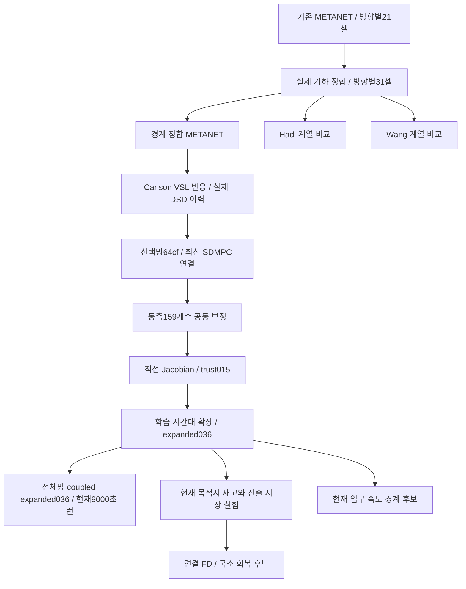

# Freeway 모델 수정 계보 — 2026-09-30

**현재 seed29 SDMPC 9000초 런은 `coupled_expanded_joint`의 동결된 expanded036을 사용한다.** 그 이후의 경로 재고·회복 FD·국소 회복·입구 속도 후보를 전부 합친 모델이 아니다. expanded036도 제어 이득 검증을 완료한 최종 정본은 아니다. 사용자가 이 후보로 실제 제어런을 요청해 실행 중이다.

이 문서는 모델 변경의 계보와 완료된 근거를 전달하는 기록이다. 이번 전달 범위는 문서·설정 스냅샷·계수표·작은 검증 결과이며, 미커밋 실험 코드 전체나 native 원시 기록을 배포하는 실행 패키지가 아니다. 기존 보고서에 적힌 “현재”, “새 런 없음”, “STOP 유지”는 **그 보고서 작성 당시**의 상태다. 최신 실행 상태와 채택 여부는 이 문서를 먼저 따른다.

## 1. 지금 무엇이 실행되는가

|항목|동결된 실제 런|
|---|---|
|코드 기반|`886a014a` 기반 작업본의 별도 동결 스냅샷|
|망|기존 FW80–Urban90 / DSD110 선택망, SHA256 `64cf5f55fe9990f3e25bc4fedebf4ab1e4634c8138dbcf5697a136c48cb559dc`|
|계수 후보|`expanded_joint/eval_036` → `coupled_expanded_joint/candidate_manifest.json`|
|실행 설정 SHA256|`c4abfccb63110bb4f7458a666d5e87b7ae367a07c12ae8403169ec3d674ce6dc`|
|물리 구획|동·서측 각각31셀, 각 진입·진출 접속점을 별도 셀에 배치|
|새로 보정한 자유도|동측31셀 × 5개 계수 + 합류4셀의 δ = 159개 값|
|제어|150초 갱신, 450초/3블록; VSL50:10:110, 양방향 입구110; RM10초 RED/GREEN, 실제 녹색 변경≤2초|
|계산/기록|VISSIM SimRes10, FZP5초, plant 내부1초|
|목적|Ω 내부 TTT. 외부 비용은 진단. TTD는 정상 Ω 외부 유출 사건|
|이번 실행|seed29, 9000초. 별도 R2 결과 폴더. 문서 작성 중 실제3652초 이상 진행 확인|
|후속 실험과의 분리|live 모델·계수 고정. 보정 후보는 별도 오프라인 계산|

[실행 설정][coupled-config] · [manifest][coupled-manifest] · [실효값][effective] · [159계수 전후 표][coeff-table]

**인덱스/단위 주의:** 아래 셀은31개 물리셀의0기준이다. SDMPC의 논리 VSL 구간 번호와 같지 않다. `physical_cell_fd`의 저장 임계밀도와 방향 배율이 적용된 실효 임계밀도를 구분한다. 표에는 실효값을 적었으며 배율1.4를 두 번 곱하면 안 된다. `segment_params`의 기본 τ/ν만 읽으면 `state_response.cell_overrides`가 덮어쓴 값을 놓친다.

현재 참조 설정의 VSL FD는 `law=carlson, A=0.5, E=2.0, alpha=0`이다. 과거 커밋명의 `A0.5_E4`를 현재 계수값으로 대신 사용하지 않는다. 현재값은 동결된 reference_config와 실효 설정으로 확인한다.

## 2. 큰 계보

이 그림은 구현·검토 관계다. 화살표가 모든 앞선 시험의 정본 승격을 뜻하지 않는다. Hadi/Wang, 국소 회복, 경로 재고 등은 서로 다른 비교 가지이며 자동 합성하지 않았다.

## 3. 31셀 이전부터 현재까지

|단계|바꾼 내용과 이유|근거/판정|
|---|---|---|
|초기 METANET 정합|실제 link 길이·차로·진출/합류 위치, 본선/램프 재고와 비용 회계 정리. 속도식 오차와 차량 보존 오류를 구분.|과거 인계: [기하/액추에이터](HANDOFF_20260916_geometry_actuator_response.md), [비용/램프](HANDOFF_20260919_cost_and_ramp_response.md). 당시 실험을 현재망 검증으로 대체하지 않는다.|
|31셀 분할|21→31셀. 진입8·진출8 접속점 각각 한 셀. 램프 주변 약200m, 매우 짧은 내부 분할에는 길이 보호.|[구획 검증][partition]. 공간 평균에 가려진 혼잡은 확인했지만 분할만으로 이득 예측은 해결되지 않음.|
|경계 정합 / Hadi / Wang|같은31셀·내부1초에서 경계 유량 정합과 문헌 계열을 각각 재보정.|[3모델 비교][three-model]. 상태 RMSE 비교를 제어 이득 검증으로 부르지 않음. 현재 모델이3개를 모두 합친 것은 아님.|
|VSL 이력·반응 연결|DSD를 지난 차량의 희망속도 노출과 수송, Carlson 계열 VSL FD 반응. 실제 VSL 공간/입구 고정 조건 확인.|[과거 VSL 재현 패키지][vsl-pack], 코드 이식 [75f01515][port-commit]. Native 이득 관측과 모델 이득 설명은 별개.|
|선택망을 최신 SDMPC에 연결|기존80–90망 선택. 물리 분할 뒤31셀 index 검사, `physical_cell_fd` 적용, 램프 녹색 서비스표 연결, 실제 SIG 출처 검증.|[선택망 연결][selection]. upstream v3b의 다른 수요/망 설정을 섞지 않음.|
|합류/회복 국소 보정|셀23뿐 아니라21·22와24·25의 저속·방출/회복 편향 구분. 계수 변화와 경계/수용 효과를 분리.|현재 [본선 우선 검토][freeway-first]와 아래 후속 가지. 조건부 미래 경계 진단은 운영 예측이 아님.|
|159계수 공동 보정|동측 각 셀에ρcrit, FD형상a, τ, νge, νlt를 허용하고 합류10·12·21·23에δ 추가. 서측 고정.|[1차 결과][cellwise-result]: 상태 중심/반응 포함 모두 확인 상태의 중요한 이득 방향을 충분히 못 맞춰 미채택.|
|직접 민감도|159열 Jacobian, ±5/15/30% 후보 실제 평가, 학습으로trust_0.15 선택.|[Jacobian 결과][jacobian]. 학습 개선과 달리seed43 RM/both 방향 실패. 전역 불가능성 결론은 아님.|
|expanded036|학습 창을13개로 확대. 기존 Jacobian의12개 결합 방향에서 제한 보정. 학습으로eval036 고정.|[확장 보정][expanded]. 학습 반응 손실39.9% 감소,seed43 개선0.67%. 159값을 가지지만 무제한159차원 수렴을 증명한 것은 아님.|
|coupled expanded036|위 계수를 도시·8개 독립 램프·진출 저장을 포함한 전체 플랜트에 연결. 계수 재선택 없이 확인.|[전체망 검증][coupled]. 일부 큰RM 손익 개선. 사용자 요청으로현재seed29 9000초 실행 중. 모든이득 검증완료는 아님.|

## 4. expanded036에서 실제로 달라진 항

기본 차량 보존과 수용·방출 계산을 유지하고, METANET의 FD·속도 갱신 계수를 셀별로 보정했다. 단순히 비용에 RM/VSL 보상항을 더한 모델이 아니다.

|계수|범위|의미/보정 방식|
|---|---|---|
|ρcrit|동측31셀|FD의 임계밀도. 파일 저장값과 실효값의 배율 구분|
|a|동측31셀|FD 형상|
|τ|동측31셀|속도 이완시간. 이 보정 단계에서는 가속·감속에 같은 셀별 값을 사용|
|νge / νlt|동측31셀|하류 밀도≥현재 / 하류 밀도<현재일 때 anticipation 계수|
|δmerge|셀10·12·21·23|요청 수요가 아니라 실제 받아들인 합류량에 따른 감속 반응|

이 단계에서 기하, 차로 수, 자유류 속도, κ, lane-drop φ, VSL A/E, 수요·경로·명령을 함께 무제한 보정한 것은 아니다. 실제 합류량·램프 대기, 동적 off-ramp 진입·저장·배수·spillback과 차량 보존을 유지했다. 명목 차로 감소와 off-ramp 혼잡 차단을 모든 경우 같은 lane-drop 계수로 간주하지 않는다.

전체31셀의 초기값/expanded036값/차이는 [CSV][coeff-csv]와 [읽기용 표][coeff-table]에 있다. 합류·회복 영향부21–25도 같은 표에서 비교할 수 있다.

## 5. 지금 어느 이득을 맞추고, 어느 것을 놓치는가

같은 초기 상태와 같은 평가 영역끼리만 비교한다. 다음 표는 **전체 Ω**,450초,Δ=제어−기준, 음수가 개선이다. 재고 오차 감소율이나 본선 전용 비용과 혼용하지 않는다.

|검증 상태|비교|VISSIM 실측ΔTTT [veh·h]|기존 계수|coupled expanded036|
|---|---|---:|---:|---:|
|seed47@2700|RM 완화−유지|+2.053833|+0.804344|+1.798172|
|seed43@2250|RM−NC|−1.547222|−0.037805|−0.098719|
|seed43@2250|VSL−NC|+0.777083|+0.132870|−0.089271|
|seed43@2250|결합−NC|−1.453472|+0.098171|−0.151466|

seed47의 큰RM 유지 이득은 크기까지 개선됐다. seed43의RM·결합 이득은 작게 예측하고VSL 손해 방향을 놓친다. 표의seed들은 이미 검토한 자료라 blind holdout이라고 부르지 않는다. 본선+램프connector+도시 접근도로의 지역 이득을 Ω 전체 개선으로 바꾸어 보고하지 않는다.

오늘 실제 SDMPC 2700초 선택 주변의 소수 RM 후보도 비교했다. 녹색 8/8/8 제한은 모두 제약을 통과했지만 누적 합류가 거의 같았고, 10484를 8→6→4로 줄여도 해당 합류는 0.55대만 감소하고 예측 Ω 개선은 0.013%였다. **이 상태는 강한 RM 효과의 보정 근거로 부적합하다.** RM의 일반적인 무효나 수요 부족을 입증한 결과는 아니다. [2700초 결과][rm2700]

## 6. expanded036 이후의 실험 가지와 채택 여부

|가지|무엇을 시험했나|결과|현재9000초에 포함?|
|---|---|---|---|
|현재 목적지 재고|현재 관측 경로·미래 설정 선택확률을 실제 허용 유량과 함께 수송. 합류 차량을 이미 지난 출구에 재배정하지 않도록 정합.|[route inventory][route]. 저장/배수로 수용하는 조건에서 일부 RM 개선, 다른 VSL 상태의 실패는 남음.|아니오. 현재 bridge OFF. 기존 동적 off-ramp 저장·배수는 있음.|
|연결 FD21–25|21–23 ρcrit, 24–25 ρcrit, 21–25 형상에 세 배율.|[connected FD][connected-fd]: 상태 22.92% 개선, 반응 10.93% 악화. 사전 채택 기준 실패.|아니오|
|합류21+회복24/25|δ21·τ24/25·νlt24/25에 세 공통 배율.|[regional joint][regional]: 상태 18.41% 개선, 반응 10.34% 악화. 미채택.|아니오|
|출구 차로 감소/복원|진출점의 명목 차로 감소항과 열린 하류 회복, 수용/차로 가용성 후보.|[exit-drop][exit-drop]. 일부 국소 개선과 별도 상태 악화. 모두 합쳐서 정본으로 승격하지 않음.|아니오|
|입구 속도 경계|현재 0–40m 실측 속도를 첫 동측 셀의 가상 상류 속도로 사용. 미래 관측 없음.|[inlet][inlet]: 셀0 재고 오차 개선, 큰 RM/VSL 이득 차이는 거의 그대로. 차량이 적거나 없는 상태·자유류 검증 남음.|아니오|
|전체망 이식 정합|component의 경로 재고/진출 entry 모드와 전체망의 초기화 차이 점검.|[이식 점검][transfer]. 계수 manifest 교체만으로 두 모델이 동일해지는 것은 아님.|진단. 미검증 기능을 일괄 활성화하지 않음.|

위 가지들은 입력 조건도 다르다. `route_inventory+storage` 결과와 현재 live의 `storage_and_proxy` 결과를 계수 차이만으로 비교하면 안 된다. 실측 미래 경계를 쓴 원인 분리 결과는 자율 예측 검증에서 제외한다.

## 7. 다음 작업과 전달 범위

1. 현재 9000초 런은 시작 때 동결한 expanded036으로 끝까지 유지한다. 완료 후 같은 망/seed/수요의 NC와 실행 LDP·VSL readback·Ω TTT·정상 유출·삭제/미삽입을 검증한다.
2. 실제 합류량이 충분히 다른 기존 상태에서 본선 방출·회복·램프 대기의 큰 차이를 맞추는 것을 보정 기준으로 삼는다. 약한 8초 후보의 미미한 부호를 끝없이 맞추지 않는다.
3. 회복 계수·경로 재고·입구 경계를 별도 검증하고, 채택한 변경만 새 이름/설정 해시로 합친다. 현재 런 도중 계수를 바꾸지 않는다.
4. 셀별 속도 RMSE 개선, 전체 Ω 근접, controller의 유한 후보 선택, native 성능 개선을 각각 구분한다. 어느 하나가 다른 검증을 대신하지 않는다.

[자료 목록·SHA256][inventory]에 이번에 올린 기존 보고서/설정의 원본 경로·크기·해시를 남겼다. FZP, 대형 예측 배열, 실행 중 파일, 무관한 미커밋 소스는 이 계보 문서 커밋에 포함하지 않았다. 이 문서 작성/푸시는 진행 중인 런을 중단하거나 모델을 바꾸지 않는다.

[coupled-config]: ../diagnostics/sdmpc_n31_20260924/integration_20260926/baseline_reproduction_20260929/cellwise_calibration/coupled_expanded_joint/candidate_config.json
[coupled-manifest]: ../diagnostics/sdmpc_n31_20260924/integration_20260926/baseline_reproduction_20260929/cellwise_calibration/coupled_expanded_joint/candidate_manifest.json
[effective]: ../diagnostics/sdmpc_n31_20260924/integration_20260926/baseline_reproduction_20260929/cellwise_calibration/coupled_expanded_joint/effective_parameters.json
[coeff-table]: ../diagnostics/freeway_lineage_20260930/EXPANDED036_PARAMETERS.md
[coeff-csv]: ../diagnostics/freeway_lineage_20260930/expanded036_parameters.csv
[inventory]: ../diagnostics/freeway_lineage_20260930/inventory.json
[partition]: ../diagnostics/demand_sweep/ramp_dsd_20260916_v2/segment_resolution_20260921/README.md
[three-model]: ../diagnostics/demand_sweep/user_native_20260914/metanet_calibration_v1/res10_20260922/boundary_literature_v1/README.md
[vsl-pack]: https://github.com/Ming2you/VISSIM/blob/d80faf9917fcfbc8606d606d7f89a1a2d3d47dd6/docs/vsl_bottleneck90_reproduction_20260924/README.md
[port-commit]: https://github.com/Ming2you/VISSIM/commit/75f01515
[selection]: ../diagnostics/sdmpc_n31_20260924/integration_20260926/SELECTION.md
[freeway-first]: ../diagnostics/sdmpc_n31_20260924/integration_20260926/baseline_reproduction_20260929/cellwise_calibration/freeway_first/README.md
[cellwise-result]: ../diagnostics/sdmpc_n31_20260924/integration_20260926/baseline_reproduction_20260929/cellwise_calibration/RESULT.md
[jacobian]: ../diagnostics/sdmpc_n31_20260924/integration_20260926/baseline_reproduction_20260929/cellwise_calibration/jacobian_step/RESULT.md
[expanded]: ../diagnostics/sdmpc_n31_20260924/integration_20260926/baseline_reproduction_20260929/cellwise_calibration/expanded_joint/README.md
[coupled]: ../diagnostics/sdmpc_n31_20260924/integration_20260926/baseline_reproduction_20260929/cellwise_calibration/coupled_expanded_joint/README.md
[rm2700]: ../diagnostics/sdmpc_n31_20260924/integration_20260926/expanded036_9000_20260930/RM2700_FINDINGS.md
[route]: ../diagnostics/sdmpc_n31_20260924/integration_20260926/baseline_reproduction_20260929/cellwise_calibration/freeway_first/route_inventory/README.md
[connected-fd]: ../diagnostics/sdmpc_n31_20260924/integration_20260926/baseline_reproduction_20260929/cellwise_calibration/freeway_first/connected_fd/README.md
[regional]: ../diagnostics/sdmpc_n31_20260924/integration_20260926/baseline_reproduction_20260929/cellwise_calibration/freeway_first/regional_joint/README.md
[exit-drop]: ../diagnostics/sdmpc_n31_20260924/integration_20260926/baseline_reproduction_20260929/cellwise_calibration/freeway_first/connected_exit_drop/README.md
[inlet]: ../diagnostics/sdmpc_n31_20260924/integration_20260926/baseline_reproduction_20260929/cellwise_calibration/freeway_first/inlet_speed_boundary/README.md
[transfer]: ../diagnostics/sdmpc_n31_20260924/integration_20260926/baseline_reproduction_20260929/cellwise_calibration/freeway_first/RUNTIME_TRANSFER_AUDIT.md
