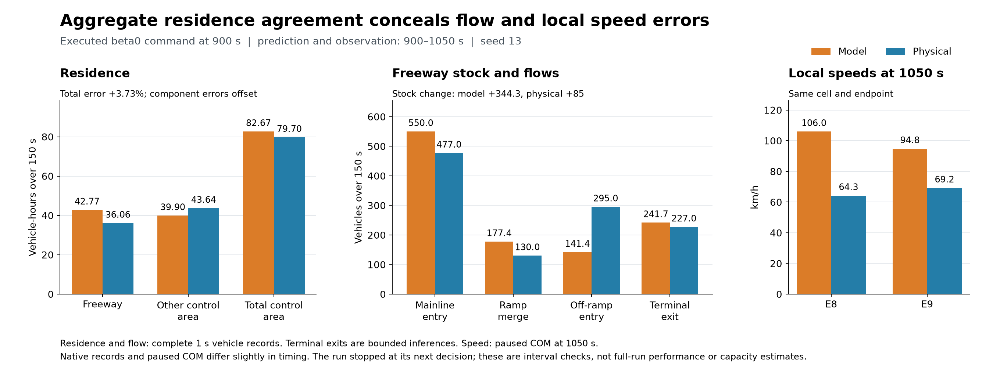

# 제어 전면 검토 — 실행 중인 검증 기록

현재 가장 우선적으로 해결할 문제는 **병목 부근의 공간 집계·회복 예측과 실제 유입·진출량의 오차**다. 신호 채점–실행 불일치, 관측 투영·차량 보존 오류는 재현해 수정했고 실제 VISSIM 첫 구간의 명령 일치도 확인했다. 그럼에도 모델은 본선 정체를 너무 빨리 해소하고 진출 수요를 과소 예측한다. 현재 진출 비율 0.2는 Ver2 보정값이 아니라 합성 NumSim 기본값이었다. 각 오류의 최종 성능 손실 기여율은 아직 분리하지 않았다.

사용자가 지정한 목적 범위는 제어 고속도로와 도시 protected network의 합집합 Ω다. TTT는 Ω 내부 차량시간, TTD는 Ω 밖으로 나간 차량의 경계 통과 사건이다. 내부 도시↔고속도로 이동은 제외하고, 비제어 영역으로 계속 주행한 차량도 Ω를 나가면 센다. β=0/60/150/300초 후보를 검토하며 아직 최종 가중치를 선택하지 않았다.

기준 커밋6056c94에서 분리한 `codex/control-full-review-20260909` 작업이다. 주 작업 폴더의 기존 변경과 vendor 원본은 수정하지 않았다. 이 문서는 최종 성능 승격 선언이 아니며 진행 중인 검증과 미해결 범위를 구분한다.

## 여섯 축의 판정

| 축 | 의심과 확인 근거 | 판정·조치 |
|---|---|---|
| ① 수요 | plant는 6개 900초 구간의 지정 배수를 적용한다. 기존 예측은 현재율 지속이다. shared69와 native1091은 명시적 발생으로 수선했으나, 추가 내부 입력 9곳은 미래 생성이 없다. 1350초 설정 수요 1960대/시간 규모다 | 초기 재고와 미래 발생을 구분해 9곳의 경로·수요를 수선 중이다. 실행 manifest로 검증한 시간표 예보도 추가 중이다. 설정 수요를 실제 수용 유입량으로 주장하지 않는다 |
| ② 관측·매핑 | FW count 속성 오류, urban/ramp 중복, off-ramp 투영 누락과 짧은 connector 누락을 재현했다. Ω635에 정적 지원 188개를 추가하고, 두 native 분기와 내부 입력은 검증된 조건부 지원으로 연결했다 | pure31상태 및 실패 상태의 Ω 합계가 관측과 일치한다. 미확정 27개에 양수 차량이 생기면 거부한다. 실제 경로 수집도 추가했다. 수량 보존은 경로·통행시간 정확성의 증명이 아니다 |
| ③ 제어 레버 | VSL80은 실제 DSD에 전달되고 개입효과가 있음. 고정 meter g5도 COM으로 동작하지만 통과량 유지·램프 대기 증가. green/offset 격리팔 완료. offset 모델 t−와 writer t+ 불일치, SC105 현시순서, SC109 상한 clip, 정수 event를 확인 | 같은 신호 계약을 통합했다. 평가 후 녹색 정련과 미터 양자화·spillback 강제 개방도 채점 전에 확정하도록 수정했다. 최종 실제 main 세 건과 첫 live 900–1050초에서 채점·CSV·readback 일치 검증을 통과했다. 기존 zero offset은 효과가 없다는 실험이 아님 |
| ④ 리더 목적함수 | far의1700문턱은현장추정근거없고작은state변화에분기가바뀜. Ω목적을endpoint stock차로대체하면누락/내부이동/재진입오류가능 | 명시accepted-flow장부로ΩTTT−βTTD 구현. Ω활성시far와기존양수TTT조기절단OFF. 고정 후보 651회 보존검사 통과. fullMPC에서 발견한 램프 공간 중복예약과 W_out 이중 인출을 수정하고 실제 main 재현 통과 |
| ⑤ 팔로워 가격 | 실제가격식은0.75(ΔG−ΔL)/δ. ΔG=0만으로전체외부효과가잘못됐다고판정불가. LIVE wu-link는off-ramp를45step내내동결하는경로가아님. 다만후보별lane context/landing stock전파오류를재현 | 프롬프트의동결단정반박. local/global물리상태·제약을같게수정하고반복worker·후보순서독립검증. β가실제endpoint순위를바꾸는기능은확인했으며성능가중치선정은별도 |
| ⑥ 교통류 동역학 | E8 t1200→1350 속도예측96.41/실제23.27,정체후27구간속도평균오차+20.04km/h. 실제10639합류→136m뒤10682분류를모형이두램프집계로다른순서로처리. direct10682의점유가본선lane feedback에서빠짐 | 실재충실도/공간집계문제. 회계수정만으로예측오차는거의안줄어듦. two-branch의cap/critical경로불일치는수정하되새용량이득을가정하지않음. 분기별state·flow범위와기존λ피드백의표현한계를별도진단 |

축별 상세와 코드 근거:

- [수요·관측](../diagnostics/review_demand_observation.md), [Ω635 지원 감사](../diagnostics/area_projection_coverage_handoff.md)
- [가격·목적함수](../diagnostics/review_objective_price.md), [물리 장부 통합](../diagnostics/model_area_integration.md)
- [FD와 프롬프트 주장 검토](../diagnostics/review_fd.md), [신호 계약](../diagnostics/signal_actuation_contract_review.md)
- [실제 n7 예측 오차](../diagnostics/n7_prediction_fidelity.md), [공간 혼잡 비교](../diagnostics/spatial_lever_comparison.md)
- [속도 오예측의 실제 항 분해](../diagnostics/freeway_speed_terms_review.md): t3300 E8의 첫 10초에서 FD relaxation은 −2.724km/h지만 하류 평균 밀도차에 의한 anticipation이 +16.608km/h다. 단순히 자유속도로 복귀하는 FD나 작은 τ만 원인이라고 설명하면 틀린다. t1200에는 relaxation·상류 convection·하류 밀도차 세 항이 모두 가속한다. 회계 수정 후에도 이 구조가 남으며 새로운 용량·계수는 아직 식별하지 않았다.
- [차로별 정체와 하류 수용 상태](../diagnostics/e8_lane_receiving_review.md), [150초 물리 통과량](../diagnostics/e8_window_passages_review.md): E9 평균 밀도가 낮아도 10682 진출 직전의 1–3차로는 정지열이고 4차로는 빠르다. 평균 밀도차를 전체 차로의 가용 공간으로 해석하면 실제 분류 대기열을 놓친다. 48개 구간의 유량·재고 차이는 확인된 강제 제거 1대를 별도 처리하면 모두 닫힌다. 5초·1초 기록의 차로 변경 및 시간 불확실성은 따로 표시했다.

위 그림은 네 실행의 정확히 3301초 차량 위치다. 점의 간격은 혼잡 구조를 보여주지만 단면 용량의 추정치는 아니다. NC와 n7는 전체 정책 비교이고, 아래 두 고정 신호 팔만 녹색 총량이 같은 상대 offset 비교다.

## 실제 첫 행동의 150초 예측 오차

수정 β0의 실제 900초 행동을 그대로 유지해 1050초까지 예측하고, 같은 구간의 1초 차량 기록과 비교했다. Ω TTT는 82.6741 대 79.69875 veh·h로 오차가 +3.73%지만, 고속도로 +6.71876과 나머지 Ω −3.74341이 상쇄된 결과다. E8/E9 속도는 각각 +41.729/+25.628km/h 높게 예측했다. [첫 구간 상세](../diagnostics/live_beta0_interval_prediction.md)에 이전 행동 750초, 관측 추정치 일치, 시간·단위·사라진 차량 판정과 원자료 해시를 기록했다.

고속도로 재고 증가는 모델 +344.30 대 실제 +85대였다. 유입은 549.978 대 477대, 램프 합류는 177.393 대 130대, 진출은 141.356 대 295대, 종단 이탈은 241.717 대 227대다. 두 장부는 각각 닫히지만 서로 다른 교통 흐름을 설명한다. 전체 Ω TTD도 모델 438.973대, 실제 경계 관측 469대+종단 추론 227대였고 미확정 내부 소실 5대는 보상에서 제외했다.

현재 네 off-ramp 그룹의 전체 진출 비율은 모두 0.2이며, 첫 구간의 수용량 거절은 0이다. 따라서 수용 용량을 늘려도 부족하게 요청된 진출 수요는 해결되지 않는다. [출처 감사](../diagnostics/total_offramp_ratio_review.md)는 합성 기본값의 상속 경로와 Ver2의 조건부 전체 진출 prior(F_E 0.411765, D_E 0.466667, D_W 0.375, F_W 0.333333)를 확인했다. 별도 cfg 복제본에서 네 비율만 바꾼150초 민감도 예측은 진출141.356→266.169대로 바뀌었지만(관측295대) E8 속도 오류는 남았다. [같은 차량 ID의 경로 추적](../diagnostics/static_route_matched_cohorts.md)에서는 native decision을 지난 집단과 두 출구 사이 램프로 합류한 집단의 실제 진출 비율이 달랐다. 한 셀에 두 집단과 출구 순서를 합친 상태에서 무조건 비율이나 용량만 맞추는 것을 최종 모형으로 채택하지 않는다.

## 완료한 실제 VISSIM 실험

모든 팔은Ver2·seed13·5400초·동일수요다. 표의5초와1초 TTD는직접비교하지않는다. 미확정내부사라짐과VISSIM강제제거는정상완료로세지않았다.

| 팔 | 전역TTT [veh·h] | ΩTTT [veh·h] | ΩTTD | 기록·무결성 |
|---|---:|---:|---:|---|
| NC |7403.8872|5578.6601|26070|5초,마지막4초재고유지적분;완료|
| pure n7 |7248.5122|5508.4361|25992|5초+최종완전state;원래7248.5재현|
| VSL80, E상류2구역 |7389.0914|5546.2331|26133|5초+최종state;실제DSD확인|
| NC 동일궤적 세밀한 측정 |7403.8872|5578.6103|26203|1초;실패한meter시도의무개입궤적을전수동일성검증해측정에만재사용|
| RM10639 g5 |7386.5289|5550.4406|26235|1초;실제GREEN5/AMBER1/RED4,정상완료|
| 고정녹색·offset0 |7281.7622|5473.8889|26574|1초;17SC고정,램프전부개방,정상완료|
| SC1004 green10 변경 |7253.8414|5435.0782|26681|1초, 정상 완료; p1=10초는 현재 MPC 하한 20초 밖의 진단 설정|
| SC1001 +10 / SC1004 −10 |7201.3372|5399.1310|26721|1초, 정상 완료; 녹색 총시간 동일, 실제 offset 확인|

처음n7계측런은감사용state기록이관측창을초기화하는root가발견한계측오류로정책이달라졌다. 이결과를pure n7로쓰지않았다. 읽기전용감사로수정후pure n7의7248.5122를재현했다. 고정신호팔의벡터는첫계측런t2100에서가져온정적진단설정이므로출처를별도로표시한다.

VSL80은첫지속혼잡을늦췄지만입구까지장기전파를막지못했다. RM10639g5는ΩTTT가28.17줄었어도총램프통과가258대로같고정지열은늘었다. 고정녹색은D동측10481/127 대기를크게줄였지만도시부40/420과F동측10682/10639 대기를늘렸다. 집계이득을모든병목의해결로해석하지않는다.

[VSL 실험](../diagnostics/vsl80_result_20260910.md), [metering 실험](../diagnostics/meter10639_result.md), [고정신호 기준](../diagnostics/signal_zero_result.md)에측정창·물리통과량·실제신호·한계를기록했다.

## 최종 정본 전의 필수 검증

1. Ω 목적값 대신 전역 TTT를 읽던 offset·leader fallback 비교를 수정했다. 녹색과 미터를 채점 전에 확정한 최종 코드의 실제 main은 warmup 1.56초, t900 β0 122.71초, t3300 β300 115.64초에 정상 종료했다. 마지막 목적값은 657.264861−300/3600×1578.983378=525.682913 veh·h다. 실제 phase/follower 10개, 미터·보존·preflight 22개, 원래 run/Git 접근을 차단한 portable 49개 검사가 통과했다. [최종 preflight](../diagnostics/area_final_preflight_results.json)에 코드·입력·CSV 해시와 worker 종료 증거를 남겼다. 앞선 445.63초 추적 실행은 평가 후 녹색 변경이 있어 최종 정렬 검증으로 인정하지 않는다.
2. 신호 계약을 실제 정본에 통합했다. 설치된 코드의 신호·offset 회귀 15개와 정수 event 10,395건 비교가 통과했다. 수정 MPC 실런에서 결정별 실제 신호를 다시 확인한다.
3. green/offset 격리팔은 모두 완료했다. 수정 MPC의 β=0/60/150/300 후보를 실제로 실행하고 같은 1초 측정·공간 분석으로 비교한다.
4. 한seed로최적화·추정한routing prior와제어선택은독립seed에서추가확인한다. 과거다른실험의σ50.7을현재실험의유의성기준으로그대로사용하지않는다.
5. 호출되지 않는 구형 adapter 18개와 미사용 placeholder 1개를 삭제했다. 구형 18개는 146,966행이며 삭제 전후 git blob의 원래 바이트·해시 복원 검사를 통과했다. 실행 중인 정본과 실제 공유 helper는 유지했다. 진단용 임시 사본과 오래된 패치 생성기도 실제 소비자를 확인하며 정리 중이다.

최종 코드 bc9078e의 첫 β0 실런 `codex_area_beta0_s13_20260910`은 1050초에서 중단됐다. 초기 무응답이나 최적화 timeout이 아니다. 900초 결정은 최종 preflight와 CSV 바이트가 같았고, 900–1050초의 도시·램프 130개 SG readback과 VSL 66행에 불일치가 없었다. 다음 snapshot에서 미확정 Ω 링크 10421에 실제 차량 1대가 나타나 물리 재고 지원 검사가 명시적으로 실패했다. [첫 구간 감사](../diagnostics/live_beta0_first_interval_audit.md)에 정상 적용과 다음 결정 실패를 구분했다. 이 미완료 팔은 5400초 성능표나 가중치 비교에 사용하지 않는다. 실제 경로를 확인해 지원을 보완한 뒤 새 run 이름으로 재실행한다.

10421은 SC5 신호를 이미 통과한 `1220019201→10421→1220014000`의 차량이므로 `SC5_to_SC11` 재고로 귀속했다. 이전 접근부 alias에 머무르는 것이 오류였다. 원래 미확정45개를 전수 검토해 단일 수신저장소가 증명된16개만 추가했고29개는 여전히 차단한다. 초기 차량에 새 유입·유출 사건을 만들지 않았다. 실제1050 재고2083대 일치, 기존31상태 일치,186개 신규지원 합성 차량 단독 귀속,29개 각각 차단 등9개 검사가 통과했다. [수선 후 실제 main](../diagnostics/area_projection_repair_preflight.json)은115.30초에 통과했고36개 관측 worker가 모두 종료됐다. β0의450초 예측J는336.026120 veh·h, 예측TD는1506.008073대이며, 이는 실제 성능값이 아니다.

시작무응답대응은사용자요청대로300초startup감시를적용했다. 해당런의cscript와새로생긴VISSIM PID/생성시각을대조해종료하며다른실행을일괄종료하지않는다. 현재실런은한라이선스에서순차실행한다.

수선 후 `codex_area_beta0_retry_s13_20260910`은1050초 결정을 통과했고1200초 결정도 실행했다. 1050–1200초의130개 SG는 immediate19,508건/post-step19,500건 모두 명령과 같았다. RM9102/10482는10초 중GREEN2/AMBER1/RED7, 나머지7개 램프는 개방이었고 VSL66행은120km/h, offset14개가0이 아니었다. [구간 검증](../diagnostics/live_codex_area_beta0_retry_s13_20260910_actuation_1050_1200.md)을 보존했다. 이 런도1350초에서336의1대·10634의3대에 대한 미확정 재고 지원으로 중단됐으므로 전체 성능표에 넣지 않는다.

336은 고유한 하류 `336→10529→1210014303` 경로로 `SC101_to_SC5` 재고에 귀속할 수 있다. 일반 경로 검증을 추가했고 지원187개/미확정28개 상태에서 관련12개 검사를 통과했다. 10634는 달리 `56` 위 native1129 앞의 공용 접근부다. [경로 증거와 설계](../diagnostics/projection_10634_handoff.md)에 세 갈래가 모두 Ω 내부임을 확인했으며, 여기서 임의 TTD를 만들거나 한 수신 저장소에 몰아넣지 않는다. 다음 시점에 또 멈추는 문제를 줄이려고 완료5개·부분2개 런의1초 차량 기록도 확인했다. 미확정28개 중 실제 양수인 링크는10379/10381/10610/10611/10627/10634의6개였고 나머지22개는 이번 관측에서0이었다. 관측0을 접근 불가능의 증명으로 취급하지 않는다.

현재 경로를 관측할 수 있는지 직접 VISSIM1050초 검증을 실행했다(원 native 수요·신호, 성능 비교 팔 아님). 56에서1129 이후830개 관측은 모두 현재1129:1/2/3, 57의1349개 관측은1129:2/3이었다. 경로가 없는 경우 세 COM 속성은 모두Empty였다. [검증 자료](../diagnostics/vehicle_route_com_qualification.json)에71개1초 분기점 통과 사례와 원자료 해시를 기록했다. 생산 수집기에 별도 `vehicle_routes` 관측을 추가하고 실제 VBS 가짜COM·Python 검증6개 및 기존 상태 수집 정적12개 검사를 통과했다. 다음 실런에서 새 관측과 공용 재고 모형의 통합을 확인해야 한다.

이후 정본 경로 직렬화 함수 자체도 실제 COM에서 검증했다. 빈 네트워크를 포함한9개 시점의16,195건 관측에서 독립 차량 ID·시각·대수 검사가 통과했고, 이전 native 진단의6,009행 표본은 바이트 단위로 같았다. 실행시간70.306초, 원본 입력·신호·수집 소스 변경0이다. [직렬화 검증](../diagnostics/vehicle_route_collector_qualification.json)은 전체 제어기 실행과 구분한다.

native1128·1129를 하나의 유한 저장소·경로 선택 엔진으로 묶었다. 분기 전 차량은 아직 가능한 미래 선택만 따르고, 이미 선택한 차량은 실측 경로를 유지한다. shared69의 연속 경로와1128의 신호 전 우회도 각각 한 번만 전달한다. [두 분기 통합](../diagnostics/route_choice_two_corridors_handoff.md)에 물리 경로·수용 공간·현재 경로 및 remaining SC1005 혼합 신호그룹 한계를 적었다. 실제 native 관측9개 시점은 미확정 경로0으로 초기화됐다. 과거1350 스냅샷은 필요한 경로가 없던6대를 진단용으로 보류하며, 이를 정상 예측이나 실제 성능으로 주장하지 않는다.

10379는 세 상류 회전이 모두 같은 `SC11_to_SC1` 수신 저장소에 도달함을 검증해 추가했다. 정적 지원은188개, 미확정27개이며 미확정 양수 거부는 유지한다. 그중10381은 단순 별칭이 아니라 native1091의 내부 발생 계약이 활성화되고 입증될 때만 지원한다. 이 입력은 외부 gate 예측에서 빠져 있었으므로 원본 입력 구간·실행 배수·입력 역할·실제 internal aggregate를 함께 확인한다. 수용된 차량만 기존 접근 저장소와 이동 예약에 넣고, 대기 중인 미발생 수요는 별도로 보존한다. Ω 안에서 생성되므로 경계 진입이나 TTD를 만들지 않는다.

세 이동의 잘못된 신호 phase도 고쳤다: SC1 E→S p4→p3, SC11 N→E p2→p1, SC11 W→N p4→p3. [실제 SG 근거와 한계](../diagnostics/physical_phase_authority_handoff.md)를 참조한다. 이 수선과 두 분기·native1091을 합친 실제1350→1800의450초 모델 검사는 차량 보존, 후보 독립성, main/fresh worker, Ω ON/OFF 물리상태 동치를 통과했다. 이 구간의1091 생성 예측은20대이고, 외부 gate 유입과 중복되지 않는다. [통합 결과](../diagnostics/native_internal_input_canonical_1350_450.json)는 과거6대의 경로를 보류한 진단이라는 제한을 유지한다.

속도식의 양의 anticipation만 제거하는 실험도 수행했다. t3300의 E8 +30초 예측은23.407→5.000km/h로 실제5.010에 가까워졌으나450초까지5에 묶였다. t1200의 +150초 예측은95.888→95.172로 실제23.269를 계속 크게 벗어났다. 따라서 이를 식별된 계수나 정본 수정으로 채택하지 않는다. [다음 물리 모형 제안](../diagnostics/e8_minimal_repair_handoff.md)은10639 합류와10682 분류의 순서, 차로별 접근 가능한 하류 상태, 각 경로의 대기를 보존하는 국소 인터페이스다.

진출 총비율만 native 값으로 바꾸는 것도 충분하지 않았다. 기존 direct 분율을 그대로 두면 F동측 신호 경로 유입이 과장되고,450초 모형에서 신호 저장소가 포화되며 새 정체를 만들었다. total과 signal/direct/through의 결합 비율은 함께 검토해야 한다. 이 사전 비교 역시 실제 제어 성능의 개선 증거가 아니다.

새 전체 관측 기준 런 `codex_area_observed_nc_s13_20260910`은 5400초를 정상 완료했다
(실행시간 721초). 이전 1초 NC와 26,693,633개 FZP 차량 행이 바이트 단위로 같고,
181개 기본 상태·7602개 본선 셀·56,644개 링크 행도 물리값 차이가 없다.
[전체 궤적 동치](../diagnostics/observed_nc_trajectory_equivalence.json)는 새 차량 경로
수집기가 이 seed13 기준 궤적을 바꾸지 않았음을 확인한다.

이 런의 완전한 900초 차량·경로 상태로 실제 정본 MPC 전체 검색을 실행했다.
135.907초에 정상 완료했고 source/input 변경과 남은 worker가 없다.
[실행 기록](../diagnostics/area_production_preflight/wu-link_t900_beta0_20260909T214050241171Z/manifest.json)의
결과는 offline main 검증이며, 아직 수선된 제어의 5400초 성능 팔은 아니다.
해당 결과 이후 추가 내부 입력 9곳의 누락을 확인했으므로 이를 고친 뒤 제어 실런을 재개한다.

내부 입력 감사에서는 두 종류의 오류를 구분했다. 초기 차량 수가 맞아도 미래 발생이 누락될 수
있었고, 발생량을 추가하더라도 실제 신호 앞 재고를 하류에 배치하면 green·offset의 영향을
잘못 평가했다. source21의 관측 차량은 lane별 SC108 stopline 위치로 전·후 재고를 나눴다.
source201의 native1102 경로와 source225의 native22 경로도 기존 재고의 부분집합으로
추적한다. 이 표식은 추가 차량 수가 아니며, 내부 신호 통과를 TTD로 세지 않는다.

SC15의 두 입력에는 별도의 큰 용량 오차가 드러났다. 기존 공통값
`330 × 184 / 294 = 206.530612 veh/h/lane`에 실제 녹색을 적용하면
900→1350초의 모형 source 방출은 각각6.02381대였다. 같은 VISSIM 구간은28대와45대이며,
실제 두 대기열은 모든 관측 녹색 종료 전에 해소됐다. 따라서 이 구간의 모형 포화를
실제 병목이나 green 조절의 이득으로 해석할 수 없다. 전체 녹색 평균은 수요 제약을
포함하므로 포화용량 추정에 쓰지 않는다. 녹색 네 번째 이후에 대기가 지속된 출발 간격을
이용하고, 두450초 검증 구간을 제외한 자료로 추정하는 수선을 진행한다.

수요 예측에는 현재 관측값을 계속 유지하는 방식 외에, 검증된 native 입력 시간표의
구간 적분을 명시적으로 선택할 수 있도록 했다. 실제1500초 상태에서1800초 이후의
선언된 수요 변화를 반영했고 fresh worker가 같은 예측을 만들었다. 이는 미래 궤적을
읽는 기능이 아니다. 내부 발생과 shared69 입력은 외부 gate에 다시 더하지 않는다.
가중치0/60/150/300초 후보 비교와 seed14 검증은 아직 남아 있다.

통합 후 전체 MPC는 실제900초 관측/β0에서150.047초, 실제2700초 관측/β300에서
178.187초에 정상 종료했다. 두 실행 모두 입력·소스 변경과 잔류 worker가 없었다.
원래 run 폴더와 Git 접근을 차단한 복원 자료에서도116개 검사가 통과했다.
신호별 보정의 [두 시간 holdout 결과](../diagnostics/native_sc15_service_review.md)는
추정 구간 밖에서 인위적인 source backlog와 방출 오차가 줄었음을 확인한다.
이 수선 뒤의 전체 VISSIM 제어 성능은 별도 실런으로 확인한다.

TTD 목적함수를 쓰기 위해 VSL에 따라 용량이 증가하는 식을 반드시 넣어야 하는 것은 아니다.
이번 실제 green·offset 실험처럼 경계 출구의 막힘과 도착시각을 바꿔 유출을 늘릴 수도 있다.
반면 **VSL이 capacity drop을 예방해 처리량을 회복한다**는 설명을 하려면 그 현상을
예측모형과 VISSIM에서 각각 확인해야 한다. 예를 들어
[Jin & Jin의 lane-drop 연구](https://arxiv.org/abs/1310.2658)는 해당 단일 병목 모형에서
VSL 효과가 capacity drop에 의존한다고 명시한다. 이것을 도시부·램프·여러 출구를 포함한
모든 네트워크의 일반 법칙으로 확장하지 않는다. two-branch 구조 자체도 검증을 대신하지 않는다.

VISSIM 포화교통량은 운전행태와 속도·차량구성·차로수의 영향을 받는다.
[PTV의 Wiedemann74 공식 설명](https://cgi.ptvgroup.com/vision-help/VISSIM_2024_ENG/Content/4_BasisdatenSim/FahrverhaltensparameterFolgeverh_Wied74.htm)은
이 점과 신호·대기행렬의 효과를 제외한 포화교통량 정의를 설명한다. 이는 일반적인 모형 설명이며,
이 프로젝트의 VISSIM2020 네트워크가 특정 capacity drop을 재현한다는 증거는 아니다.
현재 자료에서 식별되지 않은 VSL 용량 보너스는 넣지 않는다. E8의 차로별 정체,10639 합류,
10682 분류 순서와 실제 방출을 먼저 대조한다.

고정 녹색 대조 대비 green10은 ΩTTT −38.811 veh·h / TTD +107, 상대 offset은 −74.758 / +147이었다. 두 팔 모두 10639 대기가 줄었지만 420은 악화됐다. offset의 E8 정체 시작 지연은 90초이며 장기 상류 전파는 남았다. [green10 상세](../diagnostics/signal_green10_result.md), [offset 상세](../diagnostics/signal_offset10_result.md)에 적용 검증·경고·측정 한계를 기록했다.
