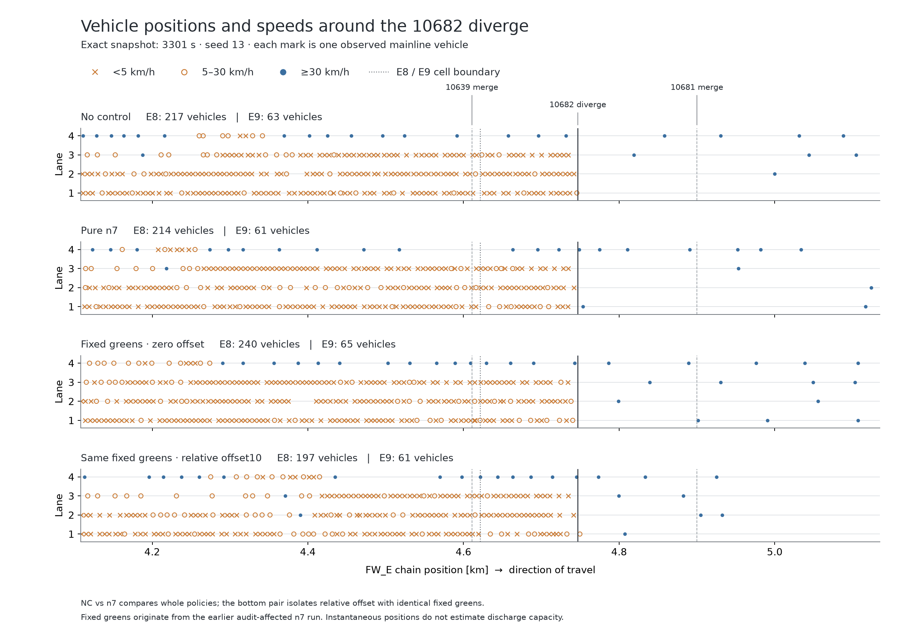

# 제어 전면 검토 — 실행 중인 검증 기록

현재 가장 우선적으로 해결할 문제는 **병목 부근의 공간 집계·회복 예측 오차와 신호 모델–실행 불일치**다. 실제 VISSIM에서 VSL·metering·녹색 명령은 전달됐고 위치별 혼잡도 바뀐다. 반면 모형이 본선 정체를 너무 빨리 해소하고, 일부 명령의 실제 신호 시간창과 다른 서비스를 채점한다. 관측 투영·차량 보존 오류도 별도로 재현했다. 각 요인의 최종 성능 손실 기여율은 아직 분리하지 않았다.

사용자가 지정한 목적 범위는 제어 고속도로와 도시 protected network의 합집합 Ω다. TTT는 Ω 내부 차량시간, TTD는 Ω 밖으로 나간 차량의 경계 통과 사건이다. 내부 도시↔고속도로 이동은 제외하고, 비제어 영역으로 계속 주행한 차량도 Ω를 나가면 센다. β=0/60/150/300초 후보를 검토하며 아직 최종 가중치를 선택하지 않았다.

기준 커밋6056c94에서 분리한 `codex/control-full-review-20260909` 작업이다. 주 작업 폴더의 기존 변경과 vendor 원본은 수정하지 않았다. 이 문서는 최종 성능 승격 선언이 아니며 진행 중인 검증과 미해결 범위를 구분한다.

## 여섯 축의 판정

| 축 | 의심과 확인 근거 | 판정·조치 |
|---|---|---|
| ① 수요 | plant는6개900초 구간의 지정 배수를 실제 입력에 적용한다. x15의역사적이름과0.8333배를 구분했다. 예측은미래전체프로파일이아니라현재율persistence다. shared69 신규입력과기존독립램프/게이트 입력은31시점에서중복되지않음 | 배수 전달은동작. profile-aware로해석하면오류. 초기arrival예약과source release불일치를수정하고향후예측의근사범위명시 |
| ② 관측·매핑 | FW count helper의차로속성오류,동일차량의urban/ramp중복,off-ramp투영누락,짧은connector누락을재현. Ω635전체를지원분류하고새170개를실제단일하류근거로추가 | 실재오류. exactN후pure31초기상태Ω합계는관측과정확일치. 미확정45개양수는링크를명시하며거부. 수량보존이routing정확성의증명은아님 |
| ③ 제어 레버 | VSL80은 실제 DSD에 전달되고 개입효과가 있음. 고정 meter g5도 COM으로 동작하지만 통과량 유지·램프 대기 증가. green/offset 격리팔 완료. offset 모델 t−와 writer t+ 불일치, SC105 현시순서, SC109 상한 clip, 정수 event를 확인 | 같은 신호 계약을 통합했다. 평가 후 녹색 정련과 미터 양자화·spillback 강제 개방도 채점 전에 확정하도록 수정했다. 최종 실제 main 세 건과 첫 live 900–1050초에서 채점·CSV·readback 일치 검증을 통과했다. 기존 zero offset은 효과가 없다는 실험이 아님 |
| ④ 리더 목적함수 | far의1700문턱은현장추정근거없고작은state변화에분기가바뀜. Ω목적을endpoint stock차로대체하면누락/내부이동/재진입오류가능 | 명시accepted-flow장부로ΩTTT−βTTD 구현. Ω활성시far와기존양수TTT조기절단OFF. 고정 후보 651회 보존검사 통과. fullMPC에서 발견한 램프 공간 중복예약과 W_out 이중 인출을 수정하고 실제 main 재현 통과 |
| ⑤ 팔로워 가격 | 실제가격식은0.75(ΔG−ΔL)/δ. ΔG=0만으로전체외부효과가잘못됐다고판정불가. LIVE wu-link는off-ramp를45step내내동결하는경로가아님. 다만후보별lane context/landing stock전파오류를재현 | 프롬프트의동결단정반박. local/global물리상태·제약을같게수정하고반복worker·후보순서독립검증. β가실제endpoint순위를바꾸는기능은확인했으며성능가중치선정은별도 |
| ⑥ 교통류 동역학 | E8 t1200→1350 속도예측96.41/실제23.27,정체후27구간속도평균오차+20.04km/h. 실제10639합류→136m뒤10682분류를모형이두램프집계로다른순서로처리. direct10682의점유가본선lane feedback에서빠짐 | 실재충실도/공간집계문제. 회계수정만으로예측오차는거의안줄어듦. two-branch의cap/critical경로불일치는수정하되새용량이득을가정하지않음. 분기별state·flow범위와기존λ피드백의표현한계를별도진단 |

축별 상세와 코드 근거:

- [수요·관측](../diagnostics/review_demand_observation.md), [Ω635 지원 감사](../diagnostics/area_projection_coverage_handoff.md)
- [가격·목적함수](../diagnostics/review_objective_price.md), [물리 장부 통합](../diagnostics/model_area_integration.md)
- [FD와 프롬프트 주장 검토](../diagnostics/review_fd.md), [신호 계약](../diagnostics/signal_actuation_contract_review.md)
- [실제 n7 예측 오차](../diagnostics/n7_prediction_fidelity.md), [공간 혼잡 비교](../diagnostics/spatial_lever_comparison.md)
- [속도 오예측의 실제 항 분해](../diagnostics/freeway_speed_terms_review.md): t3300 E8의 첫 10초에서 FD relaxation은 −2.724km/h지만 하류 평균 밀도차에 의한 anticipation이 +16.608km/h다. 단순히 자유속도로 복귀하는 FD나 작은 τ만 원인이라고 설명하면 틀린다. t1200에는 relaxation·상류 convection·하류 밀도차 세 항이 모두 가속한다. 회계 수정 후에도 이 구조가 남으며 새로운 용량·계수는 아직 식별하지 않았다.
- [차로별 정체와 하류 수용 상태](../diagnostics/e8_lane_receiving_review.md), [150초 물리 통과량](../diagnostics/e8_window_passages_review.md): E9 평균 밀도가 낮아도 10682 진출 직전의 1–3차로는 정지열이고 4차로는 빠르다. 평균 밀도차를 전체 차로의 가용 공간으로 해석하면 실제 분류 대기열을 놓친다. 48개 구간의 유량·재고 차이는 확인된 강제 제거 1대를 별도 처리하면 모두 닫힌다. 5초·1초 기록의 차로 변경 및 시간 불확실성은 따로 표시했다.

위 그림은 네 실행의 정확히 3301초 차량 위치다. 점의 간격은 혼잡 구조를 보여주지만 단면 용량의 추정치는 아니다. NC와 n7는 전체 정책 비교이고, 아래 두 고정 신호 팔만 녹색 총량이 같은 상대 offset 비교다.

## 완료한 실제 VISSIM 실험

모든 팔은Ver2·seed13·5400초·동일수요다. 표의5초와1초 TTD는직접비교하지않는다. 미확정내부사라짐과VISSIM강제제거는정상완료로세지않았다.

| 팔 | 전역TTT [veh·h] | ΩTTT [veh·h] | ΩTTD | 기록·무결성 |
|---|---:|---:|---:|---|
| NC |7403.8872|5578.6601|26070|5초,마지막4초재고유지적분;완료|
| pure n7 |7248.5122|5508.4361|25992|5초+최종완전state;원래7248.5재현|
| VSL80, E상류2구역 |7389.0914|5546.2331|26133|5초+최종state;실제DSD확인|
| NC 동일궤적 세밀한 측정 |7403.8872|5578.6103|26203|1초;실패한meter시도의무개입궤적을전수동일성검증해측정에만재사용|
| RM10639 g5 |7386.5289|5550.4406|26235|1초;실제GREEN5/AMBER1/RED4,정상완료|
| 고정녹색·offset0 |7281.7622|5473.8889|26574|1초;17SC고정,램프전부개방,정상완료|
| SC1004 green10 변경 |7253.8414|5435.0782|26681|1초, 정상 완료; p1=10초는 현재 MPC 하한 20초 밖의 진단 설정|
| SC1001 +10 / SC1004 −10 |7201.3372|5399.1310|26721|1초, 정상 완료; 녹색 총시간 동일, 실제 offset 확인|

처음n7계측런은감사용state기록이관측창을초기화하는root가발견한계측오류로정책이달라졌다. 이결과를pure n7로쓰지않았다. 읽기전용감사로수정후pure n7의7248.5122를재현했다. 고정신호팔의벡터는첫계측런t2100에서가져온정적진단설정이므로출처를별도로표시한다.

VSL80은첫지속혼잡을늦췄지만입구까지장기전파를막지못했다. RM10639g5는ΩTTT가28.17줄었어도총램프통과가258대로같고정지열은늘었다. 고정녹색은D동측10481/127 대기를크게줄였지만도시부40/420과F동측10682/10639 대기를늘렸다. 집계이득을모든병목의해결로해석하지않는다.

[VSL 실험](../diagnostics/vsl80_result_20260910.md), [metering 실험](../diagnostics/meter10639_result.md), [고정신호 기준](../diagnostics/signal_zero_result.md)에측정창·물리통과량·실제신호·한계를기록했다.

## 최종 정본 전의 필수 검증

1. Ω 목적값 대신 전역 TTT를 읽던 offset·leader fallback 비교를 수정했다. 녹색과 미터를 채점 전에 확정한 최종 코드의 실제 main은 warmup 1.56초, t900 β0 122.71초, t3300 β300 115.64초에 정상 종료했다. 마지막 목적값은 657.264861−300/3600×1578.983378=525.682913 veh·h다. 실제 phase/follower 10개, 미터·보존·preflight 22개, 원래 run/Git 접근을 차단한 portable 49개 검사가 통과했다. [최종 preflight](../diagnostics/area_final_preflight_results.json)에 코드·입력·CSV 해시와 worker 종료 증거를 남겼다. 앞선 445.63초 추적 실행은 평가 후 녹색 변경이 있어 최종 정렬 검증으로 인정하지 않는다.
2. 신호 계약을 실제 정본에 통합했다. 설치된 코드의 신호·offset 회귀 15개와 정수 event 10,395건 비교가 통과했다. 수정 MPC 실런에서 결정별 실제 신호를 다시 확인한다.
3. green/offset 격리팔은 모두 완료했다. 수정 MPC의 β=0/60/150/300 후보를 실제로 실행하고 같은 1초 측정·공간 분석으로 비교한다.
4. 한seed로최적화·추정한routing prior와제어선택은독립seed에서추가확인한다. 과거다른실험의σ50.7을현재실험의유의성기준으로그대로사용하지않는다.
5. 호출되지 않는 구형 adapter 18개와 미사용 placeholder 1개를 삭제했다. 구형 18개는 146,966행이며 삭제 전후 git blob의 원래 바이트·해시 복원 검사를 통과했다. 실행 중인 정본과 실제 공유 helper는 유지했다. 진단용 임시 사본과 오래된 패치 생성기도 실제 소비자를 확인하며 정리 중이다.

최종 코드 bc9078e의 첫 β0 실런 `codex_area_beta0_s13_20260910`은 1050초에서 중단됐다. 초기 무응답이나 최적화 timeout이 아니다. 900초 결정은 최종 preflight와 CSV 바이트가 같았고, 900–1050초의 도시·램프 130개 SG readback과 VSL 66행에 불일치가 없었다. 다음 snapshot에서 미확정 Ω 링크 10421에 실제 차량 1대가 나타나 물리 재고 지원 검사가 명시적으로 실패했다. [첫 구간 감사](../diagnostics/live_beta0_first_interval_audit.md)에 정상 적용과 다음 결정 실패를 구분했다. 이 미완료 팔은 5400초 성능표나 가중치 비교에 사용하지 않는다. 실제 경로를 확인해 지원을 보완한 뒤 새 run 이름으로 재실행한다.

시작무응답대응은사용자요청대로300초startup감시를적용했다. 해당런의cscript와새로생긴VISSIM PID/생성시각을대조해종료하며다른실행을일괄종료하지않는다. 현재실런은한라이선스에서순차실행한다.

고정 녹색 대조 대비 green10은 ΩTTT −38.811 veh·h / TTD +107, 상대 offset은 −74.758 / +147이었다. 두 팔 모두 10639 대기가 줄었지만 420은 악화됐다. offset의 E8 정체 시작 지연은 90초이며 장기 상류 전파는 남았다. [green10 상세](../diagnostics/signal_green10_result.md), [offset 상세](../diagnostics/signal_offset10_result.md)에 적용 검증·경고·측정 한계를 기록했다.
