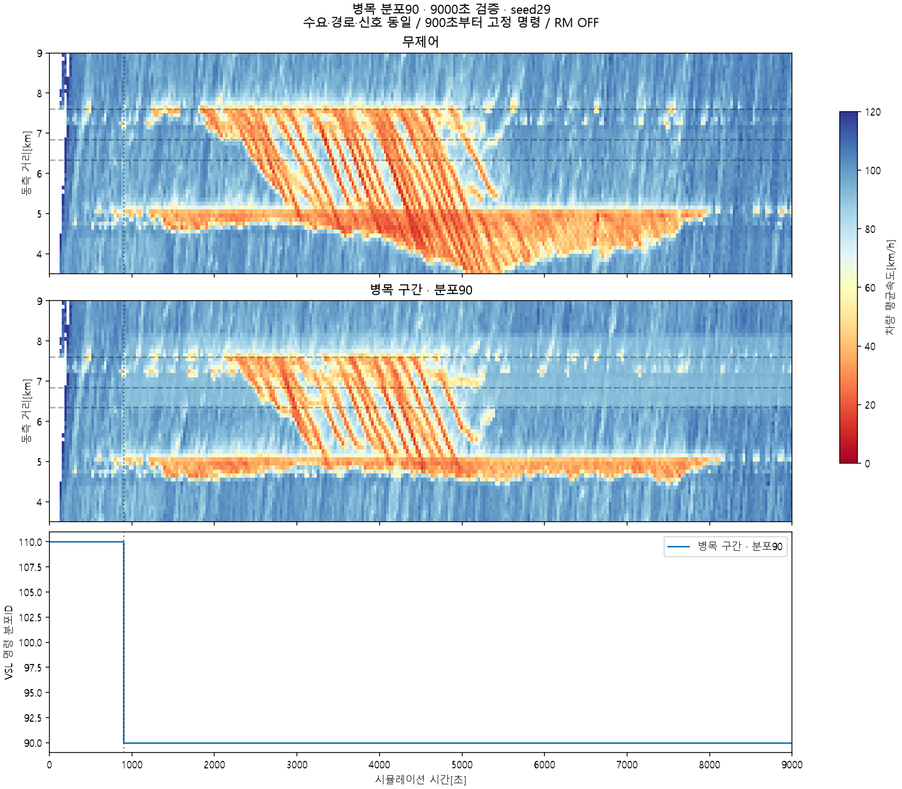
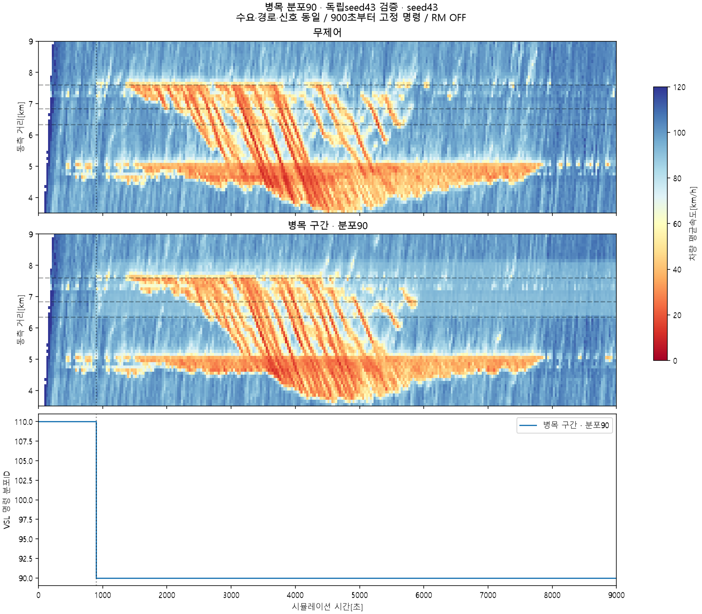

# 병목 구간 VSL90: 재현·다른 프로젝트 이식 가이드

2026-09-24. **동측 지역 TTT가 감소한 VISSIM 실험은 있지만, 여러 seed에서 망 전체 순이득이 확인된 방법은 아직 아니다.** 성공한 조건과 반례를 함께 전달한다. 아래 결과는 실제 VISSIM 실행이며, METANET 예측이나 MPC가 선택한 결과가 아니다.

## 1. 무엇을 했고 얼마나 줄었나

동측 4→3차로 감소 지점의 **500m 상류에서 희망속도 분포를 110번에서 90번으로 바꾸고**, 뒤쪽 램프군을 지난 다음 DSD에서 110번으로 복귀시켰다. 900초부터 9000초 종료까지 고정 적용했다. 상류의 다른 VSL·입구 속도·수요·경로·도시 신호는 그대로, RM은 무제어 상태다.

|9000초 결과|seed29: 탐색 후 선택한 조건|seed43: 동결 후 별도 검증|
|---|---:|---:|
|동측 지역 TTT, 무제어 → VSL [대·시간]|2483.239 → 2330.441|2457.685 → 2444.660|
|동측 지역 변화|**−6.153%**|−0.530%|
|Ω 내부 TTT 변화|−2.320%|−0.320%|
|망 전체 체류시간 + 외부 진입 대기 변화|**−78.764대·시간, −0.272%**|**+67.636대·시간, +0.236%**|
|동측 지역 비정상 삭제, 무제어 → VSL|0 → 0|0 → 1|
|망 전체 비정상 삭제|243 → 229|250 → 263|
|동측 종료 재고 [대]|562 → 568|598 → 612|

음수는 비용 감소다. **“VSL로 6% 순이득을 재현했다”라고 요약하면 안 된다.** 6.15%는 특정 seed의 제한된 동측 영역이며, 외부 대기를 합친 전체 개선은 훨씬 작다. seed43의 작은 지역 감소에는 삭제 1대도 있어 보수적으로 해석해야 한다. 두 seed 평균이나 통계적 유의성은 주장하지 않는다.

원수치와 계산 가능한 요약은 [results.json](results.json), 원 집계 및 native 누적 비용은 [evidence](evidence/)에 있다.

Python 표준 라이브러리만으로 `python verify.py`를 실행하면 명령16개·CDF·native 비용·증감률의 자료 정합성을 확인할 수 있다. 이 검사는 새 시뮬레이션 실행이나 효과의 독립 재현을 대신하지 않는다.

## 2. 공간과 시간: 어디에 적용했나

거리 원점은 동측 본선 입구다. 다른 망에서는 아래 **상대 위치와 병목 구조**를 대응시키고, 이 망의 DSD 번호를 그대로 사용하지 않는다.

|요소|위치 / 실제 주소|설정|
|---|---|---|
|본선 입구·초기 희망속도|동·서 본선|분포110 유지|
|직전 상류 DSD|59–62, link2의 2652.027349m, 1–4차로|분포110 유지|
|VSL 시작 DSD|63–66, link2의 3607.216m, 1–4차로; 누적6.341743km|900초에 분포90|
|4→3 차로 감소|누적6.841743km|기하 변경 없음|
|뒤쪽 두 합류부|약7.243 / 7.604km|기하·RM 변경 없음|
|속도 복귀 DSD|67–69, link24의652.704140m, 1–3차로; 누적8.090751km|분포110 유지|

구간 전체 차량의 현재 속도를 즉시 90으로 강제하는 방식이 아니다. 변경된 DSD를 통과한 차량부터 새 희망속도 분포가 적용된다. 이미 지나간 차량과 합류 차량의 노출은 다를 수 있다. 적용 명령 시각과 차량 반응 시각을 구분한다.

## 3. ‘90’과 ‘110’의 실제 의미

숫자는 **VISSIM의 희망속도 분포 ID**다. 90km/h 단일 속도·최대속도 제한과 동일하지 않다. 원본의 누적확률 CDF는 다음과 같다.

|분포|`(속도 km/h, 누적확률)`|CDF 평균 / 표준편차 [km/h]|
|---|---|---|
|110|`(75,0), (95,.03), (100,.10), (115,.68), (130,.91), (145,1)`|112.275 / 12.254|
|90|`(85,0), (90,.05), (100,.80), (110,.95), (120,1)`|97.125 / 6.428|

[desired_speed_cdf.xml](desired_speed_cdf.xml)은 실제 원본에서 추출했다. 평균·표준편차는 역 CDF의 선형 보간으로 계산한 **설정 분포**의 값이며, 실제 주행속도의 평균·분산이 아니다.

평균과 분산이 함께 변했다. 따라서 이 결과만으로 “평균속도를 낮춰 이득”, “속도 분산을 줄여 이득”, “차로 변경을 도와 이득” 중 하나를 확정할 수 없다. 다른 프로젝트에서 균일90이나 다른 이름의90분포를 쓰면 다른 실험이다.

## 4. 원 실험을 재현할 조건

- PTV VISSIM **2020.00-14 [95957]**, SimRes=10회/초, 실행9000초, seed29와43. 31·37·41은 다른 컴퓨터 작업용으로 예약되어 있었다.
- 해당 시점의 **동측80%·서측80%·도시90%** 망. 이후 서측56% 등의 다른 시나리오와 혼합하지 않는다. 비율은 이미 원본 입력에 반영되어 있으므로 다시 곱하지 않는다.
- 0,900,1800,2700,3600,4500초의 기존 입력 구간을 유지한다. **4500초 이후 마지막 입력값을9000초까지 유지**했다. 5400초 이후 수요를0으로 만든 실험이 아니다.
- static route·차량 구성·차량행태·차로 연결·lane-change 거리·도시 native 신호·미터 무제어 상태를 유지한다. 이득을 맞추려고 capacity나 car-following 값을 조절하지 않는다.
- 무제어는 VSL 명령0회. VSL은900초에 DSD4개 × 차량 class10/20/30/70 = **16회 설정 쓰기**, 적용 시 readback. 이후 같은 값을 반복 쓰지 않는다.
- FZP는5초 기록, 실제 시각 위상은 `.1초`다. 이는 SimRes10과 다른 설정이다. native LDP·LSA·ERR를 보존하고 종료 후 분석했다.
- native `TravTmTot`, `DelayLatent`, `DemandLatent`, `VehAct`, `VehArr`는0–9001 단일 누적 평가 구간으로 수집하고9000초 종료 직전에 읽었다. 종료 재고·외부 대기를 누락하지 않는다.

[experiment_spec.json](experiment_spec.json)에 주소·분포·시각·평가 link집합을, [vsl_events.csv](vsl_events.csv)에 실제16개 명령을 넣었다. [reference_demand_routes.xml](reference_demand_routes.xml)은 원본의 입력·구성·시간구간·static routing 설정을 추출한 참고 자료다. 독립 실행 가능한 `.inpx`는 아니다.

**이 폴더는 다른 프로젝트에 방법을 전달하는 문서·설정·결과 패키지다. 원 망 전체와 수 GB의 FZP는 포함하지 않았다.** 같은 망의 수치를 완전히 재현하려면 [reference_source_hashes.json](reference_source_hashes.json)의 원본 `.inpx`와 그 신호 부속파일이 필요하다. 같은 이름의 ‘80–90’ 파일이라도 hash가 다르면 동일 망으로 취급하지 않는다. 다른 망에서는 효과의 재검증이 필요하다.

기존 실행기에 넣을 핵심 동작은 아래와 같다. `vissim`은 해당 런이 소유한 COM 객체이며, 초기110분포·기록·native 신호 설정은 검증된 상태라고 가정한다. 아래 짧은 코드는 완전한 runner나 watchdog을 대신하지 않는다.

```python
# Native simulation clock reaches900 before this command is applied.
vissim.Simulation.SetAttValue("SimBreakAt", 900)
vissim.Simulation.RunContinuous()
assert float(vissim.Simulation.AttValue("SimSec")) == 900
for dsd_no in (63, 64, 65, 66):
    dsd = vissim.Net.DesSpeedDecisions.ItemByKey(dsd_no)
    for vehicle_class in (10, 20, 30, 70):
        attribute = f"DesSpeedDistr({vehicle_class})"
        dsd.SetAttValue(attribute, 90)
        assert int(dsd.AttValue(attribute)) == 90
# Existing runner resumes continuously to9000; upstream/release DSDs stay110.
```

무제어에도 같은 네트워크·seed·실행 길이·측정 조건을 사용한다. quick mode/최대속도·300초 실제 무진행 watchdog·정확한 PID/생성시각 소유권 확인은 기존 실행기를 그대로 사용한다. 새 adapter나 매초 차량 전수 COM 조회는 필요 없다.

## 5. 무엇을 비교해야 하는가

1. **실행 검증:** DSD 적용 readback, 초기·종료 설정, 대상 외 native 신호 유지. VISSIM2020에서는 COM 신호 변화가 LSA에 빠질 수 있어 검증된 LDP를 사용한다. 이 VSL 단독 시험은 신호 자체를 바꾸지 않는다.
2. **공통 초기 상태:** 같은 seed의 제어 전 FZP를 차량 ID·위치·속도뿐 아니라 모든 기록 열로 비교한다. 원 실험에서는900초 전 전체 행이 일치했다. 같은 seed라는 말만으로 이후 입력·미시 궤적까지 동일하다고 가정하지 않는다.
3. **TTT 영역:** 동측 지역19links = 본선7 + on-ramp4 + off-ramp4 + 직접 on-ramp 접근4. 공유 도시 진출 수용도로4개는 이 지역에서 빠져 있다. 전체 Ω/망 전체 비용도 함께 본다.
4. **순비용:** `J_all = native TravTmTot/3600 + native DelayLatent/3600`. 이는 고속도로+도시 protected network인 Ω의 TTT와 별도 지표다. Ω TTT에 전망 외부 대기를 단순히 붙여 같은 영역인 것처럼 부르지 않는다.
5. **차량 보존:** 정상 완료·Ω 경계 유출·종료 잔여·외부 미삽입·비정상 삭제를 분리한다. 살아서 Ω 밖으로 이동한 차량은 TTD에 포함하지만, 내부 이동·삭제·종료 잔여는 포함하지 않는다. 여기서 TTD는 거리 지표가 아니다.
6. **시간·공간:** 병목 방출, 합류, 차로 변경, 저속파의 상류 전파, 램프·도시 대기와 회복까지 비교한다. 같은 총량이어도 입장·방출 시각이 달라 TTT가 달라진다.

FZP TTT는 실제 timestamp의 사다리꼴 적분이며, 마지막8995.1→9000초는 종료 재고 유지 근사다. native 비용과 표본 비용의 작은 차이를 같은 정밀도로 취급하지 않는다. 5초 FZP에서는 일부 짧은 링크 통과·종료가 관측되지 않으므로 미확인 사건을 정상 TTD로 자동 합산하지 않는다. 원 집계의 unresolved 항목을 evidence에 남겼다.

## 6. 관측된 변화와 아직 모르는 기작

seed29에서는 뒤쪽 병목에서 상류로 번지는 저속파와 체류량이 줄었다. 공간별5초 표본 근사에서 첫 램프군 이전−82.06, 첫 램프군−34.73, 램프군 사이−21.82, 뒤쪽 병목−7.69대·시간이고 하류는+9.37이었다. 이 공간 분해는 위 표의 정확한 영역 적분과 별도 근사다.

그렇다고 말단 방출량이 늘었다고 할 수는 없다. 900–8970.1초 하류 단면 통과는14284→14252대였고, 전체기간 합류도5852→5825대로 달랐다. 속도·분산·군집·차로 변경의 어느 경로가 기여했는지 아직 분리하지 못했다. **용량 증가나 capacity-drop 회복을 이미 입증한 결과로 METANET에 넣으면 안 된다.**





## 7. 다른 프로젝트에서의 최소 이식 실험

먼저 동일 수요·기하·seed의 무제어와 **국소 고정 VSL** 두 조건만 비교한다. 이 망의 시작점은 차로 감소500m 상류, 복귀점은 뒤쪽 합류군 이후였다. 다른 망에서는 병목 위치, 감속에 필요한 거리, 합류 차량의 DSD 통과 여부와 다음 속도 표지까지의 거리를 실제 기하로 정한다. 무조건500m를 최적값으로 가져가지 않는다.

첫 쌍에서 실행·전체 비용·방출 검증이 통과하면, 계수를 바꾸지 않은 별도 seed로 확인한다. 그 다음에만 평균속도 효과와 분산 효과를 분리하는 분포 실험이나 상태에 따른 해제 규칙을 검토한다. 이 절차는 권장 후속 실험이며, 여기 실린 결과가 이미 그 검증을 통과했다는 뜻은 아니다.

상류부터 강한60/80 제한을 넓게 거는 이전 규칙과 MTFC 후보들은 이 망에서 이득을 확인하지 못했다. 병목90의 성공을 “VSL은 낮을수록 좋다” 또는 해당 문헌 알고리즘 전체의 재현으로 일반화하지 않는다. 이번 정책은 문헌의 병목 구간 별도 속도율에서 착안한 **고정 개입 실험**이다.

## 8. METANET/컨트롤러 작업에 넘길 때

이 패키지는 이득을 자동으로 선택하는 모델을 제공하지 않는다. 현재 31셀 플랜트의 절대 상태 보정은 일부 개선됐으나 RM의 순이득과 VSL의 seed별 비용 방향·크기를 충분히 예측하지 못한다. 서로 다른 정책에서 이미 달라진 상태를 초기값으로 한 예측은 공통 초기 상태의 제어이득 예측을 증명하지 못한다.

별도의2220.1–2670.1초 짧은 반응 시험에서는 seed43의 RM TTT 감소에 본선 진입량 감소가 크게 섞인 점도 발견했다. 이900초 시작9000초 VSL 결과와 혼합하지 않는다. 후속 보정에서는 실제 합류·방출·도착량·외부 대기를 먼저 정합하고, 유리한 부호를 만들기 위한 보상이나 임의 용량 증가를 넣지 않는다.

다른 프로젝트에는 이 README와 `experiment_spec.json`, `desired_speed_cdf.xml`, `results.json`을 함께 전달하면 된다. **재현할 대상은 명시된 개입과 검증 절차이며, 어느 망에서든6% 개선한다는 보장이 아니다.**

참고: [PTV 차량 입력의 확률적 생성 설명](https://www.cgi.ptvgroup.com/vision-help/VISSIM_2021_ENG/Content/5_Netzbearbeiten/Fzgverkehr_Zufluss_mod.htm), [PTV 망 전체 비용과 latent delay 정의](https://www.cgi.ptvgroup.com/vision-help/VISSIM_2023_ENG/Content/11_Auswertungen/AuswertungNetzauswertungFzg.htm). 현재2020 실행에서 실제로 사용한 속성·결과는 함께 제공한 native 기록을 우선한다.
