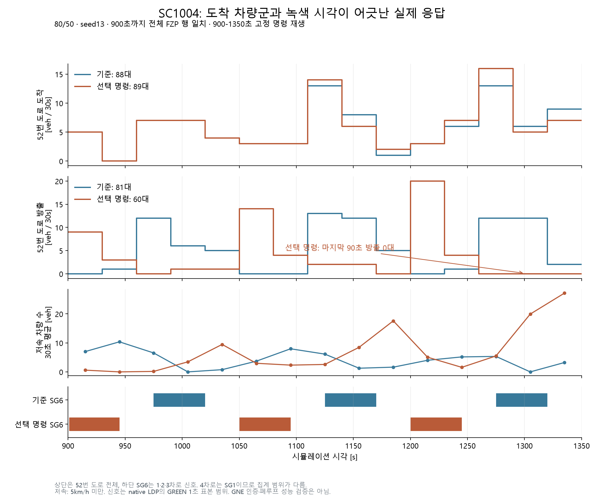
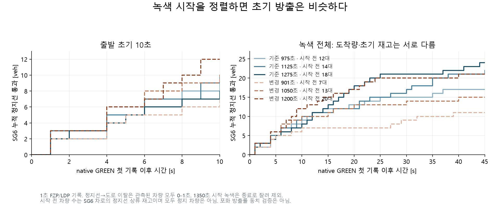

> 2026-09-13 03:32 KST 정정: 수정본 `codex_fid_cl9000_s13_v2`는 이전3150초 실패를 통과하고36개 제어 결정(900–6150초)을 완료했지만,6300초 명령 검사의 `Frozen joint query context changed` 오류로 종료했다. 실행 중 소스 변경은0이었다. 같은6300초 기록의 무수정 재실행은245.043초에 통과해, 현재 내부 상태 복원의 실제 값·공유 참조·직렬화 순서 차이를 추적한다. 전체9000초 효과와 seed17비교는 미완료이며 실패 원본은 정상 완료로 바꾸지 않는다. 기본6파일·결정280파일·native ERR2파일의 원본/보관 SHA가 모두 일치한다. 근거: `fidelity_cl9000_failure6300_v1.json`, `fidelity_recorded6300_context_v1/receipt.json`, `failure6300_archive_review_v1.md`.
> **2026-09-13 인계 업데이트:** V3는8850초 계산 중 외부 중단되어9000초 완료 런이 아니다. 사용자 요청에 따라 같은0–8850초 FZP로 비교한 TTT는 무제어4155.383750→제어4131.682500veh·h,0.5703745% 감소다. 아래 ACTIVE 표기는 과거 진행 일지다. 최신 재개 절차와 한계는 [인계 문서](../../docs/HANDOFF_20260913_controller_runtime.md)를 먼저 읽는다.

> 수정 이력: 실제3150초의 같은 차량12602를 원래 지난 경로와 함께 보존한 상태로 결정254.005초·소스 변경0·213행 명령 대조PASS를 확인했다. 관련84검사와 별도 전체 기록 결정258.499초도 통과했다. 다른 seed를 막던 완료 검사는 독립 실행 요청과 실제 seed의 정확한 대조로 수정했고 관련23검사를 통과했다. 정상NC13기준은 유지한다.

> 2026-09-12 23:39 KST 실패 이력: 첫 전체 제어9000초 런은3150초 모델 초기화 오류로 실패했다.15개 결정(900–3000초)은 완료했다. 차량12602는 출구10682를972.2m 지난 뒤에도 STATIC1130:3을 유지했다. 수정 모델은 원래 경로·현재 재고를 보존해 전진시키고 불명확한 말단 운명을 검열하며 정상TD로 세지 않는다. 실제 native에서 출구를 놓친 원인과 이후 도착·삭제는 아직 확인되지 않았다. 실패 원본/receipt/native ERR는 보존했고 긴 경로로 누락된 복사도 복구해6개 기본파일+132개 결정파일의 바이트 일치를 확인했다.

> 2026-09-12 22:15 KST 추가: 4단계 진행 중. 동일 정본의 무제어9000초(seed13) 완료·native 검증 통과. Ω TTT=4192.123194대·시간, TTD=29436사건, 미확인 소실380은 TTD제외, native 제거194는 별도 대조. 같은80/50·9000·seed13의 폐루프 런을 시작했다(ControlStart900). 기존 빠른NC9000과는448초 차량1256의 위치0.01m부터 FZP가 달라져 전체 동일성 게이트 실패로 보존했으며, 빠른 기준선을 재사용하지 않는다. 현재 런과 이후 seed17 정본 비교는 아직 미완료다. 전체 개선·10%·실시간·GNE 완료를 주장하지 않는다. 근거: `fidelity_nc9000_s13_full_v1/summary.json`, `fast_nc9000_canonical_gate_v2.json`, `fast_nc9000_first_difference_v1.json`.

# 시간 제한 해제와 실제 450초 응답 검증

갱신 — 2026-09-13. **3단계의 혼잡 구간 native 기준·폐루프 비교와 사후 검증을 완료했다.** 2400–2850초 TTT는 0.340% 줄었지만 TTD는9대 줄고 종료 재고는21대 늘어 개선 조건으로 채택하지 않는다. 4단계의 80/50·seed13·9000초 무제어 기준은 완료했고, 내부 상태 복원 수정 후 `codex_fid_cl9000_s13_v3` 전체 제어를 실행 중이다. 다른 seed 비교는 미완료다. 아래 과거 실패·검증 이력은 각 당시 설정의 결과로 보존한다.

6300초 실패는 같은 기록을 다시 계산한8개 짧은 검사와 전체 결정에서 재현되지 않았다. 별도의 합성 검사에서는 변경 없는 중첩 집합을 재생성하거나 cfg와 공유한 참조를 깊은 복사로 바꾸는 복원 오류를 확인했다. 수정은 바뀌지 않은 원래 child 객체를 보존하며, 실제로 바뀐 cfg/state를 되돌려 변조를 가리지 않는다. 전체 raw SHA 검사는 유지하고, 재발하면 최초 검사에 사용한 전후 pickle 원본을 실패 기록으로 저장한다. 관련63검사와 파라미터 검사는 통과했다. 이는 합성 오류의 수정 근거이며 원 native6300 실패의 세부 원인을 확정한 것은 아니다.

수정 후 전체6300초 기록 결정은252.921초에 완료했고213행 명령 결합·worker 종료·소스 변경0을 확인했다. 수정 전 통과본과 실제7개 명령 필드·213행 물리 SHA·CSV 전체 bytes·목적함수171.6128223·N_P217.4299016·N_UF1683.9317049 및 비교한 예측 그룹이 동일했다. 탐색평가101→96,endpoint187→179로 작업량은 달라 전체 계산 등가나 속도 향상을 주장하지 않는다. 근거: `guard6300_scope_fix_v1.md`, `guard6300_scope_regression_fixed_v1/result.json`, `fidelity_recorded6300_scope_fix_v1/receipt.json`, `fidelity_recorded6300_scope_comparison_v1.md`.

## 4단계 진행 상태: 혼잡 구간 비교 완료, 장시간 검증 진행

| 단계 | 현시점 상태 | 완료 근거와 남은 범위 |
|---|---|---|
| 1. 예측 교정 | 구조 교정·동일 명령 450초 검증 완료 | 실제 경로 선택 자격과 8개 분기 위치를 반영했다. 진출·말단 오차는 감소했으나 전체 TTD와 합류별 오차가 모두 개선된 것은 아니다. |
| 2. 계산 시간 | 동일 작업량 ABBA 및 새 설정의 기록 결정 완료 | 32회 논리 평가의 game 시간 평균 53.915→34.083초. 새 fidelity_v4의 전체 기록 결정은 111.466초였으며 최종 gap은 미완료다. |
| 3. 혼잡 폐루프 | native 기준·폐루프 및 사후 비교 완료 | 같은 80/50·seed13·fidelity_v3, 총2850초·제어 시작2400초. TTT −0.340%, TTD −9대, 종료 재고+21대. 네 결정243–272초·최종gap 미완료로 교통 개선·실시간 성능을 인증하지 않는다. |
| 4. 장시간·다른 seed | 9000초 무제어 완료·수정 후 전체 제어 실행 중 | 같은 fidelity_v3·80/50·seed13 기준 완료.3150초 경로 오류와 복원 중 집합·참조 변경을 수정하고 기록 결정을 검증했다. V3 전체 제어 완료·seed17 기준/제어·최종 비교가 남아 있다. |

이 표의 완료는 명시한 단계별 작업 범위다. 전체 GNE 인증, 반복 결정의 150초 실시간 충족, 실제 교통의 10% 개선을 달성했다는 뜻은 아니다.

### 1단계: 경로를 유지한 8개 진출 분기의 예측 교정

기존 본선·진입 대기 재고를 실제 현재 경로가 있는 차량, 현재 경로가 NULL인 차량, 앞으로 경로 결정에 도달할 기대 차량군으로 구분했다. 이미 정해진 경로를 유지하고, 결정 지점을 지난 NULL 차량이나 하류 합류 차량에 상류의 조건부 선택 비율을 다시 적용하지 않는다. 미래 선택은 망에서 검증한 시간 불변 조건부 비율로만 계산하며, 실제로 수용된 이동량만 다음 셀·분기로 옮긴다. 4개 신호 진출과 4개 직결 진출의 서로 다른 위치·수용 재고를 보존하고, 거절된 분기 수요는 원래 재고에 남긴다. 관측 통과량을 희망 수요로 대입하거나 실제 망 수요를 조정한 결과가 아니다.

900초의 같은 초기 모델 재고·예측 수요 SHA·고정 물리 명령으로 1350초까지 계산했다. 새 응답은 1125/1125개 모델 방문, 110,182개 배분 검사와 32,040개 상태 한계 검사를 통과했고 실행 중 소스 변동은 0이었다. 전체 진단 경과 5.055초 안에 물리 응답 2.460초가 포함된다. 이는 한 번의 고정 명령 예측 검증이며 controller 전체 시간이나 실제 폐루프 효과가 아니다.

| 900–1350초, 같은 고정 명령 | 실제 기준 | 기존 모델 | SC1005 무신호 귀속만 교정 | 경로 재고까지 교정 |
|---|---:|---:|---:|---:|
| Ω TTT [veh·h] | 166.565 | 191.099 | 191.011 | 187.907 |
| Ω TTD [veh] | 1558 | 1138.374 | 1141.229 | 1131.833 |
| 본선 말단 유출 [veh] | 492 | 658.636 | 658.782 | 525.090 |
| 살아서 Ω 경계를 나간 사건 [veh] | 1066 | 479.739 | 482.447 | 606.744 |
| 8개 진출 connector 진입 [veh] | 790 | 402.745 | 403.187 | 611.195 |
| 8개 램프의 본선 합류 [veh] | 301 | 235.941 | 238.892 | 249.187 |

기존→경로 교정의 분기별 평균 절대오차는 8개 진출에서 48.407→25.956대, 두 말단 방향에서 83.318→16.545대로 줄었다. 반면 8개 합류별 평균 절대오차는 10.917→10.978대로 커졌고, 전체 TTD 절대 편향도 419.626→426.167대로 커졌다. 말단의 과대 예측과 살아있는 경계 유출의 과소 예측이 각각 줄면서도 합계에서는 서로 상쇄되는 정도가 달라진 결과다. TTT는 여전히 실제보다 21.342veh·h 높다. 8개 진출·합류는 별도 물리 경계의 이동량이므로 TTD에 더하지 않는다.

SC1005의 head-free 하한은 연속된 두 유효 관측 창과 같은 실행의 이력을 요구한다. 이번 과거 900초 입력에는 검증된 이전 하한이 없어 206.531veh/h를 유지했다. **312veh/h를 적용한 예측 결과가 아니다.** 새 native 예열에서는 각 실행의 관측 이력을 이어서 검사한다. 실제 TTD 1558의 검토 필요 표시는 유지하며 미확인 내부 소실 12대는 제외한다. 초기 Ω 재고 모델/실제 1033/1034대의 기록 시점 차이는 아래 기존 확인 근거를 따른다.

진입량 비교도 정의를 바로잡았다. 교정 모델의 `entered_veh` 1710.779대에는 도시 내부 생성 308.925대가 들어 있지 않지만, native 진입 2166건에는 내부 첫 관측이 포함된다. 같은 집계 범위로 내부 생성을 포함하면 모델 2019.704대, 차이 −146.296대다. 내부 첫 관측 1622건과 모델 내부 생성·본선 진입 1628.872대의 차이는 +6.872대, 살아있는 경계 유입은 실제 544건과 모델 잔여 집계 390.832대로 차이 −153.168대다. 첫 관측은 차량 입력 ID를 맞춘 출생 검증이 아니며, 남은 차이도 동일 경계·출발 차량군으로 확인해야 한다. 원시 진입 차이 약 −455대를 모두 수요 누락으로 해석하지 않는다. 중간 경계 이탈·재진입을 셀 수 있는 코드가 있으나 기존 자료만으로 누락 경로의 위치·양은 식별하지 못했으므로 추가 보정량은 만들지 않았다.

근거: [고정 명령 비교와 원본 해시](../../diagnostics/control_improvement/decision_common_anchor_20260911/ramp8_physical_v1/fidelity_routes_comparison_v1.json), [교정 응답·모델 검사](../../diagnostics/control_improvement/decision_common_anchor_20260911/ramp8_physical_v1/fidelity_routes_recorded900_v1.json), [진입 정의와 경계 잔차 정정](../../diagnostics/control_improvement/decision_common_anchor_20260911/ramp8_physical_v1/fidelity_boundary_residual_readonly_v1.json). 비교·잔차 정리에는 기존 JSON만 사용했다.

### 2단계: 같은 탐색 작업량의 시간과 전체 기록 결정

고정된 900초 상태·450초 물리 예측·공통 가격에서 논리 평가를 32회로 맞추고 순차→8개 묶음→8개 묶음→순차(ABBA)로 측정했다. 네 조건 모두 초기 응답 포함 실제 endpoint 17회, game 내부 16회였다. 명령·가격·물리 응답·gap 값의 대조와 최종 7개 행동 필드가 일치했고 소스 변동은 0이었다. 묶음으로 미리 계산한 서로 다른 명령 17개는 모두 사용했다.

| 방식 | game 경과 [s] | worker·초기 응답 준비 [s] | 논리 평가 / game endpoint |
|---|---:|---:|---:|
| 순차 A | 54.361 | 2.980 | 32 / 16 |
| 묶음 A | 34.054 | 3.318 | 32 / 16 |
| 묶음 B | 34.111 | 3.004 | 32 / 16 |
| 순차 B | 53.470 | 3.158 | 32 / 16 |

game 경과 평균은 53.915→34.083초로 이 범위에서 36.8% 줄었다. 공통 설정 준비·가격 계산 61.051초는 위 game 시간 밖에 있다. ABBA는 기존 fast_np_v2 물리 설정을 고정하고 요청 순서만 비교한 검증으로, 새 경로 모형과 기존 모형의 속도비가 아니다. 네 조건 모두 평가 한도에서 종료해 최종 전체 gap은 미완료다. 따라서 전체 결정 또는 VISSIM의 단축률로 확장하지 않는다.

별도로 새 `joint_config_fidelity_v4.json`의 정본 전체 기록 결정은 111.466초에 종료 코드 0·소스 변동 0으로 끝났다. 설정 준비·실제 유지 명령 검증·공통 가격·leader/follower·writer를 포함한 결과다. 120초 결정 예산에서 검증된 명령을 반환했으며 최종 gap은 미완료다. 이 한 기록 상태의 시간은 반복 native 결정의 실시간 충족이나 제어 개선의 증거가 아니며, 혼잡 구간에서 실제 결정·적용을 확인하는 3단계와 구분한다.

근거: [32회 평가 ABBA](../../diagnostics/control_improvement/decision_common_anchor_20260911/ramp8_physical_v1/bounded_game32_abba_v1.json), [fidelity_v4 전체 기록 결정](../../diagnostics/control_improvement/decision_common_anchor_20260911/ramp8_physical_v1/fidelity_bounded_recorded900_v2/receipt.json). 아래 초기 v3 폐루프와 이전 17개 명령 묶음 검증은 서로 다른 실험의 완료 이력이다.

### 3단계: 혼잡 구간 폐루프는 완료됐으나 개선 조건은 미달

`codex_phys8_fidelity_fw080_u050_nc2850_s13_v1`과 `codex_phys8_fidelity_fw080_u050_cl2850_s13_v1`을 순차 완료했다. 두 런의1–2400초 원시 궤적4,475,808행이 정확히 같고 첫 차이는 없었다. 2400초 초기 관측·head 이력도 실행별5개 메타데이터 항목(config SHA, network 경로, provenance 경로·run_id, sim_period_sec)을 제외하면 정확히 같다. 폐루프의 네 결정은 행동7필드와213개 CSV 행의 출력 일치, 실제 신호·VSL 적용 확인, native LDP 검증을 통과했고 실행 검증 오류는0건이다. 독립 LSA 검사의 COM 시점 구분 한계는 실패 상태로 보존한다. 이 사후 qualification은26.712초에 완료됐고 소스 변동은0이었다.

| 결정 [s] | N_P 예측 / cap [veh] | 고정 N_UF 목표 → 예측 [veh/h] | 전체 결정 계산 [s] | 최종 gap 완료 |
|---:|---:|---:|---:|---:|
| 2400 | 404.903 /2400 | 3411.805→3445.520 | 242.663 | 0/19 |
| 2550 | 386.970 /2400 | 3271.486→3272.604 | 244.548 | 0/19 |
| 2700 | 293.294 /2400 | 2747.619→2747.619 | 271.590 | 0/19 |
| 2850 | 306.676 /2400 | 2785.446→2785.391 | 267.476 | 0/19 |

전체 wall 제한을 해제한 fidelity_v3를 사용했고 후보별120초·leader 후보3개 한도는 유지했다. 네 결정의 수량 제약과 N_UF ±40veh/h는 모델에서 통과했지만 최종 gap은 시간 한도로 미완료이며 GNE 인증은 없다. 각 N_UF는 해당 시점의450초 예측 합류 목표로 후보들 사이에 고정했다. 아래 실제150초씩 갱신한 폐루프 합류와 같은 정책·기간의 예측으로 등치하지 않는다. 네 계산 모두150초를 넘었으며 2850초 출력은 이후 교통 노출0초라 효과 분석에서 제외한다.

물리 명령 전체를 확인하면 VSL66개 행과8개 미터는 네 결정에서 직전 명령과 같았고 미터는10초 주기의 녹색10초였다. 도시 신호는2400초에17개 signal·122개 SG 명령 행이 추가됐고, 2550·2700·2850초에는 signal1개씩과 SG8·6·8개 행이 갱신됐다. 첫17개 행의 추가는 무제어에서 도시 제어권을 가져온 기록이며17개 신호의 타이밍이 모두 달라졌다는 뜻은 아니다. 녹색·offset을 담은 신호 명령과 VSL·미터의 실제 적용 검사를 구분해 통과 여부를 확인했다.

유지 이유를 확인하면, 세 노출 결정에서 두 고속도로 주체는 각각 기준점과 이웃 3개를 평가했고 이웃 3개 모두 수량 제약을 통과했다. 관측된 FW_W 개선은 0, FW_E 개선은 각각 0.006214·0.001319·0.000657veh·h였으며, 부분 round-robin에서 더 큰 신호 개선 0.805460·1.189395·0.448972veh·h가 선택됐다. 따라서 이번 유지 결과를 일괄적인 N_UF 기각으로 설명하지 않는다. 다만 각 FW의 63개 후보는 미완료다. 가격 기저에는 방향별 VSL 3개·미터 4개의 독립 좌표가 포함됐지만, 8개 미터의 모든 대안을 follower가 충분히 평가했다는 증거는 아니다. 현재 평균 예측 합류량이 g8 서비스보다 작다는 사실만으로 시간별 수요나 서비스의 무반응 구간을 확정하지 않는다. [후보 방문·제약·물리 명령 기록](../../diagnostics/control_improvement/decision_common_anchor_20260911/ramp8_physical_v1/short_cl2850_fw_lever_selection_v1.json)에 근거를 보존했다.

| 2400–2850초 실제 Ω 측정 | 무제어 | 폐루프 | 폐루프−무제어 |
|---|---:|---:|---:|
| TTT [veh·h] | 304.176667 | 303.143750 | −1.032917 (−0.340%) |
| TTD [veh] | 2019 | 2010 | −9 |
| 살아있는 경계 유출 [veh] | 1348 | 1339 | −9 |
| 말단 유출 추정 [veh] | 671 | 671 | 0 |
| 관측 진입 사건 [veh] | 2296 | 2305 | +9 |
| 종료 Ω 재고 [veh] | 2508 | 2529 | +21 |
| TTD 제외 내부 소실 [veh] | 21 | 18 | −3 |
| 8개 실제 본선 합류 [veh] | 394 | 396 | +2 |

시작 Ω 재고는2252대로 같고 진입·유출·소실을 포함한 두 수지 잔차는 모두0이다. 내부 소실21/18대는 TTD에 넣지 않았으며, 말단 제거 충돌·모호 대조가0이어도 이 소실 때문에 두 `TD_requires_review`는 true다. 소실 감소를 처리량 증가로 세지 않는다. 실제 합류의150초별 합은132/136/126→134/131/131대였다. 이는 TTD가 아닌 내부 본선 합류다. 이450초 비교의 작은 TTT 감소를10% 개선이나 장기 회복으로 확장하지 않는다.

국소 정지 체류(속도 ≤1km/h)는 도로127에서16.047639→13.837917veh·h, 진출10481에서5.421111→4.592639veh·h로 줄었다. 반면 도로40은2.249028→3.123472veh·h로 늘었다. 정지 차량 수 적분의 개선·악화가 함께 나타나므로 전체 평균만으로 병목이 해결됐다고 판단하지 않는다. 9000초 기준·폐루프와 다른 seed에서 처리량·잔여·소실·회복을 확인하는4단계는 아직 끝나지 않았다.

근거: [혼잡 폐루프 qualification](../../diagnostics/control_improvement/decision_common_anchor_20260911/ramp8_physical_v1/fidelity_cl2400_2850_qualification_v1.json), [무제어 경계 집계](../../diagnostics/control_improvement/decision_common_anchor_20260911/ramp8_physical_v1/fidelity_nc2400_2850_v1/boundary_metrics.json), [폐루프 경계 집계](../../diagnostics/control_improvement/decision_common_anchor_20260911/ramp8_physical_v1/fidelity_cl2400_2850_v1/boundary_metrics.json), 두 폴더의 `summary.json`. 이 보고서 갱신은 기존 JSON만 읽었으며 궤적·모델·native 작업을 새로 실행하지 않았다.

## 초기 폐루프 v3 완료: 실행 연결 검증, 성능 개선 미확인

80/50·seed13,900초 준비+450초 제어의1350초 런을19:05에 완료했다. 해당 VISSIM은 종료됐고 실행 오류는0건이다. 네 결정의 JSON·CSV·신호와 VSL 적용 확인·native LDP 검증이 통과했다. 독립 LSA 검사는 COM 전환 누락으로 실패 상태를 유지한다. 무제어 기준과1–900초 FZP939,080행,900초 제어 입력·head 이력도 실행·소스 메타데이터5항목(config 해시,network 경로,provenance 경로·run_id,sim_period_sec)을 제외하고 정확히 같다. 근거 `fast_np_closedloop_qualification_v1.json`(13.695초,원본 변동0) 및 런 `codex_physical8_fw080_u050_fastnp_closedloop1350_v3/completion_receipt.json`.

| 결정 [s] | 직전 실제 명령에서 바뀐 신호 | N_P 예측 / cap [veh] | N_UF 목표 → 예측 [veh/h] | 계산 [s] |
|---:|---|---:|---:|---:|
|900|SC1004 p1/p2 46/23→40/29, offset75→0|318.520 /2400|1887.526→1890.562|275.895|
|1050|SC1001 p1/p2 46/23→40/29, offset75→0|316.297 /2400|2083.926→2080.132|271.993|
|1200|SC5 p1/p2 43/23→37/29, offset114→0|339.005 /2400|2441.075→2441.075|282.524|
|1350|SC108 p1/p4 31/22→25/28, offset38→0|325.788 /2400|2477.806→2477.806|280.505|

N_P는17개 도시 주체의 동일 순유입이며, N_UF는8개 예측 본선 합류량의 합이다. 각 시점의 N_UF 기준은 직전 실제 명령에서 새로 계산했고 해당 결정의 모든 후보에서는 고정했다. 네 출력 모두±40veh/h(450초에±5대)를 만족했다. VSL120km/h와8개 미터10초 주기 전체 녹색은 유지됐다.1350초 출력은 이후 교통 노출0초이므로 효과 분석에서 제외한다.

빠른 N_P 초기값·후보 예산은 활성화됐지만, 이번 선택은 이미 제약을 만족한 기존 초기값에서 시작한 game 응답이다. 음수 N_P−250의 두 후보에서는 초기값을 실제 검사했고, 복원8회 한도로30.5–35.0초에 끝난 뒤 미확인으로 다음 후보에 넘어갔다.1050초의 한 offset 초기값은 N_UF 오차−40.888veh/h로 탈락했다. 초기값이 선택 행동을 만들었다거나 전역 불가능성을 증명한 것으로 쓰지 않는다. 네 선택 모두 후보 시간 한도로 중단돼 최종 gap 완료0/19, 최대 gap은 미확인이다. 후보120초의 진행 중 평가 초과는0.653–2.145초였다. 전체 시간 제한을 해제한 설정의272–283초 결과이므로 실시간150초 충족·GNE 인증·10% 개선을 달성하지 않았다.

|900–1350초 실제 Ω 측정|무제어|폐루프|차이|
|---|---:|---:|---:|
|TTT [veh·h]|166.5653|166.2394|−0.3258(−0.196%)|
|TTD [veh]|1558|1549|−9|
|살아서 Ω 밖으로 나간 사건|1066|1057|−9|
|검증된 망 끝 유출 추정|492|492|0|
|8개 실제 본선 합류|301|294|−7|
|종료 Ω 재고|1630|1652|+22|
|TTD 제외 미확인·비정상 소실|12|11|−1|

TTT는 Ω내 체류시간,TTD는 살아 있는 경계 이탈과 검증된 망 끝 유출이다. 내부 이동·종료 잔여·비정상/미확인 소실은 TTD에 넣지 않았다. 설정 수요는 같지만 관측 유입은2166→2178대로 달랐고 시작 재고1034대와 유입·이탈·소실을 포함한 수지는 모두 닫혔다. 작은 TTT 감소와 TTD·잔여 재고 악화를 함께 봐야 하며, 이번 짧은 런은 개선 조건으로 채택하지 않는다. 구간별8램프 합류는90/93/118→83/93/118대,10681의450초 합류는26→18대였다.450초 고정 명령 예측과150초마다 갱신한 실제450초를 같은 정책으로 비교하지 않는다. 근거 `open1350_area450_v1/boundary_metrics.json`, `fast_np_closedloop_area450_v1/boundary_metrics.json` 및 qualification의150초 램프 기록.

|도로|진입 또는 첫 관측: 기준→폐루프|이탈|종료 재고|5km/h 미만 체류 [veh·s]|
|---|---:|---:|---:|---:|
|52|진입88→90|81→60|14→37|1893→3225|
|66|첫 관측45→45|38→46|32→24|1856→3156|
|71|진입157→157|150→134|8→24|4974→4304|

도로 전체 수지를 SG별 포화 방출능력으로 대입하지 않는다.52번에서는 녹색·도착 시각과 마지막 적색 대기가 겹쳐 이탈 감소·잔여 증가가 관측됐다.1350초 SG6 녹색 시작의 정지큐는 차로별18/7/4대이며,1차로 마지막 차량의 정지선 거리는104.4m다. 이후 궤적이 없어 해소시간은 측정하지 못했다. 이를 녹색 중 방출 실패나 영구 정체로 세지 않는다. 다른 도로의 정지 체류 개선도 존재한다(Ω내127번3.7940→2.4349veh·h). 따라서 작은 전체 TTT 차이만으로 국소 병목이 해결됐다고 결론내리지 않는다.

새 런만 추가로 읽은 `startup_queue_motion_closedloop_v1.json`은1.74초에 완료했고 움직임 구간97건·원본24개 해시를 검증했다. 종료에 잘리지 않은 SG6·SG3의 동일 순번 움직임 결과는 아래 기존 분석과 같았다.30건은 차로 유지 등의 조건 실패로 제외했고40건은 종료에 잘린 사례다. 기존 기준 FZP는 다시 읽지 않았다. **큐 뒤쪽의 출발 전파와 전체 통과 지연은 확인했지만, 큐 길이에 비례하는 출발 손실계수는 새 근거로 지지되지 않았다.**

실행 경과는 wrapper 기준1585.557초였다. 계측된 망 로딩11.133초, 시작 수요 설정2.375초, simulation step 합계32.250초, Python 결정 대기1136초(준비 포함10회), 필수 head capture287.508초였다. head 신호 읽기153.789초는 capture에 포함되므로 더하지 않는다. 별도 head history44.883초·명령 적용5.727초도 기록했다. 제어에 필요한 관측은 유지했다. 이는 이번 런의 시간 분해이며 다른 실험과 동일 작업량의 단축률은 아니다. Ω 사후 추출은8.956초에 끝났다. 후속 과제는 실제 도착·방출 시각과 예측 편차 개선, 최종 follower gap 및150초 계산 예산 충족이다. 이 결과를 정본 controller의 최종 성능 인증으로 사용하지 않는다.

## 초기 폐루프 v2 오류와 수정 이력

`codex_physical8_fw080_u050_fastnp_closedloop1350_v2`는900초의 첫 결정과 명령 적용을 완료했으나,1050초 두 번째 결정의 `load_joint_historical_reference`에서 `First native anchor lacks its actual source-clock representation` 오류로 실패 종료했다. 해당 런 소유 native 프로세스의 종료를 확인했고 실패 자료를 보존했다.900초 명령은 도시 신호40/29초·offset0으로 바뀌었지만,750초 무제어의 진단 표시가 복사돼 남아 다음 계산이 고정신호46/23초·offset75와 비교한 것이 원인이었다.

정본 JSON 출력에서 실제 controller 종류에 따라 오래된 무제어 표시2개만 제거하도록 수정했다. 평가된 명령 객체·물리7필드·무제어 신호 증거 검사는 그대로 보존한다. 수정 전 실패 재현과 수정 후34개 관련 검사(4.524초), 실제 실패900 파일의 물리7필드 해시 및 원본 보존 검사를 통과했다. 근거 `fast_np_no_control_marker_fix_v1.json/.txt`.18:38:44에 같은80/50·seed13·1350초의 v3를 시작했고, 완료 결과는 문서 첫 부분에 정리했다.

이전 `runtime_unlimited_prefetch_900_v1`은 사용자 승인으로 소유 프로세스만 종료했고 전체 결정은 미완료로 보존했다. 준비 수정6개는 정본 반영 후198개 검사, 추가 finite validated hold 수정은53개 검사를 통과했다. 목표값 재생 사전검증은 논리6개 필드·물리213개 행의 정확한 일치를 확인했다. native qualification 도구 준비는 완료됐지만, 실패한 폐루프 실행을 완료·검증 통과로 표시하지 않는다. 전체 controller 계산 시간의 개선률·최종 GNE 인증·실제 교통 개선은 아직 입증되지 않았다.

## 17시 이후 추가 방향: 빠른 N_P 초기값과 후보 예산

17시 당시에는 기존 장시간 결정을 유지했다. 이 실행은 이후 사용자 승인으로 중단했다. 후속 제어에는 공통 가격 계산에서 이미 구한450초 응답의 종류별 실제 방출량을 재사용하는 초기값 생성을 준비했다. N_P는17개 도시 주체의 `boundary_in + off_ramp − boundary_out − on_ramp`이며 Ω재고·TTD를 대입하지 않는다. 같은 현시가 유입과 유출을 함께 처리하면 두 변화량을 함께 계산한다. 목적지 queue·구간 내 예측 도착·이동 시간·하류 수용·차로 접근·공유 재고·spillback·offset/도착 시각은 기존 전체 예측 반응에 포함된 범위에서 사용한다.

현시 최소·최대, 실제 명령에 고정된 trust region, 황색·전적색 및 동시 현시 주기 규약을 지킨 녹색 극단값과 녹색+offset 후보를 만든다. 추가 전수 모델 탐색은 하지 않는다. 조합 후에는 원래 writer와 전체 모델로 N_P cap, 이번 주기의 고정 N_UF 및±40대/h 허용오차, 자원 제한을 다시 확인한다. 이 초기값의 국소 예측값은 전체 green·offset·VSL·metering 영역의 한계가 아니다. 현재 유효한 전역 하한은 없어 **가능성 미확인**으로 기록하고, 이 값만으로 목표를 제외하지 않는다.

첫 검증 설정은 복원 최대8회·45초, 후보 전체120초다. 복원 예산 초과·개선 정지로도 목표를 만족하지 못하면 미확인 상태로 다음 후보로 넘어간다. 실행 명령·모델 계약 오류는 실패로 처리한다. 시간 제한은 협조식이므로 진행 중인 한 콜백의 초과시간도 따로 보고한다. 당시 진행 중이던 장시간 실행의 예산에는 적용하지 않았다. 초기 버전의 메모리 적용196개 검사는 통과했다. v2의198개 통합 검사에서는197개 통과·새 테스트 자체의 잘못된 변수 참조1개 실패가 있었고, 해당 테스트를 고친 뒤 관련3개 검사가 통과했다. 당시에는 기존 결정의 소스 고정을 지키기 위해 정본 반영을 대기했다. 이후 준비 수정6개를 정본에 반영했고 실제 파일 기준198개 전체 검사가 통과했다. 아래 완료된 기록 상태·고정 명령 VISSIM 검증과, 위 v2의 실패 이력 및 v3의 폐루프 완료 결과와 각각 구분한다.

## 빠른 탐색과 선택 명령의 실제 검증 완료

당시 준비본 `fast_np_*_pending_v2`를 같은900초 기록 상태에 메모리 적용한 전체 결정은337.615초에 끝났다. 초기값 생성0.0226초·추가 endpoint0회였다. 실제 직전 명령 N_P328.935대에서 녹색 초기값301.507대, 녹색+offset 초기값286.398대가 나왔다. 두 초기값 모두 writer·모델 자원 제한과 고정 N_UF1887.526±40대/h를 만족했지만 N_P−250대는 만족하지 못했다. 따라서 불가능 판정 없이 가능성 미확인 상태로 다음 후보에 넘어갔다. 어려운 두 후보의 총 경과는50.950초와45.975초였다. 동일 작업량 전후 비교가 아니므로337초를 계산 성능 향상률로 환산하지 않는다. 150초 실시간 주기를 충족한 결과도 아니다.

선택 후보의 N_P cap은2400대였다. SC1004의 p1/p2가46/23→40/29초, offset75→0초로 바뀌었고 VSL과8개 미터는 기존 값이었다. 모델 제약과 실제 명령 기준 trust region은 통과했으나, 시간 예산 때문에 최종 모든 주체의 gap을 인증하지 못했다. 이 명령은 유효한 유한 탐색 결과이며 GNE 인증·10% 개선 결과가 아니다.

80/50·seed13,900초 준비+450초 고정 명령으로 실제 VISSIM1350초 재생을 완료했다. 제한 환경의 첫 실행은 CScript 접근 거부로 시작 전 실패해 보존했고, 권한이 허용된 두 번째 실행은701초에 종료했다. native LDP·SG/VSL 적용 확인과213개 실행 CSV 행 대조는 통과했다. 기존 기준 런과1–900초 FZP939,080개 행 및 제어 입력 head 이력도 같았다. LSA의 COM 전환 누락은 별도 실패로 유지한다.

당시 기록 선택값을 읽는 진단 재생기의 N_P/N_UF 메타데이터가0/0인 결함 때문에 **물리 명령 재생만 통과**했다. 이후 목표값 보존 수정을 정본에 반영했고 재생 사전검증에서 논리6개 필드·물리213개 행이 정확히 일치했다. 이는 당시 native 기록의 메타데이터를 소급 수정하거나 폐루프 동치를 인증한 결과가 아니다. 초기 폐루프 v2의1050초 결정 실패는 위 오류 이력에 별도로 기록했다.

|900–1350초 측정|기준|선택 명령|해석|
|---|---:|---:|---|
|Ω TTT [veh·h]|166.5653|166.7243|+0.1590, 악화|
|Ω TTD [veh]|1558|1556|−2, 악화|
|8개 실제 본선 합류 [veh]|301|293|−8|
|종료 Ω 재고 [veh]|1630|1641|+11|
|TTD 제외 비정상/미확인 소실 [veh]|12|9|개선 실적으로 세지 않음|

모델은 같은 명령의 TTT가 약0.6033veh·h 줄고 합류가0.3795대 늘 것으로 예측했다. 실제 결과와 부호가 반대다. 이것을 빠른 탐색의 성능 개선으로 채택하지 않는다.

52번 도로의 도착은88→89대로 비슷했지만 방출81→60대, 종료 재고14→36대, 저속 체류1893→3206veh·s로 악화했다. 1·2·3차로의 SG6 녹색 총량은135초로 같지만 마지막 녹색이1275–1319초에서1200–1244초로 이동했다. 선택 명령에서는 마지막90초 도착28대에 방출0대였고, 기준은 같은 구간28대 도착·26대 방출이었다. 녹색 시각 이동 뒤 이 관측 구간의 대기는 늘었다. 다만 다음 녹색이 종료에 잘린 효과와 출발 지연은 아래 추가 분석처럼 분리해야 한다. 4차로 SG1은 별도이며 도로 전체 방출을 SG6 방출로 세지 않는다. 66번 도로는 방출38→46대로 늘었지만 저속 체류1856→3156veh·s도 늘었다. 교차로의 이득과 손해를 함께 확인해야 한다.

근거: `fast_np_recorded900_v3.json`, `fast_np_native_qualification_v1.json`, `fast_np_area450_v1/`, `fast_np_sc1004_arrivals450_v1.json`, `fast_np_selected_preflight_validation_v1.json`. 실패한 preflight v1과 native v1도 보존했다. 이 고정 명령 재생의 native 프로세스는 종료됐다. 당시 병행하던 무제한 prefetch 결정도 이후 사용자 승인으로 중단했다.

## 사용자 지적 반영: 출발 지연과 종료 시각 효과 분리

녹색 전환 직후의 출발 지연을 분리하기 위해 native SG6 정지선 통과를 GREEN 첫 기록 기준으로 다시 정렬했다. 완료된 두 런만 읽었고 새 시뮬레이션은 하지 않았다. 두 조건의 모든 관측 녹색에서 첫 통과는 약1초 뒤였다. 이는1초 기록의 첫 통과 지연이며, 포화 교통류에서 추정한 출발 손실시간 자체는 아니다. 같은 차량113대의 정지선 통과와52번 도로 이탈을 연결하면 지연은 모두0–1초였다.

|GREEN 첫 기록 [s]|조건|시작 전 SG6 상류 재고 [veh]|첫10초 정지선 통과 [veh]|녹색·전환 경계 통과 [veh]|
|---|---|---:|---:|---:|
|975|기준|12|9|17|
|1125|기준|14|10|22|
|1275|기준|18|8|24|
|901|변경|7|7|11|
|1050|변경|13|10|15|
|1200|변경|20|12|21|

초기 방출은 겹치는 범위에 있다. 따라서 이 실험에서 **변경 신호의 출발·방출 능력이 떨어졌다고 해석하지 않는다.** 녹색 전체 통과량은 초기 재고와 도착 차량군이 다르므로 포화 방출률의 직접 비교도 아니다. 기존30초 도로 끝 방출 그림만 보고 지연·처리능력을 판정한 설명은 이 정렬 결과로 보완한다.

특히 변경 조건의 다음 GREEN은1350초에 시작하며, 바로 런 종료 시점이다. 1349초에는 SG6 상류33대 중28대가 저속 상태였지만, 다음 녹색의 방출은 관측하지 못했다. 마지막90초 방출0대는 주로 적색 시간대의 대기이며 **녹색 중 방출 실패 또는 장기 회복 실패의 증거가 아니다.** 450초 내 TTT·잔여 재고가 증가했다는 측정은 유지하되, 장기 성능으로 확장하지 않는다. 향후 비교에서도 녹색 기준 방출, 동일 관측 구간의 대기, 종료에 잘린 다음 현시를 함께 제시한다.

근거 `fast_np_native_startup450_v2.json`: 기존 자료만4.601초에 읽고 원본 hash 변동0. v1은 공통 reader의 실행 길이 기본값1050을 지정하지 않아 분석 시작 전 실패했으며 별도 보존했다. 별도 두 모델 반응 `fast_np_model_platoon450_v1.json`은12.672초에 완료했고 선택 명령의 SC1004 모든 누적 이동량이 기존 게임 결과와 정확히 같았다. 그 안의 실효 경로 계약에서 E_SC1005와 E_SC107 출발군 모두52번 정지선을 공유함을 확인했다. 정지선 도착 모델량과 물리 도로 진입량은 시간·공간 범위가 다르므로 즉시 같은 수요로 등치하지 않는다.

### 황색3초와 출발 지연은 별개

정본 도시 신호는 황색3초·전적색0초, 물리8개 미터는 황색0초다. 실제 LDP에서도 SG6가 기준1019초까지녹색→1020–1022초황색→1023초적색, 변경944초까지녹색→945–947초황색→948초적색임을 확인했다. 황색은 해당 녹색의 **끝**에 있다. 이를 녹색으로 바꾸면 끝의 서비스 시간을 늘릴 수는 있지만, 다음 적색→녹색 때 운전자의 반응·가속 지연 자체가 없어지지는 않는다. 기준 SG6는 황색에서도3대의 추가 통과가 관측됐으므로3초 전체를 미사용 시간으로 세지 않는다.

출발 지연을 반영해 녹색 시작·offset을 조정하는 것과 황색을 없애 물리 신호 조건을 바꾸는 것은 다른 실험이다. 현재 황색 설정은 변경하지 않았다. [FHWA의 출발 손실·황색 연장·유효 녹색 설명](https://ops.fhwa.dot.gov/publications/fhwahop08024/chapter3.htm)도 이를 구분한다. native 근거는 `urban_amber_native_confirmation_v1.json`에 있다. 현재 모델의 `signal_actuation_contract.phase_fraction`은 실제 녹색 구간의 시간 비율을 계산하고, 도시 서비스 계산은 이 비율과 용량·가용 재고를 사용한다. 이 경로에서 별도 출발 반응 손실 항은 확인되지 않았다. 따라서 후속 모형 검토는 황색 삭제보다 출발 손실과 황색 중 실제 통과를 분리해 반영하는 쪽이 타당하다. 아직 해당 물리 모형을 수정한 것은 아니다.

### 큐 길이와 대기 순번: 움직임 시작을 별도 확인

완료된 기준·선택 고정 명령 런의 900–1350초에서 같은 차로의 초기 정지 차량을 식별하고, 순번별 움직임 시작과 정지선 통과를 분리했다. 아래 각 차로는 초기 차량군의 통과를 끝까지 추적한 6개 녹색 사례다. 큐의 물리 길이는 정지선부터 마지막 차량의 앞쪽 위치까지의 거리이며, 차량 길이를 합산한 점유 길이는 아니다.

| 동일 차로 | 초기 큐·마지막 차량 거리 | 2·3·4번째 차량 움직임 시작 [s] | 마지막 초기 차량 움직임 시작 [s] | 마지막 초기 차량 통과 표본시각 [s] |
|---|---|---|---:|---:|
| SC1004 SG6, 도로52 1차로 | 4–11대·18.1–64.9m | 2 / 3 / 4–5 | 4–13 | 8–22 |
| SC1004 SG3, 도로66 4차로 | 7–15대·43.6–85.7m | 2 / 3–4 / 4–5 | 8–16 | 15–28 |

움직임 시작은 같은 접근 차로에서 연속된 GREEN 프레임 2개의 속도가1km/h를 초과하는지 확인한 뒤, **첫 프레임 직전의1초 구간**으로 잡은 대리 측정값이다. 표의 움직임 시간은 녹색 전환 대비 지연 구간의 중간값이며, 각 값의 ±1초 범위는 기록 해상도만 반영한다. 신뢰구간·운전자 반응시간·모형 보정의 근거로 해석하지 않는다. 통과 표본시각은 첫 GREEN 기록을 기준으로 정렬했다. 맨 앞 차량은 12개 사례 모두 두 번째 확인 프레임 전에 connector로 진입해 동일 접근 차로 유지 조건을 만족하지 못했다. 따라서 **첫 차량의 움직임 시작은 측정 불가로 제외**했고, 앞서 관측한 첫 정지선 통과 약1초로 대신 채우지 않았다.

큐가 길수록 뒤쪽 차량이 움직이기 시작하고 마지막 차량이 통과할 때까지 오래 걸리는 양상은 보인다. 그러나 같은 순번끼리 비교하면 2번째는 모두2초, 3·4번째도 좁은 범위이며 큐 길이에 비례해 늘지 않았다. 서로 다른 마지막 순번끼리만 비교하면 큐 길이와 차량 순번의 효과가 섞인다. 같은 seed의 적은 사례이고 신호 시각·적색 지속시간·도착 차량군·간격·차종·하류 수용 조건도 통제하지 못했으므로, **큐 길이에 비례하는 출발지연 계수는 채택하지 않는다.** 초기 차량군의 마지막 통과는 뒤에 도착한 차량까지 포함한 접근로 전체 해소시간도 아니다. 차로 변경·출처 차로 이탈·1350초 종료 절단은 제외 또는 관측 중단으로 남겼다.

근거: `startup_queue_motion_v1.json`, 재현용 `startup_queue_motion_v1.py`, 앞선 `startup_queue_length_review_v1.json`. 완료된 두 런의 제한 구간 처리는 4.35초였고, 확인된 움직임 구간195건의 시간 경계 검사와 원본35개 해시 확인을 통과했다. 움직임 필드를 제외한 기존 차로·순번·통과 증거도 정확히 같았다. 초기 폐루프의 성능 결과가 아니며, 진행 중인 native 런을 읽거나 새 시뮬레이션을 수행한 분석도 아니다.

## 컨트롤러 정본 반영과 초기 폐루프 실행 이력

사용자가 이전 오프라인 계산의 중단을 명시적으로 승인했다. 소유를 확인한 adapter와8개 worker만 종료했고 wrapper는 종료 기록을 남긴 뒤 닫혔다. 종료 시 경과25,863.107초, 소스 변동0이며 전체 결정은 미완료다. 완료된 중간 결과·로그를 보존했다. 다른 작업이나 native VISSIM은 종료하지 않았다.

이후 준비한6개 수정을 정본5개 파일에 반영했고 실제 파일 기준198개 검사가53.13초에 모두 통과했다. 파라미터 검사도 통과했다. 추가 검토에서 짧은 복원 탐색이 후보 수 한도에 먼저 걸리면 검증된 직전 명령을 재사용하지 못하는 결함도 수정했고 관련53개 검사가 통과했다. 이 경우에도 불가능·GNE로 판정하지 않고 검증된 유지 명령을 반환하며, 모델·명령 계약 오류는 계속 실패로 처리한다.

출발지연을 고려하면서 추가로 확인한 점은 현재 일부 용량이 이미 전체 녹색 시간당 실제 통과대수로 보정돼 있다는 것이다. 같은 값에 출발지연을 다시 차감하면 손실을 두 번 반영한다. 초기 정지 대기열8대 이상을 유지한 차로만 따로 분석했으나, SG6는 기준·변경 각1개 주기만 남았고 후속 headway2초 대비 출발 초과시간은0초, 기록 해상도 한계는−2~2초였다. 다른 신호까지7개 사례의 점추정은0~3초지만 동일 조건의 인과 비교가 아니다. 따라서 일률적인 출발지연 상수는 활성화하지 않는다. 기존 실측 유효 방출률을 사용하면서 녹색 초반/후반 방출·도착·종료 절단을 초기 런에서 분리 검증한다.

근거: `fast_np_patches_applied_v1.json`, `fast_np_actual_tests_v1.json`, `startup_lane_headways_v1.json`. 이후 시작한 초기 VISSIM 폐루프 v2는900초 결정·적용 후1050초 두 번째 결정에서 source-clock 표현 오류로 실패 종료했다.이 실패 기록은 유지하며, 이후 수정한 v3의1350초 실행·검증 완료는 문서 첫 부분을 따른다.

## 진출램프 분배의 기존 예측 오차 확인 이력

기존900–1350초 FZP와 같은 구간 예측을 대조하면 진출램프8개 분기의 **connector 진입**은 실제790대, 모델402.745대다. 10682는 실제150대 진입·135대 방출·재고1→16인데 모델 진입은56.475대였다. 모든8개 connector의 프레임 재고 수지는 닫혔다. connector 진입과 끝단 방출, 희망 수요는 서로 다른 값이다. Ω밖으로 향하는10479·10645만 이 비교의 TTD 대상이며 나머지6개 분기는 내부 이동이다.

당시 실효 모델의 진출 비율은4그룹 모두0.2, 직결 분기 비율은D서/동0.468·F서/동0.484였다. 실제 실행된 망의 decision별 조건부 진출 선택 비율은1132에서0.375,1133에서1/3,1131에서7/15,1130에서5.6/13.6이고 직결 비중도 각0.5·0.75·3/7·4/5.6으로 다르다. 다만 decision보다 하류에서 합류하거나 이미 경로가 지정된 차량도 있으므로, 이 비율을 모든 본선 차량에 곧바로 대입하지 않는다. 이 발견 시점에는 망·모형을 변경하지 않았다. 이후 실제 망은 유지하고 모형의 경로 자격·분기 위치를 교정했으며, 완료된 450초 결과와 잔여 오차는 위 1단계에 정리했다.

근거: `ramp8_physical_v1/offramp_eight_branches_450_v1.json`, `offramp_effective_and_native_weights_v1.json`.

## 이전 무제한 prefetch 실행 이력

사용자 요청에 따라 정본의 계산 시간 제한을 옵션으로 해제했다. 상태·예측 수요·실제 직전 명령·가격 기준점·450초 예측 길이·150초 제어 주기·물리 모델은 유지한다. 첫 실제 시뮬레이션 진행이 없는 실행의 300초 정리 기준도 유지한다.

이전 `runtime_unlimited_900_v1`은 미완료로 보존했다. 9월12일10:56에 소유 wrapper·adapter·8개 worker가 모두 없음을 확인했고 도구 세션도 종료되어 있었다. 마지막 진행 기록은07:00:03, 기록상 경과25,410.817초다. 최종 명령·완료 receipt는 없으며 종료 원인은 확인되지 않았다. 이 경과를 완료 소요시간으로 사용하지 않는다. 이 원래 실행의 프로세스를 이번 작업에서 종료한 것은 아니다. 이후 사용자 승인으로 중단한 prefetch 실행과 구분한다.

정본 세 파일에 준비한 수정5개를 반영했다. 실제 파일 기준 통합150개 검사와 WSH 실행기8개 검사, 파라미터 검사가 통과했다. 기록 VSL 재생, 실제 완료 응답 진행 기록, 8개 램프의 실패 처리, 기존 병렬 응답 캐시를 이용하는 전체 이웃 요청 묶음이 포함된다. 네트워크·수요·물리 모델은 바꾸지 않았다.

새 `runtime_unlimited_prefetch_900_v1`을10:59:59에 시작했다. 80/50·seed13·900초 기록 상태,450초 예측,후보 최대3개·follower 반복4회·평가 한도20,000회와 시간 제한 해제는 이전과 같다. 설정 차이는 요청 묶음 옵션과 이름뿐이다. 원래 실행의 최종 결과가 없으므로 전체 결정의 전후 시간이나 최종 선택 동치는 아직 입증하지 못했다. 기존 합성 게임과 실제17개 물리 응답 동치 결과는 별개로 유효하다. 당시에는 새 전체 결정의 완료·최종19개 gap·명령 실현 가능성을 확인한 뒤 같은1350초 VISSIM 재생을 수행할 계획이었다. 그러나 이후 사용자 승인으로 이 전체 결정을 완료 전에 중단했다.

첫 후보는 새 실행의 경과6832.706초에 끝나고 두 번째 후보NP−250으로 넘어갔다. 첫 후보 자체의 경과시간은6765.126초다. 이전 실행은 경과25,410.817초까지도 첫 후보의 최종 gap 검사를 마치지 못했다. 두 기록에 공통으로 남은86개 이웃 목록의 owner 순서·후보 수는 모두 같지만, 이전 실행의 최종 행동·점수가 없어 수치 동치나 완료 시간 단축률로 확정하지 않는다. 근거는 `unlimited_first_leader_progress_comparison_v1.json`이다.

이 계산 중에는 코드·설정·기록 상태의 해시를 고정했고, 종료 시 소스 변동0을 확인했다. 도중에 발견한 모형 오차를 이 실행에 섞지 않았다. 시간 제한 해제가 곧 수렴 또는 교통 개선을 뜻하지 않는다.

## 완료된 VSL 재생 수정의 실제 검증

정본 고정 명령 재생에 `replay_recorded_vsl=true`를 추가했다. 동측 첫 구역만120→100km/h로 바꾼 진단 명령으로80/50·seed13·1350초 실행을 완료했다. 실제 GNE가 선택한 명령은 아니다. 전 구역·셀의 완전한 VSL 표를 요구하고, 옵션이 없으면 기존120 재생을 유지한다.

기준1350초 실행과900초까지 FZP939,080행이 정확히 같다. 초기900 관측·차량·head 이력도 실행 식별 정보를 제외하고 같다. 최초 궤적 차이는902초 차량3187의74번 도로 위치·속도에서 나타났다. 900/1050/1200/1350 명령213행이 사전검증과 같고,12개 DSD×4개 차량종류×4회 적용의192개 되읽기가100 설정을 확인했다. 신호·8개 미터·모든 대상SG의 LDP 검증도 통과했으며 LSA는 별도FAIL이다.

| 900–1350초 Ω | 기준 | VSL100 | 변화 |
|---|---:|---:|---:|
| 실제 TTT [veh·h] |166.5653|167.1746|+0.6093|
| 실제 TTD [veh] |1558|1549|−9|
| 실제 진입 [veh] |2166|2166|0|
| 종료 재고 [veh] |1630|1639|+9|
| 모델 TTT [veh·h] |191.0986|191.2573|+0.1587|
| 모델 TTD [veh] |1138.3740|1134.5171|−3.8569|

정상 외부 이동은5대, 고속도로 말단 유출은4대 감소했다. 제외된 사라짐12대는 두 조건 모두 같고 재고 수지는0이다.74번 도로의 체류가1.0065veh·h 늘고 일부 하류 체류가 줄었다.8개 램프의 본선 합류량은 모두 같아 총301대이며10484의 진입과 종료 재고만 각1대 늘었다. 일부 도시 정체 감소만으로 좋은 VSL 제어라고 판단할 수 없다. 모델은 이 한 변화의 악화 방향을 맞췄지만 TTT 변화는0.4506veh·h, TTD 변화는5.1431대만큼 과소 예측했다. 합계 상쇄나 전체 모델 정확도 인증으로 일반화하지 않는다.

이 실행은628.15초 걸렸다. 네트워크 로딩13.36초, 수요 설정3.20초, simulation 호출55.80초, head 관측354.98초·이력62.12초, Python 고정 명령 처리58.26초, 명령 적용7.42초를 기록했다. 중첩 구간을 단순 합산하지 않는다. 별도 전체 게임과 동시에 실행했으므로 계산 최적화의 전후 단축률로 쓰지 않는다.1초 관측1350회와 native 궤적은 유지했다.

근거는 `ramp8_physical_v1/vsl100_e0_native_qualification_v1.json`, `vsl100_e0_comparison_v1.json`, `vsl100_e0_native_timing_v1.json`이다. 원본 CSV의8개 미터 설명란은 이전4그룹 표기로 인해 달랐고, 이 원시 텍스트 불일치도 보존했다. 현재8미터 기준 CSV에 의도한12개 VSL 값만 바꾼213행과는 정확히 같다.

47·71번 도로의 기존 궤적만 추가 대조했다. 두 교차로의 native 녹색 창과 정지선 위치는 정확히 같다.71번 도로의 진입157→159·방출150→155·종료 재고8→5,47번 도로는 진입57→58·방출53→48·종료 재고19→25였다.5km/h 미만 정지 체류는71번4974→4275차량·초,47번945→1524차량·초다.47번 SG8 녹색 표본138초는 같지만 통과26→21대이며, 무신호1차로 쪽10494 방출은27대로 같다. 녹색 시간이 같다는 사실만으로 정체나 실제 방출이 같지는 않다.

다만 개별 사례의 원인을 신호로 단정할 수 없다. 차량3472·3583은 두 조건 모두1181초에47번 도로로 들어왔지만,1200초 COM 기록에서 기준은 routing decision1122의 route1, VSL 조건은 route2였다. 기준에서는1212초에10493을 통과했고 변경 조건에서는 각각1247·1248초에10494로 나갔다. 이 차량들은900초 상태에는 아직 없었다. 동일한 seed와 경로 비율 설정을 유지해도 이후 실제 경로가 달라진 사례다. VISSIM 내부 난수 소비 원인은 확인하지 않았고, SG8 통과가 없다는 이유로 녹색을 놓쳤다고 표시하지 않는다. 작은 제어 변화의 총량 차이에는 이처럼 실현된 목적지 구성·차로 선택·도착 시각 차이가 섞일 수 있다. 현재 자료로 추가 녹색이나 offset 이동이 반드시 개선한다고 결론내리지 않는다. 근거는 `vsl100_e0_city_corridor_v1.json`과`vsl100_e0_city_route_cases_v1.json`이다.

## 완료된 실제 기준 실행

`codex_physical8_fw080_u050_open1350_v1`은 무제어의 실제 green/offset, VSL120, 8개 미터 완전 개방 명령을 1350초까지 유지했다. 실행 명령의 물리 행 213개는 900·1050·1200·1350초에서 원래 기준 명령과 일치한다. 종료 확인, 즉시 signal/VSL readback, 초기·변경 쓰기 기록, native LDP 검증이 통과했다. native LSA 누락은 별도 FAIL로 남겼으며, 사용자가 허용한 LDP 기준으로 실행을 검증했다.

실행 전체 경과는 약 546초다. 별도의 장시간 GNE 계산과 동시에 실행했으므로 속도 개선의 벤치마크로 쓰지 않는다. 이 실행이 소유한 VISSIM과 cscript는 종료되었다.

기존 1050초 기준 실행과 비교하면 1044초까지 모든 FZP 데이터가 같지만 1045초부터 19개 행, 6개 차량에서 차이가 있었다. 위치·속도·차로가 포함되며 단순 출력 메타데이터 차이가 아니다. 실행 길이까지 같은 1350초 반복 `open1350_v2`를 완료했다. 두 1350초 실행의 FZP 데이터 1,767,768행이 전부 정확히 일치한다. 헤더 이전의 실행 메타데이터만 비교에서 제외했다. 제어 실험도 같은 1350초 길이로 비교해야 한다. v2도 LDP/readback 등 실행 검증을 통과하고 자체 프로세스가 종료되었다. 실행 경과 약 507초 역시 다른 모델 계산과 동시 실행한 값이다.

기존 9000초 빠른 무제어 실행은 448초부터 궤적이 달라, 이번 제어의 정확한 초기 상태 비교군으로 재사용하지 않는다. 실행 길이·기록 설정 등이 다른 비교였으므로 이를 특정 COM 실행 방식의 탓으로 단정하지 않는다.

## 기존 모델의 900–1350초 실제 응답 비교 이력

TTT는 Ω 내부 체류시간, TTD는 Ω 밖으로 이동한 차량 사건이다. 내부 램프 합류는 TTD가 아니다. 아래 TTD는 비정상·미해결 사라짐을 제외했다.

| 지표 | 실제 VISSIM | 같은 고정 명령의 모델 | 모델 − 실제 |
|---|---:|---:|---:|
| Ω TTT [veh·h] | 166.5653 | 191.0986 | +24.5333 |
| Ω TTD [veh] | 1,558 | 1,138.3740 | −419.6260 |
| 원시 진입 집계: 정의 다름 [veh] | 2,166 | 1,710.7369 | −455.2631 |
| 8개 램프 본선 합류 [veh] | 301 | 235.9407 | −65.0593 |

진입 행은 당시 원시 출력을 보존한 것으로, native는 내부 첫 관측을 포함하고 모델 `entered_veh`는 도시 내부 생성을 제외한다. 같은 정의의 수요·유입 오차로 사용하지 않는다. 이후 교정 모델에서 내부 생성 308.925대를 포함해 다시 비교한 결과는 위 1단계와 `fidelity_boundary_residual_readonly_v1.json`을 따른다.

native FZP의 Ω 재고는 1,034→1,630대다. TTD는 살아서 밖으로 이동한 1,066건과 확인된 망 끝 유출 492건으로 구성된다. 미해결 사라짐 12건은 TTD에서 제외했고 추가 검토 대상으로 남겼다. 프레임별 재고 보존 검사는 통과했다.

초기 재고 1대 차이는 관측 시점의 망 끝 유출로 확인했다. 같은 900초에서 COM에 있는 전체 1,443대는 FZP와 차량 번호·도로·차로가 모두 같고 위치·속도도 FZP 소수점 정밀도에서 일치한다. FZP에만 남은 5대 중 Ω 내부는 차량2123 한 대다. 이 차량은 도로120의 검증된 끝 위치6958.141m를 지나 6986.99m에 기록됐고, 같은 시각의 정지된 COM과 901초 FZP에는 없다. 따라서 모델/COM의1,033대는 초기 투영에서 차량을 잃은 결과가 아니다. 기존 1초 FZP 적분·사건 규약은 유지했으며, 망 끝 유출의 사건 시각에는 COM 대비 한 샘플 차이가 있을 수 있다. 이 초기 기록은 기준·변경 런에서 정확히 같고 수백 대의 예측 오차를 설명하지 않는다. 근거는 `initial_stock_com_native_clock_v1.json`이다.

### 말단 유출과 살아서 나가는 외부 경계 유출의 상쇄

기존 완료 자료를 분리하면, 첫150초의 본선 말단 예측이 비슷하다는 결과는450초까지 유지되지 않는다. 모델의 말단 항은 정본 `area_freeway_accounting.py`가 명시적으로 내부→외부로 기록하는 두 terminal transfer다. 나머지 모델 TTD는 도시부와 외부 진출램프 등을 포함한 외부 경계 사건의 합계이며, 아직 개별 이동류와 일대일 대응시킨 값은 아니다.

| 구간·유출 종류 | 실제 [대] | 모델 [대] | 모델−실제 [대] |
|---|---:|---:|---:|
|900–1050 본선 말단|151|156.23|+5.23|
|900–1050 살아서 외부 경계 통과|313|138.31|−174.69|
|1050–1200 본선 말단|178|239.73|+61.73|
|1050–1200 살아서 외부 경계 통과|371|160.44|−210.56|
|1200–1350 본선 말단|163|262.67|+99.67|
|1200–1350 살아서 외부 경계 통과|382|180.99|−201.01|
|900–1350 본선 말단|492|658.64|+166.64|
|900–1350 살아서 외부 경계 통과|1066|479.74|−586.26|

450초 말단 유출 편향은 실제를 분모로+33.87%, 외부 경계 유출 편향은−55.00%다. 두 오차가 상쇄되어 전체 TTD는−26.93%로 보인다. 특히 같은900초 초기 상태의 예측 중 뒤300초에서 말단 유출은 실제341대/모델502.41대로 갈라진다. 이는 새1050초 관측으로 초기화한 예측 검증이 아니며, 이 수치만으로 FD나 수요의 어느 항이 원인인지 단정하지 않는다. 첫150초 말단 수치가 가깝다는 이유로 고속도로 동역학 전체를 정확하다고 판단할 수 없다.

기존 정확히 맞춘 초기 상태·명령·실행 길이 검증을 재사용했다. 비정상·미해결 사라짐6/5/1대는 각 구간의 TTD에서 제외했다. 말단의150초 구간 MAE는55.55대, 나머지 외부 경계의 MAE는195.42대다. 서로 반대인 편향 때문에 합계 MAE는139.88대로 줄어든다. 이는3개 구간의 한정 결과이며 전체 모델 MAPE가 아니다.

기존 진단 실행기 `ramp8_physical_v1/invoke.py`에450초와3개150초 구간의 route별 TTD 출력을 보완했다. 서비스량을 TTD로 간주하지 않고 기존 응답에 기록된 `ttd_veh`만 합산하며, 구간을 가로지르는 모호한 기록은 실패시킨다. 경계 시각·기존150초 출력 보존·잘못된 기록 등3개 검사 후 동일 기준 명령의450초 예측1회로 검증했다. 이전 arm의 모든 기존 필드(측정 시간 제외)와 전체 물리 응답 SHA가 정확히 같았다. 이 예측 재생은 집계 변경 검증이며 새 native 실행이나 계산 속도 비교가 아니다. 당시 진행 중이던 전체 게임의 정본 소스는 수정하지 않았다. 근거는 `terminal_live_ttd_decomposition_v1.json`, `ttd_windows_qualification_v1.json`, `terminal_live_ttd_windows_v1.json`이다.

이미 무신호로 선언한 SC107 터널 직진의 잔여 오차도 기존 자료에서 확인했다. 물리 경로1220006803→10597→1220006801의 고유한 Ω 유출 경계에서 실제46대가 나갔지만, 같은450초 모형 movement 방출은18.70대였다(−27.30대, 실제 대비−59.35%). 현재 신호 귀속 파일은 이 경로를 head-free로 선언한다. 따라서 남은 차이를 다시 신호의 적색 탓으로 간주하거나 신호 귀속 수정만으로 정확도가 해결됐다고 판단하지 않는다. 이 집계는 도착·서비스율·대기 재고 중 원인을 식별하는 검증까지 포함하지 않는다. 근거는 `sc107_held450_residual_v1.json`이며 새 모형 계산은 없다.

| 램프 connector | 실제 접근 유입 | 실제 합류 | 모델 합류 | 실제 처음→끝 재고 |
|---|---:|---:|---:|---:|
| 10480 | 22 | 23 | 12.0529 | 1→0 |
| 10482 | 58 | 55 | 51.1379 | 2→5 |
| 10646 | 58 | 56 | 16.7070 | 5→7 |
| 10644 | 66 | 66 | 67.0195 | 8→8 |
| 10639 | 11 | 9 | 9.7295 | 0→2 |
| 10681 | 26 | 26 | 3.9031 | 0→0 |
| 10490 | 24 | 24 | 27.9681 | 1→1 |
| 10484 | 38 | 42 | 47.4227 | 5→1 |

이 표의 실제 접근 유입은 물리 램프 connector의 관측 유입이다. 상류의 희망 목적지 수요가 아니다. 모든 접근 도로 차량을 램프행으로 분류하지 않았다. 8개 connector 모두 재고 보존 오차와 설명되지 않은 사라짐은 0이다.

900초의 실제 차량·선택 경로·필수 head 관측 이력은 1050초/1350초 기준 실행에서 값이 같다. 기록의 `sim_period_sec`와 모델의 총 실행 길이만 1050→1350으로 바꿔도 450초 예측 수요·전체 응답·상태·목적함수는 정확히 같다. 기존 기록의 종료 시각이 예측을 잘랐다는 가설은 기각했다.

## 150초씩 나눈 램프 합류 오차

기존 완료 FZP와 같은900초 초기 상태에서 만든450초 예측을 세 구간으로 나눴다. 세 번 새로 초기화한 예측이나 첨두·회복 대표 상태 검증은 아니다. 물리 connector→본선 사건만 집계했으며 총301대가 기존 실제 집계와 정확히 맞는다. 모형의10초 accepted release를 적분한 값도 기존450초 합계와 일치한다.

| 램프 | 실제 900–1050 / 1050–1200 / 1200–1350 [대] | 현재 모형 [대] |
|---|---|---|
|10480|6 / 4 / 13|3.54 / 3.56 / 4.96|
|10482|10 / 21 / 24|24.76 / 13.19 / 13.19|
|10484|17 / 13 / 12|16.51 / 14.29 / 16.62|
|10490|9 / 3 / 12|13.49 / 7.24 / 7.24|
|10639|1 / 4 / 4|1.00 / 3.60 / 5.13|
|10644|20 / 22 / 24|26.94 / 19.57 / 20.51|
|10646|20 / 17 / 19|6.99 / 4.55 / 5.17|
|10681|7 / 9 / 10|0.66 / 1.52 / 1.72|

8램프×3구간24개의 평균 절대오차는5.83대/구간, 부호 있는 평균 편향은−2.71대/구간이다. 절대오차 합140.02대를 실제 합류 합301대로 나눈 집계 상대오차는46.52%다. 작은 유출 구간의 MAPE는 사용하지 않았다. 각150초의 전체8램프 합류 예측 오차는+3.90,−25.49,−43.47대로 증가한다. 첫 구간의 합계만 보면 큰 램프별 오차가 상쇄된다.

10482는450초 합계51.14대가 실제55대와 가까워 보여도 도착·방출의 시간 배치가 반대다. 10644도 총67.02대와 실제66대가 가까워 보이지만 첫 구간은6.94대를 과대 예측한다. 10646·10681은 세 구간 모두 크게 과소 예측한다. 현재 모형의 이 두 램프 종료 재고도 각각0.46/0.15대여서, 미터 설정만 조정하기 전에 상류 도착·전달·램프 재고 표현을 함께 검토해야 한다.

별도로 검증한 SC1005 무신호 경로 수정만 적용한 기존 응답에서는 MAE5.83→5.71대, 집계 상대오차46.52→45.54%다. 실제 본선 합류301대에 대한 예측은235.94→238.89대다. 구조적 수정은 필요하지만 남은 오차를 충분히 해결했다는 결과가 아니다. 용량을 관측량에 맞춰 임의로 조정하지 않았고 당시 활성 controller 계산에는 이 모형 변형을 섞지 않았다.

근거는 `ramp_merge_three_windows_v1.json`이다. 기존 reader로900–1350초 구간만 읽어1.45초에 집계했고, 새 물리 예측·COM·VISSIM 실행은 없었다.

## 현재 경로 비율을 사용한 분리 진단

활성 모델의 미래 경로 선택 prior는 과거 관측 통과량으로 만든 파일이다. 현재 VISSIM의 정적 경로 상대유량과 다르다. 초기 차량의 이미 선택된 경로는 보존되지만, 앞으로 선택할 차량에는 이 prior가 적용된다.

| 분기 | 현재 모델 free / onE / onW | 실제 네트워크 free / onE / onW |
|---|---|---|
| SC1001_W_out | 0.25 / 0.50 / 0.25 | 1/6 / 1/2 / 1/3 |
| SC1004_W_out | 1/3 / 1/6 / 1/2 | 0.20 / 0.20 / 0.60 |

현재 네트워크의 경로 연결과 상대유량에서 직접 산출한 prior로 별도 고정 명령 예측을 수행했다. 수요·신호·VSL·미터와 예측 수요 해시는 동일하다. 실제 VISSIM 수요나 경로를 변경한 실험이 아니다. 결과는 합류 예측 235.94→242.74대로 일부 개선되지만 실제 301대와 차이가 크다. TTT는 191.10→191.40, TTD는 1138.37→1133.19로 전체 오차는 줄지 않았다. 서로 다른 오차가 상쇄될 수 있으므로 거시 지표에 맞춰 경로 비율을 임의 보정하지 않는다.

SC1004의 동측 접근 직진 SG6은 450초에 135초 녹색, 실제 정지선 통과 66대였다. 같은 접근의 모델 직진 방출 합계는 약 25.69대다. 실제 도로52는 7→14대, 저속 1,893 veh·s를 보였다. 분기 비율만으로 설명되지 않는 상류 도착·정지선 방출 차이를 다음 진단 대상으로 삼는다.

## 분기 비율이 적용되지 않는 하류 합류 차량

31번 도로의 decision1137은 28.547m에 있지만, 78→10703의 합류 위치는 350.718m다. 900–1350초 실제 진입79대 중43대가 이 하류 합류를 통해 들어왔다. 나머지36대의 상류 경로는1137 이전에 끝나고 연결도 decision 이전으로 진입한다. 반면68번 도로의 확인된 세 유입 경로는 모두1135 이전으로 들어온다. 두 접근 권역을 같은 조건으로 취급하지 않는다.

기존1350초 무제어의 완료된1초FZP와150초COM 기록을 연결했다. 1137의 종점은24/125/26번 도로에 있으므로 그 이전인31·124·10484·10480에 있는 차량만 비교했다. 정상 접근의 확인 가능한10대는 모두1137의 실제 선택 경로를 갖고 있었다. 하류10703에서 합류한 확인 가능한6대는 모두 명시적인NULL 경로였다. 예를 들어 같은1050초10484 위에서 차량1332는1137:1, 차량3771·3818은NULL이다. 차량2964는1200초124번 도로에서NULL인 반면, 정상 접근 차량2563은1350초 같은124에서1137:3을 갖는다. 해당 경로·연결 기하는 실제 실행용 망과 일치했다.

이는 단순히 경로를 끝낸 뒤NULL이 된 사례가 아니다. 다만150초 표본에 잡힌6대를 확인한 것이며,43대 전부의COM 경로 이력을 관측했다고 주장하지 않는다. 하류 합류43대의 첫 분기 실제 방출은10484로22대,124/10774를 통한 계속 진행21대다. 계속 진행을 곧바로 최종 통과 목적지로 분류하지 않는다. 합류1차로24대 중22대가10484로 나갔고2대는2차로로 이동해 계속 진행했으며, 합류2차로19대는 모두 계속 진행했다. 이 관측 분율은 설정된 희망 수요나 보편적인 경로 선택 규칙이 아니다.

따라서 위 표의1137 상대유량은 **그 decision을 실제로 선택하는 차량의 설정값**이다. 31번 전체 미래 차량에 적용할 정본 prior로는 아직 검증되지 않았다. 경로 선택 없이 들어오는 하류 합류를 분리하지 않고 합류량에 맞춰 prior를 조정하지 않는다. 현재 계산·명령 재생 비교의 네트워크와 모델은 그대로 유지한다. 이 구조는 별도 네트워크·경로 검증 대상으로 보존한다.

근거: `native_split_route_eligibility_v1.json`, `native_split_late31_cohort_v1.json`, `native_split_route_assignment_v1.json`. 모두 기존 완료 자료를 사용했고 새VISSIM 실행이나 네트워크 변경은 없었다.

## 상류 실제 경로와 잘못된 신호 종속

도로52의 실제 유입 88대는 58 방향 57대(54대는 connector10498 관측, 3대는 1초 사이 짧은 connector를 건너뜀)와 connector10501 방향 31대다. 방출은 connector10629 방향 66대, 10628 방향 8대, 10630 방향 7대이며 재고 7→14대와 정확히 맞는다. 도로68은 10629에서66대, 10625에서15대, 10633에서33대가 들어온다. 68→121의 88대와 68→10681의 26대가 확인된다. 도로121에는 본선에서 나온 차량도 135대 들어오므로, 그 재고 전체를 on-ramp 대기로 취급하면 안 된다.

상류 SC1005의 물리 연결을 직접 확인했다. 403번 도로의 1차로→10565→58은 해당 차로·connector·landing에 신호등이 없고 관련 충돌영역은 PASSIVE다. 실제 403의 우회전 방출은 57대다. 53대는 403→10565가 관측됐고, 4대는 1초 사이에 짧은 connector를 건너뛰어 403→58로 관측됐다. 10565→58은 54대이며 이 수에는 시작 시 connector 재고 1대가 포함된다. 처음의 54대 비교는 이 위치 차이를 구분하지 못한 수치이므로 방출 비교에는 57대를 쓴다. 403의 2·3차로에 있는 SG7은 다른 connector10570→61을 제어한다. SG7의 실제 방출 50대를 58 방향의 신호 방출로 해석하면 안 된다.

그러나 모델의 `SC1005_N_SC105_to_W_SC1004`는 `SC1005_p1`에 종속되고 서비스율은 206.53 veh/h다. 이 때문에 신호 없는 우회전 방출이 7.72대로 제한된다. 같은 실제 명령·상태·수요를 유지한 분리 진단에서 이 movement의 신호 종속만 해제하면 25.62대로 늘었다. 600–750/750–900초의 실제 우회전 우회 통과 13/17대에서 보수적인 두 구간 하한 312 veh/h를 적용한 추가 진단은 34.95대를 예측했다. 실제 57대와는 여전히 차이가 있다. 이 하한은 포화교통류율 추정치가 아니며, 정본에 임의 채택하지 않았다.

서비스율206.53veh/h의 출처도 확인했다. 이 값은10565의 실측 포화 방출률이나 SG7의 관측 방출률이 아니라, 내부 movement184개의 평균 용량을 설정값330veh/h에 맞추는 전역 정규화에서 나온1차로 기본값이다. 실제900초 action의 용량 진단과 모형의 해당 movement 값이 정확히 같다. head 관측이 켜진 현재 경로는 이 기본값 위에 유효한 head 방출 하한을 올리지만, 물리 head가 없는10565에는 같은 갱신이 적용되지 않는다. config에 남은 sustained/geometric 씨앗 설정도 이 head 분기의 조기 return 뒤에 있는 기존 적용 경로를 대신 실행하지 않는다. 따라서 신호 종속 해제와 서비스율 근거 보완은 별도 문제다.312veh/h 진단을 포화 용량으로 확정하거나1800veh/h로 일괄 교체하지 않았다. 근거는 `sc1005_service_capacity_origin_v1.json`이다.

해당 진단의 기준 arm은 기존 전체 응답 해시와 정확히 같고, 소스 변경은 0이다. 나머지 두 arm은 명시적인 모형 가설 실험이며 당시 실행 중이던 GNE에는 적용하지 않았다. 합류 예측 증가도 약 3–4대에 그쳐 상류 한 곳의 수정으로 전체 차이를 해결했다고 볼 수 없다.

이 중 신호 종속 해제는 기존 정본의 `config_overrides`에서 병합 전 두 movement 이름에 `unsignalized=true`를 선언하는 방식으로 반영한 검증용 구성을 만들었다. 최종 병합 movement 하나만 무신호가 되며, 전체 모델 응답은 앞선 신호 종속만 해제한 진단의 해시와 정확히 같다. 초기 재고·예측 수요·물리 명령도 같고 파라미터 검사를 통과했다. 용량 하한 312 veh/h를 이 구성에 채택하지 않았으며, 당시 실행 중이던 장시간 탐색에는 원래 구성을 유지했다.

native LDP와 57개 우회전 사건을 대조하면, 모델이 잘못 연결한 p1(SG4/8)이 두 관측 시점 모두 RED일 때 45대가 통과했다. 나머지는 GREEN/GREEN 7대와 전환·황색 구간 5대다. 이 SG들은 다른 차로의 신호이므로 해당 우회전은 정상 통행이며 신호 위반이 아니다. 모델의 신호 종속이 실제 제어 권한과 다르다는 추가 근거다.

또한 현재 head 관측 품질 기준은 각 150초 창에서 최소 녹색 30초다. SG7은 매 주기 녹색 23초이므로, 2개 차로에서 실제 16/17대의 검증된 통과가 있어도 계속 짧은 노출로 제외된다. 이를 해결하려면 짧은 녹색의 여러 실제 노출을 어떻게 합칠지 검증해야 한다. 임의로 포화율을 높이거나 필요한 head 관측을 줄이는 방식으로 처리하지 않는다.

## 추가 신호 실행 검증과 당시 후속 계획

03:26 KST: SC1005 p1 +3초·p2 −3초만 바꾼 추가 1350초 실제 실행이 완료됐다. 명령·즉시 SG/VSL readback·native LDP·종료 검증이 통과했고 소유 프로세스가 종료됐다. LSA는 기존과 같이 별도 FAIL이다. 이는 신호 없는 우회전과 실제 SG7 방출의 반응을 구분하기 위한 진단이며, GNE가 선택한 명령이 아니다. 213개 명령 행 중 SC1005 현시 행과 SG3/4/7/8의 시간 경계만 변경됐다. 먼저 만든 ±6초 조건은 p2 최소 녹색 하한을 위반해 실행 전 검사에서 차단됐고 VISSIM에는 적용하지 않았다.

900초까지의 모든 FZP 데이터 행은 기준과 정확히 같았다. 최초 차이는 950초 도로403의 2차로 차량977이다. 기준에서는 위치272.52m·속도12.60km/h, 변경 조건에서는 위치270.77m·정지 상태였다. SG7의 실제 녹색은 450초 창에서 69→60초, 방출은 50→49대였다. 도로403의 저속 체류는 1,665→1,854 veh·s, 마지막 재고는 15→16대로 늘었다. 신호 없는 우회전 방출은 57대로 같았다. 하류 58·52·68·121의 도로별 재고·진입/방출 집계·차로 변경 수·저속 체류도 모두 같고 8개 램프의 실제 합류는 각각 기준과 같다(총301대).

| 900–1350초 지표 | 기준 | SC1005 변경 |
|---|---:|---:|
| Ω TTT [veh·h] | 166.5653 | 166.6058 |
| Ω TTD [veh] | 1,558 | 1,561 |
| 미해결 Ω 내 사라짐 [veh, TTD 제외] | 12 | 9 |
| Ω 진입 / 마지막 재고 [veh] | 2,166 / 1,630 | 2,166 / 1,630 |
| 실제 8개 램프 합류 [veh] | 301 | 301 |

TTT는 146 veh·s 늘었다. TTD의 3대 증가는 미해결 사라짐 3대 감소와 함께 발생하므로 이를 처리량 개선의 근거로 삼지 않는다. 모델에서 잘못된 우회전 신호 종속을 해제하기 전에는 이 신호 변경이 램프 합류를 0.1701대 늘릴 것으로 예측했지만, 수정 후에는 실제와 같이 변화가 0이었다. TTT 증가 예측은 수정 전42.74 veh·s, 수정 후67.54 veh·s로 실제146 veh·s와 여전히 다르다. 이 결과는 특정 경로의 신호 제어 권한 수정에 대한 근거이며 모델 전체 검증이나 성능 개선의 증명은 아니다. 신호 변경 자체는 개선안으로 채택하지 않는다. 원자료와 비교는 `ramp8_physical_v1/sc1005_shift1350_native450_v1.json`, `sc1005_shift1350_comparison_v1.json`에 보존했다.

## TTD 제외 차량에서 확인한 경로 결정 위치

기준 런의 12개 Ω 내 사라짐을 별도로 추적했다. 329번 도로의 2대는 정지한 채 차로 변경에 실패해 삭제됐다는 native ERR가 있다. 나머지10대는 움직이면서 연결 없는 차로의 끝을 넘었다. 9대는1220000201의1차로, 1대는327의5차로다. 전자는 우회전 connector10616의 분기점7.954m를 이미 지나 있고 도로 끝의 직진 connector10023은2–5차로만 받는다. 후자의 하류 connector10519는1–4차로만 받는다. 따라서 정상적인 목적지 완료로 가정해 TTD에 더하지 않는다.

이에 관련된 경로 설정 결함 두 곳이 확인됐다. 도로387의 decision1061은2.341m에 있지만, 이 도로로 들어오는 connector10499/10621은 각각2.603/3.604m에 착지한다. 모든 진입 차량이 decision보다 뒤에서 시작한다. 실제 차량2388(900초)과3000(1050초)은1220000201에 있으면서 완전한 COM 경로 관측의 활성 경로 값이 null이었다. 또한 도로328의 decision1011은8.562m인데, 상류1115번 경로1의 종점은 같은 도로14.018m다. 차로5로 빠져 사라진 차량2240은900초에 이 상류 경로를 사용 중이었다. 두 번째 사례의 선택 실패 인과관계는 추가 실행 검증이 필요하다.

VISSIM2020의 설명도 연속 경로 결합에서 이전 경로 종료점보다 하류의 다음 decision을 확인한다고 명시한다. [PTV 공식 경로 결정 설명](https://cgi.ptvgroup.com/vision-help/VISSIM_2020_ENG/Content/5_Netzbearbeiten/Fzgverkehr_Routen_statische_RoutenEntsch_Attr.htm). 따라서 결합 옵션이 켜져 있다는 사실만으로 위치 오류가 해결됐다고 볼 수 없다. 근거`lane_end_disappearance_routing_audit_v1.json`은 기존12개 사례에 대한 한정 분석이며 네트워크 전수 스캔이 아니다. 현재 계산·명령 동치 비교 망은 수정하지 않았다. 이 두 지점의 위치·연속 경로를 수정한 별도 망에서 실제 선택 경로와 차로별 정상 방출을 검증해야 하며, 그 결과를 계산 최적화의 교통 동치나 controller의 개선으로 계산하지 않는다.

다음 문단은 정본 반영 전의 검증 이력이다. 현재 반영·검사 상태는 문서 첫 부분을 따른다. VSL 재생 수정안은 별도 테스트 프로세스에서 13개 검사, 실제 완료된 후보 평가의 진행 기록 수정안은 48개 검사를 통과했다. 후자는 선택 행동·점수·예측 호출 수를 유지하고 불완전 witness를 성공으로 바꾸지 않는지 확인했다. 당시 실행 중인 기존 계산에는 적용하지 않았다. 이후10:59의 새 실행에는 검증된 정본 수정을 적용했다. 기존 WSH 테스트의 누락된 계측·시작 진행 mock과 한국어 오류 디코딩만 테스트 파일에서 수정했다. 최초 무진행 300초 기준을 완화하지 않았다.

1. 당시 요청 묶음 수정이 반영된 새 게임의 최종 gap·공유 제약·명령 실현 가능성을 확인할 계획이었으나, 이후 사용자 승인으로 전체 결정 완료 전에 중단했다. 두 무제한 실행은 미완료 기록으로 보존하며 수렴으로 표시하지 않는다.
2. VSL120 고정 문제의 정본 수정과 실제100km/h 재생 검증은 완료했다. 이후 별도의 fast-NP 선택 명령 고정 재생도 원본213개 물리 행·native 실행을 대조했다. 당시 목표값0/0 기록 결함과 이후 논리 목표값 재생 사전검증은 상단에 구분해 기록했다.
3. 실제 완료된 응답 단위의 진행 기록은 정본에 반영했다. 긴 정상 계산을 native 사후 진행 watchdog이 오판하지 않도록 이 기록을 사용한다. 차량 전수 조회나 가짜 진행 신호로 대체하지 않는다.
4. 별도의 fast-NP 선택 명령은 같은 초기 상태·1350초 고정 재생에서 LDP/readback, 제어 전 FZP 일치, 이후 도착·녹색·차로 움직임·8개 합류와 Ω 지표를 대조했다. 이어 시작한 초기 폐루프 v2는1050초 결정에서 실패했으므로, 이 고정 재생의 완료를 폐루프 완료로 확대하지 않는다. 오류 수정 후 실행·사후 검증이 남아 있다.

아직 GNE 수렴, 실제 교통 개선, 10% 이상 개선을 달성했다고 보고할 근거는 없다. β=0인 진단 목적함수이며 최종 TTD 가중치는 별도 결정 대상이다.

## 주요 근거

모든 아래 경로는 저장소 기준이다.

- `diagnostics/control_improvement/decision_common_anchor_20260911/ramp8_physical_v1/runtime_unlimited_900_v1/`
- 같은 폴더의 `open1350_model_native_comparison_v1.json`, `open1350_area450_v1/`, `open1350_ramp450_v1.json`
- `recorded_period_held450_parity_v1.json`, `open1350_native_prefix_v2.json`, `open1350_prefix_difference_detail_v1.json`
- `native_boundary_split_v1.json`, `native_split_model450_v1.json`, `open1350_sc1004_signal_v1.json`
- `open1350_same_length_reproducibility_v2.json` (v1은 분석기의 기본 종료1050 설정 오류를 보존한 파일이며 실제 런 실패가 아니다)
- `open1350_sc1004_corridor_v1.json`, `sc1005_head_service_projection_v1.json`, `sc1005_bypass_physical_evidence_v1.json`, `sc1005_bypass_model_probe_v1.json`
- `open1350_sc1005_departures_v1.json` (403의 방출, 10565의 시작 재고, 1초 사이 connector 통과를 구분한 최종 수치)
- `sc1005_bypass_vs_native_phase_v1.json` (실제 우회전 사건과 해당 경로를 제어하지 않는 SG4/8의 native LDP 대조)
- `evaluation/runs/codex_physical8_fw080_u050_open1350_v1/completion_receipt.json`

8개 램프의 실패 처리 경로에서도 남아 있던 4그룹 요청률 합 검사를 재현했다. 평가 수 한도에서 멈춘 복원 탐색을 처리할 때 발생하며, 정상적인 8개 합류량 증거를 잘못된 입력으로 거절하는 오류다. 준비한 수정은 같은 실제 합류량·시간 창·owner 합계·고정 N_UF 목표를 검사하고 미확인 후보를 실패나 수렴으로 바꾸지 않는다. 진행 기록 수정과 함께 별도 프로세스에서 관련 60개 테스트를 통과했다. 이 수정은 이후 정본에 반영했고 실제 파일 기준 통합150개 검사도 통과했다. 이전 실행에는 소급 적용하지 않았다.

## 동일 명령의 계산 요청 묶음 검증

정본의 응답 캐시에서 8개 작업 프로세스를 사용하면서도 대부분의 후보가 한 개씩 순차 요청되는 경로를 확인했다. 정본 파일을 바꾸지 않고 실제 900초 상태·450초 예측에서 기준 명령과 각 8개 미터의 녹색8/9초를 합친 17개 명령으로 요청 순서만 비교했다. 두 방식 모두 worker 상한은8개였지만, 실제 물리 응답을 수행한 프로세스는 순차 조건1개·묶음 조건8개였다. 최초 기준 응답 준비 시간을 따로 기록했다. 묶음 조건의 나머지 worker 생성·초기화는 아래 후보 요청 시간에 포함되므로 이 시간을 순수 모델 계산 시간이라고 부르지 않는다. 순서는 순차→묶음→묶음→순차(ABBA)였다.

| 방식 | 16개 추가 후보 계산 [초] | 실제 endpoint 수 | 결과 |
|---|---:|---:|---|
| 순차 A | 116.33 | 16 | 일치 |
| 묶음 A | 28.68 | 16 | 일치 |
| 묶음 B | 27.19 | 16 | 일치 |
| 순차 B | 111.20 | 16 | 일치 |

평균 후보 요청 시간은 113.77→27.94초로 줄었다(이 측정에서75.4%). 17개 결과의 전체 값과 pickle 해시가 네 조건에서 같았고, 역순 재조회도 일치했다. 각 조건의 소유 worker는 모두 종료됐다. 측정 당시 같은 장시간 제어 계산과 다른 Numerical Simulation 프로젝트의 계산이 함께 실행 중이었으므로 이 수치를 독점 환경의 속도나 전체 controller/VISSIM 단축률로 일반화하지 않는다. 비교 실험은 16개 후보를 한 번에 8-worker 큐에 넣었고, 당시 준비한 실제 game 변경은 worker 수만큼인8개씩 제한해 미리 계산하도록 했고 이후 정본에 반영했다. 전체 game에서의 단축률과 최종 명령 일치는 별도 검증 대상이다.

준비한 `prefetch_complete_sweep_responses` 옵션은 시간 제한이 없고, 병렬 응답 캐시를 사용하며, 남은 평가 수가 전체 검사를 마칠 만큼 충분할 때만 고정 incumbent의 완전한 후보 목록을 미리 계산한다. 후보·소유권·명령·고정 컨텍스트를 검사하고 채점·채택·최종 gap 검사는 기존 game이 한다. 합성 테스트에서는 여러 후보·중복·두 번의 갱신·최종 검사·평가 한도 중단을 포함해 기존 선택과19개 gap, 논리적 평가 순서, 실제 endpoint 집합이 같았다. 묶음 요청이 입력을 바꾸면 실패한다. 관련63개 검사 후 캐시 필수 조건 보완을17개 검사로 재확인했고, 설정의 boolean 검사는 실제 기록 상태 초기화로 별도 확인했다. 이후 VSL·진행 기록·8개 램프 실패 처리·prefetch·설정 읽기의 수정5개를 함께 구성한 통합150개 검사도 통과했다. 이 단계까지는 별도 프로세스의 메모리에서만 검증했다. 이후 실제 정본에 같은 조합을 적용하고 통합150개 검사를 다시 통과했다(22.819초, 실행 중 소스 변경0). 비기본 VSL의 native 실행 검증은 위에 기록한 대로 완료했다. 이 무제한 전체 결정은 이후 중단돼 최종 결과가 없는 미완료 기록으로 남았다. 별도의 fast-NP 선택 명령 고정 재생은 완료됐고, 이어 시작한 초기 폐루프 v2는1050초 결정에서 실패했다. 오류 수정 후 v3의 실행·검증 완료는 문서 첫 부분에 정리했다.

## 선택 명령 재생의 목표값 보존 점검

12:04 KST에 재생기가 기록된 N_P·N_UF 대신 무제어 기본값0을 남기는 문제를 단위 재현했다. 신호·미터·VSL 물리 명령은 영향을 받지 않지만 목표값 기록과 다음 상태 연결을 검증하려면 보존해야 한다. `replay_recorded_targets=true`일 때 두 값을 엄격히 검사하고 그대로 복사하는 작은 수정안을 준비했다. 옵션 미지정/OFF 결과와 물리 명령은 유지된다. 당시 실제 소스는 실행 중인 전체 게임과 같은 해시로 유지하고, 별도 검사 프로세스에서 수정안의7개 검사를 통과했다. 이후 정본 적용과 실제 파일 검증을 완료했으며, 재생 사전검증에서 논리6개 필드·물리213개 행이 정확히 일치했다.

## 반복 검증의 중복 해시 비용

실제900초 상태를 사용한 별도 짧은 비교에서, 같은 명령의 캐시 검증20회를 수행했다. 기존 방식은1.205/0.826초, 동일 객체의 중복 해시만 제거한 방식은0.500/0.403초였다(기존→변경→변경→기존 순서). 평균1.015→0.451초로 줄었고 전체 명령 증거의 값·pickle 해시가 정확히 같다. 각 조건은20번 모두 캐시를 재사용했고 추가 writer 검사를 호출하지 않았다. 새 물리 예측과 COM 호출은0회다. 이는 가격을 아직 설치하지 않은 실제 기록 상태의 해당 함수 비용이며 전체 controller 단축률이 아니다.

서로 다른 문맥 객체는 둘 다 검사하고, 호출 전후 입력 변경 검사도 유지한다. 별도로 불변 바이트의 식별값을 매번 다시 계산하는 부분도 한 번 계산하도록 수정안을 준비했다. 목표값 재생 수정까지 합친172개 검사가 별도 프로세스에서 통과했다. 이 단계에서는 당시 실행 중이던 전체 게임의 소스를 바꾸지 않았다. 이후 세 수정안을 포함한 준비 수정6개를 정본에 반영했고 실제 파일 기준198개 전체 검사가 통과했다.

## 목표값과 물리 응답의 분리 확인

추가 짧은 기록 상태 비교에서 실제 명령213행을 고정하고 N_P·N_UF만0/0에서−250/1887.526으로 바꿨다. TTT·TTD·19개 owner 비용·8개 합류량·종료 재고는 같았다. 전체 응답 해시는 달랐으며, 기존 비교기에 진단 옵션을 추가해 차이를 추적했다. 초기 기록과45개 freeway 프레임의 applied_control에 있는 목표값2개씩, 총92개 값만 달랐다. 이 필드를 명시적으로 제외한 비교에서는 나머지 모든 Python 타입·값·배열 비트·사전 순서·가변 객체 공유 구조가 정확히 같았다. 원시 응답은 변경하지 않았다.

이는 현재900초 상태·450초 held-command의 두 조건에 대한 확인이며, NP−250의 실행 가능성이나 다른 모드에서도 목표값이 물리에 영향을 주지 않는다는 인증은 아니다. 현재 캐시는 전체 행동을 키로 유지한다. 다른 목표값의 동일 물리 명령을 재사용하려면 응답의 물리 부분과 목표값 결합 증거를 분리해 검증해야 하므로 이번 자료만으로 응답 토큰을 바꾸어 재사용하지 않았다. 근거: held_targets_diagnostic_manifest_v1.json, held_targets_model450_v1/v2/v3.json, held_targets_model450_parity_v1.json. v1/v2의 원시 해시 불일치를 숨기지 않고 v3에서 전부 설명했다.
